# Explore Bharat Safar — Development Workflow & Engineering Lifecycle Blueprint (Part 11)

- **Document Identifier**: EBS-BLU-50-WORKFLOW
- **Version**: 1.0.0
- **Classification**: Production Architectural Specification & System Blueprint
- **Domain**: Enterprise Development Lifecycle, GitOps, CI/CD Governance & Engineering Operations
- **Status**: Approved & Authoritative
- **Author**: Principal Software Engineering Manager, Enterprise Software Architect, Technical Director, DevOps Architect, Engineering Productivity Lead, Enterprise Delivery Consultant
- **Target Audience**: Software Engineers, QA Automation Leads, DevOps/SRE Engineers, Engineering Managers, Product Owners, Security Architects
- **Related Documents**:
  - `03-architecture.md` (High-Level Architecture)
  - `07-roadmap.md` (Release Roadmap & Phased Trajectory)
  - `09-api-design.md` (RESTful API Design & OpenAPI Contracts)
  - `10-database-design.md` (Relational & PostGIS Architecture)
  - `22-deployment.md` (Cloud Deployment & Multi-AZ Topology)
  - `23-devops.md` (DevOps & CI/CD Pipelines)
  - `24-testing.md` (Testing & QA Strategy)
  - `26-business-rules.md` (Business Logic & Invariant Rules)
  - `38-project-checklist.md` (Production Readiness Checklist)
  - `40-enterprise-security-blueprint.md` (Enterprise Security Blueprint)
  - `41-bharat-discovery-engine-blueprint.md` (Bharat Discovery Engine Blueprint)
  - `42-village-knowledge-system-blueprint.md` (Village Knowledge System Blueprint)
  - `43-travel-booking-and-experience-management-blueprint.md` (Booking System Blueprint)
  - `44-traveller-social-network-and-community-blueprint.md` (Social Network Blueprint)
  - `45-core-technical-architecture-and-infrastructure-blueprint.md` (Core Technical Architecture Blueprint)
  - `46-documentation-standards-and-file-specifications-blueprint.md` (Documentation Standards Blueprint)
  - `47-system-diagrams-and-workflow-visualizations-blueprint.md` (System Diagrams Blueprint)
  - `48-business-logic-validation-rules-and-quality-gates-blueprint.md` (Business Logic & Quality Gates)
  - `49-project-folder-and-repository-structure.md` (Enterprise Repository & Folder Topology)
- **Last Updated**: 2026-09-28

---

## Executive Summary & Engineering Charter

This master blueprint establishes the authoritative **Enterprise Development Workflow, Software Development Life Cycle (SDLC) Governance, Git Operations, Quality Engineering Gates, and Production Deployment Protocols** for the entire **Explore Bharat Safar** monorepo ecosystem.

Engineered to govern a multidisciplinary engineering organization operating across high-velocity feature squads, this workflow balances rapid feature velocity with institutional software reliability, zero regression deployments, mathematical data consistency, and strict compliance with national digital standards (DPDP Act, Survey of India cartographic boundaries, and WCAG 2.1 AA accessibility).

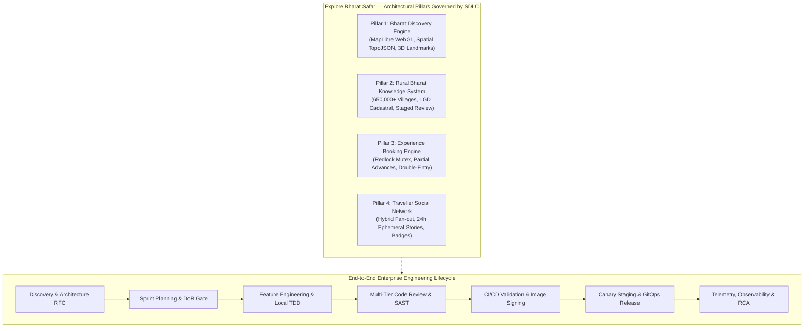

Every engineering workflow defined in this document adheres to an immutable 11-point operational rubric: **Purpose, Entry Criteria, Exit Criteria, Roles Responsible, Inputs, Outputs, Dependencies, Quality Gates, Best Practices, Common Mistakes, and Future Scalability**.

---

# SECTION 1: MASTER DEVELOPMENT LIFECYCLE & SDLC PROCESS

## 1. Development Lifecycle

The Explore Bharat Safar engineering lifecycle operates on an integrated **Idea-to-Telemetry** continuum. Software delivery moves through six formal lifecycle states, ensuring that every architectural decision, line of code, and cloud deployment is mathematically auditable, security-hardened, and traceably linked to business objectives.

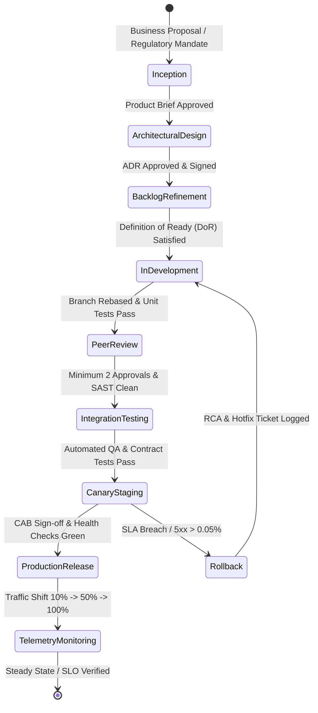

### Operational Lifecycle Stages

| Stage | Domain Focus | Primary Deliverables | SLA / Timebox | Verification Mechanism |
| :--- | :--- | :--- | :--- | :--- |
| **1. Inception** | Problem validation, cultural alignment, ROI | Product Requirement Document (PRD) | 1–2 Weeks | Product Council Review |
| **2. Architecture** | System topology, schema impact, security | Architecture Decision Record (ADR), OpenAPI DTOs | 3–5 Days | Architectural Review Board (ARB) |
| **3. Execution** | TDD feature development in monorepo | Clean code, unit tests, Zod validation | 1 Sprint (2 Wks) | Pre-commit hooks & local Turborepo DAG |
| **4. Verification** | Code review, static analysis, PostGIS QA | PR approval, SonarQube / Trivy scan report | < 24 Hours | GitHub Actions CI Matrix |
| **5. Staging** | Multi-service integration, performance | Staging deployment, smoke tests, k6 load test | 1–2 Days | Automated Playwright & k6 runs |
| **6. Operations** | Progressive delivery, canary monitoring | OCI container signed by Cosign, Grafana telemetry | Continuous | ArgoCD rollouts & Prometheus alerts |

---

## 2. SDLC Process (Enterprise Dual-Track Agile)

Explore Bharat Safar employs a **Dual-Track Agile** methodology combining a forward-looking **Discovery Track** (Product Architecture, UX Research, Security Modeling) running one sprint ahead of the **Delivery Track** (Production Engineering, Quality Engineering, SRE).

```mermaid
gantt
    title Explore Bharat Safar — Dual-Track Sprint Rhythm (Two-Week Cadence)
    dateFormat  X
    axisFormat  Day %d
    section Discovery Track (Sprint N+1)
    UX Prototyping & Design Tokens  :active, d1, 0, 4
    Architecture RFC & ADR Sign-off :d2, 3, 7
    API Contract & Schema Modeling  :d3, 6, 10
    section Delivery Track (Sprint N)
    Sprint Commitment & Task Split  :crit, done, s1, 0, 1
    TDD Feature Implementation     :active, s2, 1, 7
    Automated E2E & Spatial QA     :s3, 6, 9
    CAB Sign-off & Canary Release  :crit, s4, 8, 10
```

### SDLC Sprint Ceremonies & Governance

1. **Backlog Refinement (Weekly, 60 mins)**: Engineering leads and Product Managers review epics, decomposing them into atomic User Stories meeting the **Definition of Ready (DoR)**.
2. **Sprint Planning (Bi-weekly, 90 mins)**: Engineering squads commit to story point capacities calculated from historical velocity ($Velocity_{actual} = 0.85 \times Capacity_{raw}$).
3. **Daily Standup (Daily, 15 mins)**: Focused strictly on blockers, code review handoffs, and WIP limit violations.
4. **Sprint Demo & Review (Bi-weekly, 45 mins)**: Live demonstration of completed staging features to stakeholders. Zero slide decks allowed; demonstration must occur on staging environments.
5. **Engineering Retrospective (Bi-weekly, 45 mins)**: Action-oriented retrospective yielding at least two process improvement backlog tickets per sprint.

---

# SECTION 2: GIT GOVERNANCE, BRANCHING & REVIEW INFRASTRUCTURE

## 3. Git Strategy (Trunk-Based Development with Release Branches)

To maximize continuous integration across our Turborepo monorepo while eliminating merge friction across multidisciplinary squads, Explore Bharat Safar enforces **Trunk-Based Development**. All feature branches are short-lived ($\le 48\text{ hours}$ lifespan). Long-lived develop branches are strictly prohibited.

```mermaid
gitGraph
    commit id: "v1.2.0 (prod)" tag: "v1.2.0"
    branch feat/EBS-102-spatial-index
    checkout feat/EBS-102-spatial-index
    commit id: "feat: add GiST index"
    commit id: "test: spatial query coverage"
    checkout main
    merge feat/EBS-102-spatial-index id: "squash: EBS-102 (#45)"
    branch release/v1.3.0
    checkout release/v1.3.0
    commit id: "chore: bump version 1.3.0"
    checkout main
    branch hotfix/EBS-105-redlock-timeout
    checkout hotfix/EBS-105-redlock-timeout
    commit id: "fix: redlock drift correction"
    checkout main
    merge hotfix/EBS-105-redlock-timeout id: "squash: EBS-105 (#46)"
    checkout release/v1.3.0
    cherry-pick id: "squash: EBS-105 (#46)"
    commit id: "release: v1.3.0-rc1" tag: "v1.3.0"
```

---

## 4. Git Branch Naming Standards

Branch names must strictly match the enterprise regex pattern:
$$\text{\bf `^(feat|fix|perf|refactor|chore|docs|test|hotfix)/EBS-[0-9]{3,5}-[a-z0-9-]+$`}$$

### Standard Branch Types & Examples

| Branch Prefix | Usage Domain | Example Branch Name | Permitted Merge Targets |
| :--- | :--- | :--- | :--- |
| `feat/` | New functional business capability | `feat/EBS-240-village-directory-filter` | `main` |
| `fix/` | Standard bug fix identified in sprint | `fix/EBS-312-booking-advance-rounding` | `main` |
| `perf/` | Performance optimization (database/WebGL) | `perf/EBS-405-topojson-mesh-simplification` | `main` |
| `refactor/` | Code structure change without feature alteration| `refactor/EBS-180-nest-prisma-service` | `main` |
| `chore/` | Tooling, dependencies, or linter configuration | `chore/EBS-510-upgrade-turbo-2` | `main` |
| `docs/` | Architectural docs or OpenAPI contract updates| `docs/EBS-112-update-erd-village-schema` | `main` |
| `test/` | Adding missing tests or mock harness updates | `test/EBS-390-k6-booking-lock-stress` | `main` |
| `hotfix/` | Emergency production defect resolution | `hotfix/EBS-999-razorpay-signature-mismatch`| `main`, `release/vX.Y.Z` |

---

## 5. Feature Branch Workflow

### 1. Purpose
Defines the atomic, developer-level engineering cycle for creating, maintaining, testing, and preparing a feature branch for peer review in the monorepo.

### 2. Entry Criteria
- User Story ticket in Jira/Linear transitioned to `IN PROGRESS`.
- Task satisfies the **Definition of Ready (DoR)**.
- Local repository synchronized with latest `origin/main`.

### 3. Exit Criteria
- Feature branch passes all local pre-commit hooks (`lint`, `format`, `type-check`).
- Unit tests written and passing locally with $>85\%$ line coverage.
- Pull request opened using the enterprise PR template.

### 4. Roles Responsible
- **Primary**: Feature Software Engineer (Junior, Mid, Senior, Staff).
- **Secondary**: Assigned Peer Reviewer, Engineering Lead.

### 5. Inputs
- Target Jira Issue Key (`EBS-XXX`).
- UI/UX Figma component tokens and API Contract DTOs.
- Clean working directory on `main` branch.

### 6. Outputs
- Version-controlled Git commits following Conventional Commits 1.0.0.
- Pushed remote branch: `origin/feat/EBS-XXX-...`.
- Initiated GitHub Pull Request linked to Jira issue.

### 7. Dependencies
- Node.js LTS (v20.x) locked via `.nvmrc`.
- pnpm package manager installed and configured with internal store.
- Local Docker environment running PostgreSQL 16 + PostGIS and Redis 7.

### 8. Quality Gates
- **Gate 1**: Git pre-commit hook runs `pnpm lint-staged` (ESLint, Prettier).
- **Gate 2**: Git pre-push hook runs `pnpm type-check` and affected package unit tests via Turborepo DAG.

### 9. Best Practices
- Keep branches short-lived ($\le 48\text{ hours}$ from branch creation to PR merge).
- Perform daily rebase against `origin/main`: `git fetch origin && git rebase origin/main`.
- Write atomic commits with precise Conventional Commit scopes (e.g., `feat(api/booking): add slot mutex validation`).

### 10. Common Mistakes
- **Never** merge `main` into your feature branch creating merge bubble commits; always **rebase**.
- **Never** commit secrets, private keys, `.env` files, or local build artifacts (`.turbo/`, `dist/`).
- **Never** combine unrelated changes (e.g., refactoring auth while implementing village maps).

### 11. Future Scalability
As the engineering organization scales past 100 engineers, local hooks transition to remote ephemeral CI runners utilizing GitHub Actions Merge Queue to validate speculative rebases before queueing.

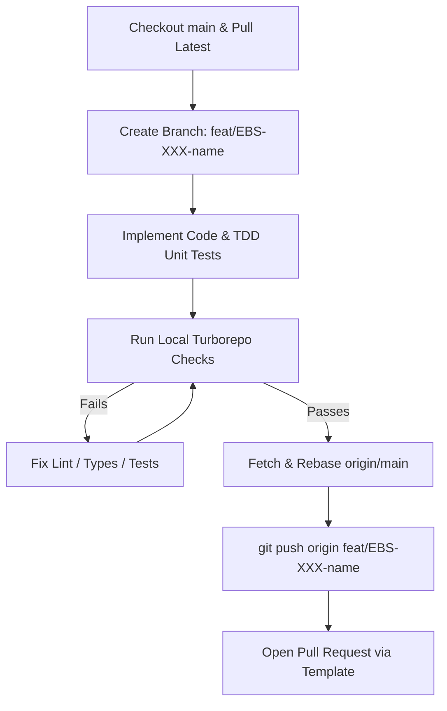

---

## 6. Pull Request Process

### 1. Purpose
Standardizes how code modifications are presented for architectural inspection, automated verification, compliance auditing, and collaborative feedback.

### 2. Entry Criteria
- Feature branch pushed to remote origin.
- CI pipeline triggers automatically upon PR creation.
- PR template fully completed with zero unaddressed fields.

### 3. Exit Criteria
- Minimum 2 approvals from designated Senior Engineers or Codeowners.
- All GitHub Actions automated CI checks green (100% pass).
- Branch rebased cleanly onto latest `main` with zero merge conflicts.

### 4. Roles Responsible
- **PR Author**: Submits, explains context, and responds to review comments.
- **Code Reviewers**: Inspects code quality, architecture, security, and performance.
- **Engineering Lead**: Confirms compliance with sprint objectives and merge readiness.

### 5. Inputs
- Branch diff against `main`.
- Completed PR Template (Problem statement, Solution, Affected modules, Evidence of testing).

### 6. Outputs
- Peer-reviewed, verified, and squashed atomic commit landed on `main`.
- Auto-closed Jira/Linear task transitioned to `RESOLVED / IN STAGING`.

### 7. Dependencies
- GitHub Actions CI runner infrastructure.
- SonarQube quality analysis engine.
- Datadog / Snyk vulnerability scanning hooks.

### 8. Quality Gates
- PR size budget: $\le 400$ lines of code changed (excluding auto-generated locks and schema files).
- SonarQube Quality Gate: Zero new blocker/critical code smells; zero new security vulnerabilities.
- Mandatory screenshot/screen-recording proof for all `apps/web` UI alterations.

### 9. Best Practices
- Draft PR early (`Draft: feat/...`) to solicit early architectural feedback on interface design.
- Respond to every reviewer comment systematically; resolve threads only after changes are pushed.
- Label PRs accurately with monorepo tags (`area: web`, `area: api`, `area: db`, `security`).

### 10. Common Mistakes
- Submitting "mega PRs" spanning 1,500+ lines covering multiple bounded contexts.
- Omitting verification evidence, forcing reviewers to check out and build the branch locally.
- Force pushing over existing PR branches while an active review discussion is underway without notification.

### 11. Future Scalability
Implement automated AI-assisted code review bots (e.g., CodeRabbit/Copilot Reviewer) to catch trivial syntax, AST boundary breaches, and docstring omissions before human reviewers inspect the diff.

---

## 7. Code Review Process

### 1. Purpose
Ensures collective codebase ownership, architectural consistency, security hardening, high-performance execution, and cross-team knowledge dissemination.

### 2. Entry Criteria
- PR transitioned from `Draft` to `Ready for Review`.
- Assigned reviewers notified via Slack/GitHub notifications.
- CI static analysis and unit test suites passing.

### 3. Exit Criteria
- Formal `APPROVED` state recorded by at least 2 authorized reviewers.
- All reviewer comment threads resolved.
- Security and Architecture Lead sign-off for sensitive modules (Auth, Payments, PostGIS).

### 4. Roles Responsible
- **Primary Reviewer**: Domain Peer Engineer.
- **Secondary Reviewer**: Cross-domain Senior / Staff Software Engineer.
- **CODEOWNER Reviewer**: Designated architectural owner of the modified packages/apps.

### 5. Inputs
- Pull request diff, linked Jira issue, Figma specs, and OpenAPI contracts.

### 6. Outputs
- Constructive review comments, approved review status, or actionable change requests (`CHANGES_REQUESTED`).

### 7. Dependencies
- GitHub CODEOWNERS file at `.github/CODEOWNERS`.
- Monorepo boundary rules configured in `tooling/eslint-plugin-ebs-boundaries`.

### 8. Quality Gates
Reviewers must verify compliance against the **Seven Enterprise Review Dimensions**:
1. **Architectural Purity**: Clean architecture adherence; no UI imports in API; no domain logic in controllers.
2. **Security**: Zero SQL injection, parameterized queries only, RBAC guards applied, DPDP PII masked.
3. **Data Integrity**: Database transactions wrapped atomically; Redlock locks freed in `finally` blocks.
4. **Performance**: No $O(N)$ database query loops (N+1 problem); WebGL asset sizes within budget.
5. **Test Rigor**: Tests verify edge cases, negative boundaries, and failure states, not just the happy path.
6. **Accessibility**: ARIA labels, semantic HTML, keyboard focus management, color contrast $\ge 4.5:1$.
7. **Maintainability**: Clear variable naming, zero dead code, proper TypeScript strict typing (no `any`).

### 9. Best Practices
- Review code within 4 business hours of assignment.
- Frame comments constructively using conventional comments (e.g., `suggestion:`, `question:`, `nit:`, `blocking:`).
- Pair program on complex PRs rather than exchanging lengthy asynchronous debate threads.

### 10. Common Mistakes
- Rubber-stamping PRs ("LGTM") without reviewing test cases or boundary conditions.
- Nitpicking formatting issues that should be handled automatically by Prettier/ESLint.
- Approving PRs that bypass established database migration conventions.

### 11. Future Scalability
Dynamic reviewer assignment based on commit topology and CODEOWNERS load balancing to prevent senior engineering review bottlenecks.

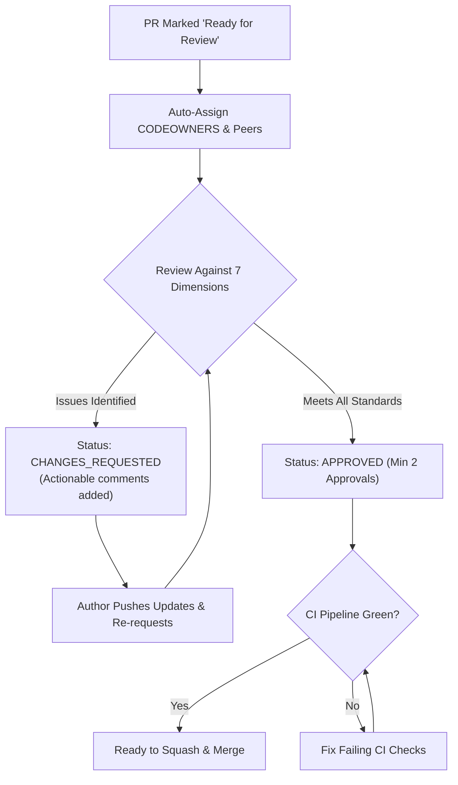

---

## 8. Merge Rules & Branch Protection

### Enterprise Branch Protection Matrix

The `main` branch and all active `release/*` branches are cryptographically and administratively locked in GitHub Enterprise:

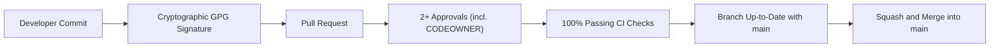

### Specific Enforcement Rules
1. **Require Pull Request Before Merging**: Direct commits or pushes to `main` and `release/*` are strictly blocked for all users, including Enterprise Administrators.
2. **Require Linear History**: Merges must execute via **Squash and Merge**. Merge bubbles and rebase commits with multiple intermediate hashes are rejected.
3. **Require Signed Commits**: Every commit merged into trunk must possess a valid, verified GPG or SSH cryptographic signature.
4. **Require Status Checks to Pass**:
   - `ci/turborepo-build`: All apps and packages build successfully.
   - `ci/type-check`: Zero TypeScript compiler errors across the workspace.
   - `ci/unit-tests`: 100% unit tests pass with $>85\%$ coverage.
   - `ci/security-sast`: SonarQube and Trivy scan reporting zero high/critical CVEs.
   - `ci/postgis-integration`: Spatial query regression suite passing against real PostgreSQL 16.
5. **Require Up-to-Date Branches**: Feature branches must be rebased onto the tip of `main` before the merge button becomes active.
6. **Automatic Branch Deletion**: Head branches are automatically deleted immediately upon successful squash-merge.

---

# SECTION 3: RELEASE MANAGEMENT, VERSIONING & DEPLOYMENT

## 9. Release Workflow

### 1. Purpose
Orchestrates the predictable, zero-downtime transition of validated code from the monorepo trunk (`main`) into staging and production Kubernetes environments.

### 2. Entry Criteria
- Sprint scope fully committed and merged to `main`.
- All milestone features pass the **Definition of Done (DoD)**.
- Release Candidate branch (`release/vX.Y.0`) cut from `main`.

### 3. Exit Criteria
- Production deployment canary progression reaches 100% traffic with zero SLO violations.
- Git tag published and cryptographically signed (`vX.Y.Z`).
- Automated release notes and changelog published to GitHub Releases and internal Slack.

### 4. Roles Responsible
- **Release Manager**: Coordinates staging hardening, CAB approval, and deployment scheduling.
- **DevOps / SRE Lead**: Manages ArgoCD rollout, canary monitoring, and infrastructure telemetry.
- **QA Automation Lead**: Executes and verifies staging smoke and end-to-end regression suites.
- **Principal Software Architect**: Gives final technical sign-off on production rollout.

### 5. Inputs
- Release Candidate branch diff, automated test reports, security audit sign-offs.

### 6. Outputs
- Production-deployed OCI container images signed with Cosign.
- Tagged Git release commit with generated `CHANGELOG.md`.

### 7. Dependencies
- Multi-AZ Kubernetes cluster, Traefik Ingress Controller, ArgoCD GitOps engine.
- HashiCorp Vault secrets injected into staging and production pods.

### 8. Quality Gates
- **Gate 1: Staging Regression**: 100% pass on automated Playwright E2E suites covering Booking, Auth, Village Staging, and Spatial Maps.
- **Gate 2: Performance Gate**: k6 load test verifying API p95 latency $\le 85\text{ms}$ under 2,500 concurrent synthetic users.
- **Gate 3: Security Gate**: Zero open high/critical vulnerabilities across dependencies and container base images.

### 9. Best Practices
- Execute production releases on Tuesday through Thursday during morning operational hours (10:00 AM IST); avoid Friday afternoon deployments.
- Deploy database migrations via backward-compatible expand-and-contract patterns before rolling out application containers.
- Maintain an active War Room channel during canary progression.

### 10. Common Mistakes
- Bundling unverified hotfixes directly into a release candidate without cherry-picking back to `main`.
- Deploying breaking database schema changes simultaneously with code changes.
- Skipping staging soak periods (minimum 24 hours required for minor releases).

### 11. Future Scalability
Transitioning to automated continuous delivery where every commit landing on `main` that passes staging automated canary analysis is automatically promoted to production without human gate intervention.

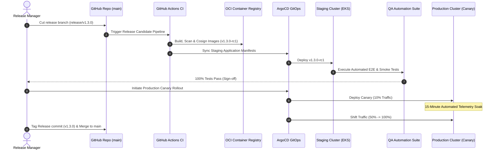

---

## 10. Versioning Strategy (Semantic Versioning 2.0.0)

Explore Bharat Safar strictly enforces **Semantic Versioning 2.0.0** (`MAJOR.MINOR.PATCH`) across all deployable applications (`apps/*`) and shared workspace libraries (`packages/*`):

$$\text{\bf Version Format: } \mathbf{MAJOR.MINOR.PATCH}$$

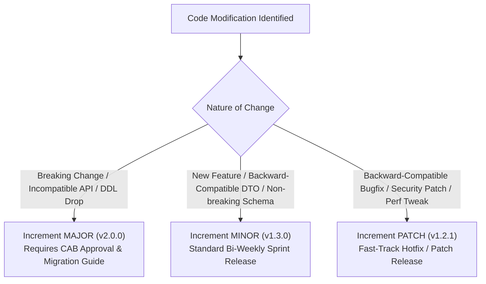

### Semantic Increment Criteria

| Semantic Tier | Trigger Event | Monorepo Impact | Example Scenario |
| :--- | :--- | :--- | :--- |
| **MAJOR (X.0.0)** | Incompatible API changes, breaking database DDL, deprecated route removal | All consuming applications must be refactored simultaneously. | Redesigning the Booking DTO contract; dropping deprecated columns. |
| **MINOR (0.Y.0)** | New functional capability, new database entity, new shared package | Backward-compatible; consuming apps may adopt asynchronously. | Adding Village Chronicle audio guide endpoints; introducing Guild badges. |
| **PATCH (0.0.Z)** | Bug fix, security CVE mitigation, internal logic refactor, performance fix | Drop-in replacement; zero API contract changes. | Fixing Redlock timeout drift calculation; patching an npm vulnerability. |

---

# SECTION 4: PLANNING, SPRINT GOVERNANCE & ROLES

## 11. Milestone Planning

Milestone planning aligns the engineering trajectory with the authoritative strategic roadmap defined in `07-roadmap.md`:

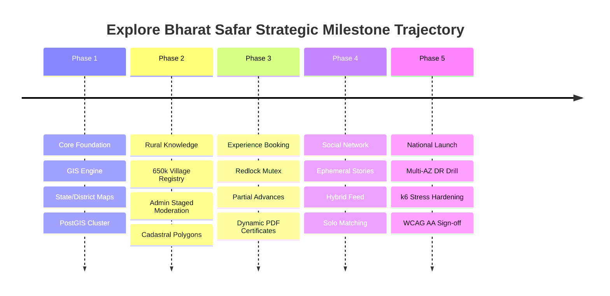

### Milestone Governance Rules
1. **Milestone Kickoff Criteria**: An architectural milestone cannot commence until its preceding foundational phase has achieved 100% production sign-off.
2. **Scope Locking**: Milestone functional boundaries are frozen once sprint execution begins; changes require formal Architectural Review Board (ARB) review.
3. **Buffering**: Every 12-week milestone incorporates a mandatory 2-week **Hardening & Security Verification Buffer** prior to milestone completion sign-off.

---

## 12. Sprint Planning

### 1. Purpose
Converts milestone epics into committed, prioritized, and capacity-aligned engineering sprint backlogs for two-week delivery cycles.

### 2. Entry Criteria
- Product backlog groomed; stories satisfy the **Definition of Ready (DoR)**.
- Engineering squad capacity calculated ($Capacity_{net} = \sum DeveloperHours \times 0.85$).
- Architectural spikes and third-party dependencies resolved.

### 3. Exit Criteria
- Sprint backlog committed and locked in Jira/Linear.
- Every user story has an assigned owner, story points, and explicit acceptance criteria.
- Sprint goal articulated and published to engineering stakeholders.

### 4. Roles Responsible
- **Product Manager**: Defines business priority and sprint goal.
- **Engineering Lead / Scrum Master**: Facilitates estimation, enforces capacity limits, and removes ambiguities.
- **Squad Engineers**: Estimates story complexity and commits to task delivery.

### 5. Inputs
- Groomed backlog stories, team availability calendar, historical velocity metrics.

### 6. Outputs
- Active Sprint Dashboard, committed story list, sprint burndown chart initialized.

### 7. Dependencies
- Jira/Linear sprint tracking board; architectural design sign-offs.

### 8. Quality Gates
- **Gate 1**: Zero stories committed without meeting DoR.
- **Gate 2**: Total committed points must not exceed $105\%$ of the trailing 3-sprint average velocity.

### 9. Best Practices
- Utilize modified Fibonacci sequence ($1, 2, 3, 5, 8, 13$) for estimation.
- Reserve $20\%$ of team capacity in every sprint for technical debt, refactoring, and automated testing improvements.
- Commit to a single, focused **Sprint Goal** that delivers tangible user value.

### 10. Common Mistakes
- Over-committing capacity by failing to account for on-call duties, PTO, and code review overhead.
- Carrying over large 13-point stories across multiple sprints without decomposing them into smaller units.

### 11. Future Scalability
Adoption of automated story sizing recommendations based on repository historical commit churn and file change complexity.

---

## 13. Task Breakdown Rules

To maintain high engineering velocity, atomic pull requests, and predictable estimation, all development work must adhere to strict task decomposition rules:

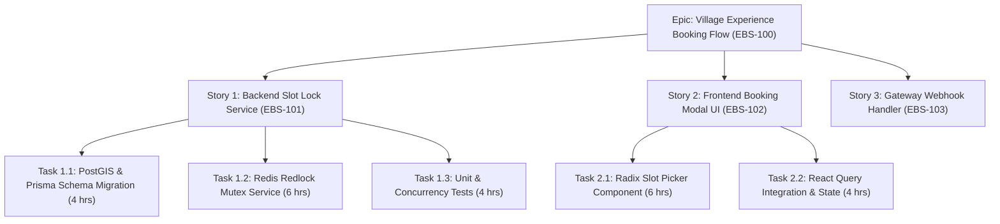

### The 8-Hour Rule & Decomposition Standards
1. **The 8-Hour Maximum Ceiling**: No individual engineering task shall exceed **8 working hours** (1 engineering day). Any task estimated $>8\text{ hours}$ must be decomposed into smaller sub-tasks.
2. **Architectural Separation**: Backend, frontend, database migration, and test automation tasks must remain distinct sub-tasks to facilitate concurrent development and atomic pull requests.
3. **Traceability**: Every sub-task must link directly to a parent User Story, which links to a high-level Epic.

---

## 14. Developer Responsibilities

The Explore Bharat Safar engineering team maintains high standards of technical excellence, operational accountability, and collective code stewardship:

| Engineering Level | Core Technical Responsibilities | Architectural & Review Expectations | Operational Duties |
| :--- | :--- | :--- | :--- |
| **Junior Engineer** | Implements well-scoped sub-tasks, writes thorough unit tests, adheres to style guides. | Participates in code reviews, reads ADRs, reports code smells. | Resolves assigned Sev-3/Sev-4 bugs; shadow on-call rotation. |
| **Mid-Level Engineer** | Delivers end-to-end user stories, implements domain services, optimizes queries. | Reviews peer PRs thoroughly, authors unit/integration tests, ensures zero regressions. | Active participant in secondary on-call support; triages alerts. |
| **Senior Engineer** | Authors complex domain logic (Redlock, GIS), designs database migrations, mentors juniors. | CODEOWNER for assigned packages; enforces Clean Architecture; reviews security. | Serves as Primary On-Call Engineer; conducts incident triage and RCA. |
| **Staff / Principal Architect**| Defines system topology, authors ADRs, guides cross-squad architecture, unblocks leads. | Final architectural authority; conducts CAB reviews; approves breaking schema changes. | Incident Commander for Sev-1 outages; oversees disaster recovery drills. |

---

# SECTION 5: SPECIALIZED ENGINEERING WORKFLOWS

## 15. Frontend Development Workflow (Next.js 14+ App Router & Design System)

### 1. Purpose
Standardizes UI development within `apps/web`, enforcing React Server Components (RSC) architecture, accessibility (WCAG 2.1 AA), and high-performance WebGL rendering for the Bharat Discovery Engine.

### 2. Entry Criteria
- UI/UX designs approved in Figma and exported as design tokens.
- Shared Zod validation schemas updated in `packages/validators`.
- Target API endpoints documented in OpenAPI / Swagger contracts.

### 3. Exit Criteria
- Components implemented using Radix UI primitives and Tailwind CSS.
- Page load time (TTI) $\le 1.8\text{ seconds}$ on simulated 4G mobile profiles.
- 100% keyboard navigable with zero axe-core accessibility violations.

### 4. Roles Responsible
- **Primary**: Frontend Software Engineer.
- **Secondary**: UI/UX Designer, QA Automation Engineer.

### 5. Inputs
- Figma components, OpenAPI contracts, `packages/ui` design system primitives.

### 6. Outputs
- Next.js Server Components, interactive client boundaries (`"use client"`), and Playwright component tests.

### 7. Dependencies
- `packages/ui`, `packages/types`, `packages/validators`, `packages/gis-core`.

### 8. Quality Gates
- Lighthouse Score: Performance $\ge 90$, Accessibility $\ge 95$, Best Practices $\ge 95$, SEO $\ge 95$.
- WebGL map canvas renders sustained $60\text{ FPS}$ during camera panning and zoom operations.
- Zero client-side bundle size regressions ($< 150\text{ KB}$ initial JS payload).

### 9. Best Practices
- Default to **React Server Components (RSC)**; isolate client components strictly to interactive leaves (e.g., interactive map pins, booking quantity steppers).
- Consume shared UI primitives from `packages/ui`; avoid inline ad-hoc styling.
- Utilize TanStack React Query for client-side data fetching with aggressive caching and stale-while-revalidate configurations.

### 10. Common Mistakes
- Declaring `"use client"` at the top of entire layout trees, negating server-side rendering benefits.
- Fetching large GeoJSON datasets directly in the client rather than querying simplified vector tiles from the backend.
- Hardcoding user-facing strings instead of utilizing the internationalization dictionary.

### 11. Future Scalability
Adoption of Next.js Partial Prerendering (PPR) to stream dynamic booking states inside statically cached destination layouts.

---

## 16. Backend Development Workflow (NestJS 10.x Clean Architecture)

### 1. Purpose
Governs the implementation of resilient, modular backend domain services within `apps/api` and background queues in `apps/worker`.

### 2. Entry Criteria
- Domain model and business logic signed off against `26-business-rules.md`.
- Database schema migrations applied and verified in local PostgreSQL.
- API contract drafted in OpenAPI / Swagger format.

### 3. Exit Criteria
- Clean Architecture layers strictly separated (Domain -> Application -> Infrastructure).
- Unit and integration tests passing with $>85\%$ branch coverage.
- Structured logs integrated using `packages/logger` (Pino + OpenTelemetry context).

### 4. Roles Responsible
- **Primary**: Backend Software Engineer.
- **Secondary**: Database Administrator, Security Engineer.

### 5. Inputs
- Jira Story, database repository interfaces, shared Zod schemas.

### 6. Outputs
- NestJS modules, controllers, domain services, DTOs, and automated integration tests.

### 7. Dependencies
- `packages/database` (Prisma/PostGIS), `packages/security-crypto`, `packages/logger`.

### 8. Quality Gates
- NestJS dependency injection boundaries strictly maintained (zero circular module dependencies).
- API response latency p95 $\le 85\text{ms}$ under unit test mock load.
- All mutating endpoints enforce idempotent transaction boundaries.

### 9. Best Practices
- Keep domain entities completely pure; zero framework imports (`@nestjs/*`, `prisma`) inside `domain/` directory.
- Use NestJS Interceptors for universal response envelope formatting and exception filters for error translation.
- Encapsulate all distributed locking inside dedicated Redis Redlock adapters with automated release guarantees.

### 10. Common Mistakes
- Writing raw SQL queries inside NestJS controllers instead of utilizing the domain repository pattern.
- Failing to pass OpenTelemetry trace context across BullMQ background worker job dispatches.
- Swallowing database errors without logging structured diagnostic context.

### 11. Future Scalability
Microservice extraction readiness: Any domain module within `apps/api` can be decoupled into an independent container service within $<48\text{ hours}$ due to strict interface boundaries.

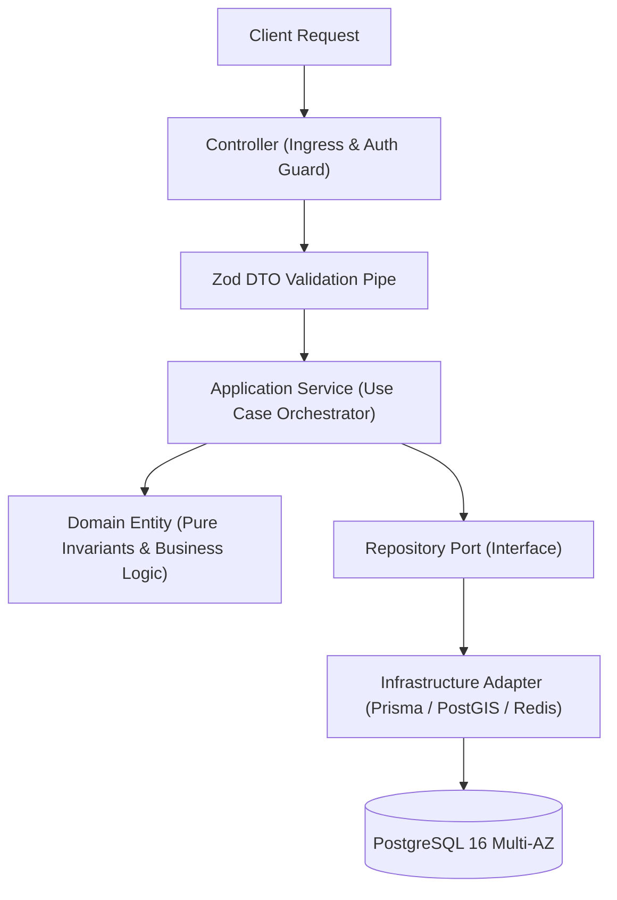

---

## 17. Database Migration Workflow (PostGIS & PostgreSQL 16)

### 1. Purpose
Governs the safe, zero-downtime evolution of the relational and spatial database schema in `packages/database`.

### 2. Entry Criteria
- Schema change requested to support a validated business feature.
- Migration impact assessment conducted for table locks and spatial index rebuilding.
- Migration drafted using Prisma forward-only SQL generation.

### 3. Exit Criteria
- Migration applied cleanly on local, staging, and production databases without data loss.
- PostGIS spatial indexes created concurrently (`CONCURRENTLY`) without table deadlocks.
- Extended `client.ts` regenerated and types propagated across all monorepo workspaces.

### 4. Roles Responsible
- **Primary**: Database Engineer / Backend Senior Engineer.
- **Secondary**: Principal Systems Architect, SRE Lead.

### 5. Inputs
- Updated `schema.prisma`, raw SQL migration scripts, database change proposal.

### 6. Outputs
- Version-controlled SQL migration file in `packages/database/prisma/migrations/`.
- Regenerated PrismaClient types exported via `packages/database`.

### 7. Dependencies
- PostgreSQL 16 with PostGIS 3.4+ extension enabled.
- PgBouncer connection pooling service.

### 8. Quality Gates
- **Gate 1**: Backward Compatibility: All schema changes must follow the **Expand and Contract** pattern; zero breaking column renames.
- **Gate 2**: Lock Timeout Enforcement: All DDL migration scripts must explicitly set `SET lock_timeout = '4s';` to prevent blocking production queries.
- **Gate 3**: Spatial Indexing: Every geometry column (`ST_Point`, `ST_Polygon`) must possess a corresponding GiST spatial index.

### 9. Best Practices
- Add new columns as `NULLABLE` or provide safe server-side default values.
- Split multi-table migrations into isolated, sequential atomic migration files.
- Test migrations against a sanitized staging database snapshot containing realistic volume ($>650,000$ village rows).

### 10. Common Mistakes
- Running `ALTER TABLE ... ADD COLUMN ... DEFAULT ...` on massive tables without evaluating row rewrite overhead.
- Attempting to execute destructive migrations (`DROP COLUMN`, `DROP TABLE`) before the application code referencing them has been deprecated and retired across all deployed versions.
- Forgetting to run `pnpm --filter @ebs/database db:generate` after applying migrations locally.

### 11. Future Scalability
Adoption of automated migration linting in CI using tools like `squawk` or `atlas` to catch dangerous DDL operations before pull request approval.

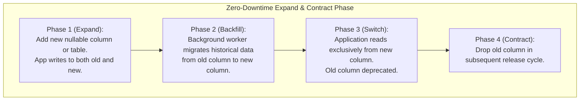

---

## 18. API Development Workflow (Contract-First OpenAPI)

### 1. Purpose
Enforces a contract-first methodology for all RESTful and WebSocket APIs, ensuring seamless interoperability between backend services, frontend web applications, and future native mobile clients.

### 2. Entry Criteria
- Feature requirements clearly established in User Story.
- Domain aggregates and entities modeled.
- API route naming conventions aligned with `09-api-design.md`.

### 3. Exit Criteria
- OpenAPI 3.1 specification fully generated, validated, and published in `docs/api-specs/`.
- Zod request/response validation schemas exported from `packages/validators`.
- Contract tests passing in CI verifying that backend implementations adhere strictly to the published specification.

### 4. Roles Responsible
- **Primary**: Backend API Engineer.
- **Secondary**: Frontend Lead, Mobile Lead, Integration Tester.

### 5. Inputs
- API route requirements, query parameter definitions, error response matrices.

### 6. Outputs
- Bundled OpenAPI JSON/YAML contracts, Swagger documentation endpoints, and shared DTO types.

### 7. Dependencies
- NestJS Swagger module (`@nestjs/swagger`), Zod schema generation tools.

### 8. Quality Gates
- **Envelope Standardization**: 100% of API endpoints must wrap responses in the universal enterprise envelope (`{ success, data, error, meta, timestamp }`).
- **HTTP Status Code Correctness**: Proper usage of REST status codes ($200, 201, 204, 400, 401, 403, 404, 409, 422, 500$).
- **Zero Breaking Contract Drift**: CI contract linter blocks any PR modifying existing fields without a formal API version increment (`/api/v2/...`).

### 9. Best Practices
- Design API contracts collaboratively before writing backend or frontend implementation code.
- Implement idempotency keys (`X-Idempotency-Key`) for all state-mutating financial and booking operations (`POST /api/v1/bookings`).
- Document all error response codes and failure scenarios directly in the OpenAPI decorators.

### 10. Common Mistakes
- Returning inconsistent error payloads that break frontend error interceptors.
- Exposing raw database model structures directly to the client instead of tailored Data Transfer Objects (DTOs).
- Omitting pagination parameters (`page`, `limit`, `cursor`) on endpoints returning collections.

### 11. Future Scalability
Automatic client SDK generation for TypeScript, Swift, and Kotlin directly from OpenAPI specifications via CI automation pipelines.

---

## 19. UI/UX Approval Workflow

### 1. Purpose
Bridges the gap between creative design, brand identity, accessibility standards, and frontend engineering execution.

### 2. Entry Criteria
- User journey wireframes drafted and reviewed by Product Management.
- Component designs constructed using the Explore Bharat Safar Figma Design System.

### 3. Exit Criteria
- Design specifications formally signed off by the Lead UX Designer and Product Director.
- Design tokens (colors, typography, spacing, shadows) synchronized with `packages/ui`.
- Interactive prototype validated via user usability testing sessions.

### 4. Roles Responsible
- **Primary**: Lead UI/UX Designer.
- **Secondary**: Frontend Architect, Product Manager, Accessibility Specialist.

### 5. Inputs
- User research findings, brand style guide (`06-styleguide.md`), usability test transcripts.

### 6. Outputs
- Approved Figma component library, annotated interaction specs, motion design tokens (GSAP timelines).

### 7. Dependencies
- Figma enterprise workspace, `packages/ui` Tailwind configuration.

### 8. Quality Gates
- **WCAG 2.1 AA Compliance**: Color contrast ratio $\ge 4.5:1$ for normal text, $\ge 3:1$ for large text and UI components.
- **Responsive Layout Verification**: Designs specified for 5 standard breakpoints (360px Mobile, 768px Tablet, 1024px Laptop, 1440px Desktop, 1920px Ultrawide).
- **Dark/Light Theme Parity**: Every component design must define both dark and light theme token variations.

### 9. Best Practices
- Design with real, cultural content from Bharat rather than generic lorem ipsum text.
- Include explicit error, loading, empty, and offline component states in all Figma deliveries.
- Conduct bi-weekly Design QA sessions reviewing frontend staging deployments against design specs.

### 10. Common Mistakes
- Designing desktop-centric layouts that degrade poorly on low-cost Indian mobile smartphones.
- Introducing novel one-off colors or font sizes outside the approved design system tokens.
- Omitting active touch target sizes ($\ge 44 \times 44\text{ px}$) on mobile interactive elements.

### 11. Future Scalability
Integration of automated Figma-to-Code token sync tools (Tokens Studio) pushing design updates directly to `packages/ui` via automated pull requests.

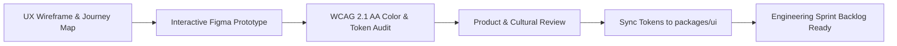

---

## 20. Testing Workflow (The Enterprise Testing Pyramid)

### 1. Purpose
Enforces comprehensive automated test coverage across all layers of the monorepo, preventing regressions and validating performance budgets.

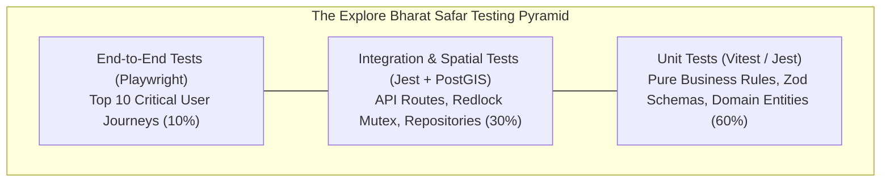

### 2. Entry Criteria
- Code implemented in feature branch.
- Unit and integration test specifications defined in User Story acceptance criteria.

### 3. Exit Criteria
- Minimum $85\%$ branch coverage across modified packages.
- 100% automated test suite passing in CI within $<10\text{ minutes}$.
- E2E smoke tests passing in staging environment.

### 4. Roles Responsible
- **Primary**: Feature Software Engineer.
- **Secondary**: QA Automation Engineer, DevOps Lead.

### 5. Inputs
- Application source code, test data seeders, mock service definitions.

### 6. Outputs
- JUnit test execution reports, Istanbul code coverage metrics, Playwright test traces.

### 7. Dependencies
- GitHub Actions CI runner matrix, Dockerized PostgreSQL + PostGIS test instance.

### 8. Quality Gates
- **Coverage Floor**: Zero PR merges permitted if package code coverage drops below $85\%$.
- **Spatial Accuracy**: Spatial queries must pass boundary tests verifying precision against Survey of India vector fixtures.
- **Flakiness Zero Tolerance**: Any test that fails intermittently is quarantined immediately into a P1 fix ticket.

### 9. Best Practices
- Follow the **Arrange-Act-Assert (AAA)** testing pattern.
- Mock external third-party services (Razorpay, SMS Gateways) using reliable contract mocks.
- Execute fast unit tests locally on every pre-push hook via `pnpm test:changed`.

### 10. Common Mistakes
- Testing framework implementation details rather than business domain behavior.
- Relying entirely on end-to-end tests while neglecting low-level unit testing of complex invariants.
- Writing tests that depend on execution order or shared mutable database state.

### 11. Future Scalability
Implementation of automated test impact analysis (TIA) via Turborepo to execute only the exact test files affected by a given commit diff.

---

## 21. Security Review Workflow (Zero Trust & DPDP Compliance)

### 1. Purpose
Verifies that all code, dependencies, cloud configurations, and data handling protocols adhere strictly to the **Zero Trust Architecture** and national privacy regulations defined in `40-enterprise-security-blueprint.md`.

### 2. Entry Criteria
- Pull request opened modifying authentication, authorization, cryptography, payments, or PII storage.
- Architecture review checklist completed for sensitive domain modules.

### 3. Exit Criteria
- Automated SAST, SCA, and Secret Scanning checks report zero High or Critical findings.
- Security Architect sign-off recorded in PR review comments.
- Threat model updated for any new public-facing endpoints.

### 4. Roles Responsible
- **Primary**: Application Security Engineer / Security Architect.
- **Secondary**: Feature Author, Tech Lead, Compliance Officer.

### 5. Inputs
- PR source code diff, dependency update manifests, API route definitions.

### 6. Outputs
- SonarQube SAST report, Trivy container vulnerability scan, GitGuardian secret scan audit.

### 7. Dependencies
- SonarQube, Trivy, Snyk, GitGuardian, HashiCorp Vault.

### 8. Quality Gates
- **Gate 1: Zero Critical Vulnerabilities**: Automatic PR block if any CVE with CVSS score $\ge 7.0$ is detected.
- **Gate 2: Cryptographic Rigor**: Verification that passwords utilize Argon2id ($m=65536, t=3, p=4$) and JWTs utilize RS256 with key rotation.
- **Gate 3: DPDP Compliance**: Verification that village and explorer personal identifiable information (PII) is encrypted at rest using AES-256-GCM.

### 9. Best Practices
- Never log plain-text passwords, tokens, full credit card numbers, or mobile numbers in application logs.
- Enforce strict Content Security Policy (CSP Level 3) headers blocking unauthorized scripts.
- Conduct quarterly external black-box penetration testing and red-team drills.

### 10. Common Mistakes
- Storing API secrets in environment files committed to Git history.
- Using client-supplied user identifiers (`req.body.userId`) instead of cryptographically verified session claims (`req.user.id`).
- Disabling CORS protections or setting `Access-Control-Allow-Origin: *` on authenticated API endpoints.

### 11. Future Scalability
Automated real-time DevSecOps policy enforcement via Open Policy Agent (OPA) validating Kubernetes manifests and cloud infrastructure in CI.

---

## 22. Documentation Update Rules

### 1. Purpose
Enforces the **Documentation as Code** principle, ensuring that architectural blueprints, API contracts, database schemas, and developer manuals in `explore-bharat-safar-ai-docs/` remain authoritative and up to date.

### 2. Entry Criteria
- Code PR introduces schema alterations, new API endpoints, infrastructure modifications, or business logic updates.

### 3. Exit Criteria
- Corresponding markdown blueprints updated within the same pull request.
- Markdown linter passes with zero broken internal links or formatting violations.

### 4. Roles Responsible
- **Primary**: Feature Author.
- **Secondary**: Technical Writer, Engineering Lead.

### 5. Inputs
- Architectural changes, modified SQL migrations, updated API routes.

### 6. Outputs
- Updated markdown blueprints in `explore-bharat-safar-ai-docs/` and API specs in `docs/api-specs/`.

### 7. Dependencies
- Markdownlint CLI, Mermaid diagram validator.

### 8. Quality Gates
- PRs modifying `packages/database/prisma/schema.prisma` must update `10-database-design.md` and `33-er-diagram.md`.
- PRs modifying API controllers must regenerate and commit the OpenAPI specification.
- Zero undocumented environment variables permitted in `.env.example`.

### 9. Best Practices
- Maintain technical documentation in clear, professional English with zero ambiguous terminology.
- Complement complex architectural changes with updated Mermaid sequence or flowchart diagrams.
- Keep documentation atomic and collocated with code changes in the same commit.

### 10. Common Mistakes
- Deferring documentation updates to a "future cleanup ticket" that is never prioritized.
- Leaving stale configuration flags or deprecated API routes in developer guides.

### 11. Future Scalability
Automated CI checks that inspect Git diffs and fail PRs if database schema files are modified without corresponding changes in the `docs/` or `ai-docs/` directories.

---

# SECTION 6: INCIDENTS, DEFECTS & OPERATIONAL RESILIENCE

## 23. Bug Fix Workflow

### 1. Purpose
Provides a disciplined, reproducible methodology for diagnosing, fixing, testing, and verifying defects identified in staging or production environments.

### 2. Entry Criteria
- Bug ticket logged in Jira/Linear with complete reproduction steps, expected vs. actual behavior, and error logs.
- Bug assigned a severity level (Sev-1 through Sev-4).

### 3. Exit Criteria
- Automated regression test written that reproduces the defect and asserts the fix.
- Root cause identified and documented in bug resolution notes.
- Code fix merged to `main` following standard PR review processes.

### 4. Roles Responsible
- **Primary**: Assigned Software Engineer.
- **Secondary**: QA Automation Engineer, Product Manager.

### 5. Inputs
- Bug reproduction script, user session telemetry, Datadog/Loki error traces.

### 6. Outputs
- Regression unit/integration test, bug fix PR, updated documentation if applicable.

### 7. Dependencies
- Staging reproduction environment, error monitoring dashboards.

### 8. Quality Gates
- **Defect Reproduction Verification**: Fix PR must include a dedicated test case that fails before the code change and passes after.
- **Zero Regression Impact**: Full regression test suite must execute cleanly in CI.

### 9. Best Practices
- Investigate the root cause thoroughly using the "5 Whys" methodology; do not merely patch symptoms.
- Check whether similar defects exist across other modules in the monorepo.

### 10. Common Mistakes
- Closing bug tickets without adding automated regression tests, allowing the defect to resurface in subsequent releases.
- Applying rushed fixes directly in production without code review.

### 11. Future Scalability
Automated bug triaging that correlates incoming Sentry/Datadog crash reports with recent Git commits to identify defect culprits instantly.

---

## 24. Hotfix Workflow

### 1. Purpose
Fast-tracks emergency production defect resolutions (Sev-1 critical outages, payment transaction failures, security vulnerabilities) that cannot wait for the standard bi-weekly sprint cycle.

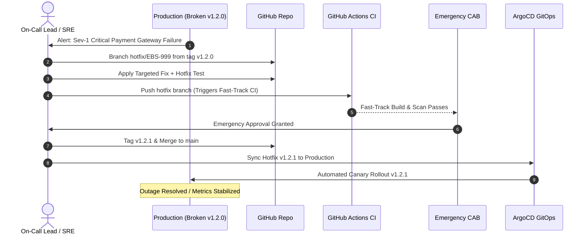

### 2. Entry Criteria
- Incident Commander declares an active Sev-1 or critical Sev-2 production defect.
- Standard sprint release cycle deemed too slow to mitigate business or security impact.

### 3. Exit Criteria
- Hotfix deployed to production; operational metrics return to green SLO thresholds.
- Hotfix cherry-picked and squashed into `main` to prevent regression in future releases.
- Post-mortem report scheduled within 48 hours.

### 4. Roles Responsible
- **Incident Commander**: Coordinates resolution and authorizes hotfix path.
- **Senior Software Engineer**: Authors minimal targeted code fix and test.
- **DevOps / SRE Lead**: Manages emergency build, tag, and deployment.

### 5. Inputs
- Production telemetry, error stack traces, active incident Slack channel.

### 6. Outputs
- Emergency release tag (`vX.Y.Z+1`), deployed patch container, incident log.

### 7. Dependencies
- Fast-track GitHub Actions hotfix pipeline; emergency CAB quorum.

### 8. Quality Gates
- **Targeted Scope**: Hotfix PR must contain the minimum viable diff necessary to resolve the defect; zero unrelated refactorings.
- **Expedited Sign-off**: Requires approval from at least 1 Principal Architect and 1 Engineering Director.
- **Regression Guard**: Must pass automated unit and smoke tests.

### 9. Best Practices
- Branch directly from the active production release tag (`git checkout -b hotfix/EBS-XXX v1.2.0`).
- Ensure the fix is immediately backported to `main` before closing the incident war room.

### 10. Common Mistakes
- Leaving the hotfix in the release branch without merging back to `main`, reintroducing the bug in the next sprint release.
- Skipping container security scanning during emergency deployments.

### 11. Future Scalability
Automated hotfix dual-merge bots that cherry-pick and open automated PRs against `main` immediately upon hotfix tag creation.

---

## 25. Rollback Workflow

### 1. Purpose
Defines the rapid, predictable reversal of application code, container images, or database schemas when a production deployment breaches service level objectives (SLOs).

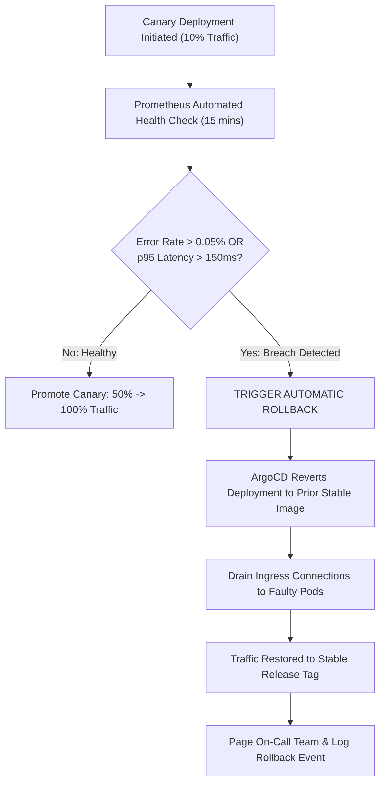

### 2. Entry Criteria
- Automated canary analysis detects 5xx error rate $> 0.05\%$ or latency p95 $> 150\text{ms}$.
- Incident Commander issues a manual rollback order during a production rollout.

### 3. Exit Criteria
- Production traffic fully served by the previous stable release tag ($N-1$).
- Health check endpoints return $200\text{ OK}$ and telemetry metrics stabilize.
- Incident report updated with rollback timestamp and diagnostic logs.

### 4. Roles Responsible
- **Primary**: DevOps / SRE Lead.
- **Secondary**: Incident Commander, Principal Architect.

### 5. Inputs
- Alert notification, ArgoCD application console, Kubernetes cluster state.

### 6. Outputs
- Restored production service running verified image; archived crash dump logs.

### 7. Dependencies
- ArgoCD GitOps engine, Kubernetes Deployment revision history, Cloudflare CDN cache flush.

### 8. Quality Gates
- **Rollback Time Objective (RTO)**: Total rollback execution must complete within $\le 5\text{ minutes}$ of trigger.
- **Zero Data Corruption**: Database migrations must remain forward-compatible to prevent data loss during code rollback.

### 9. Best Practices
- Never roll back database migrations during an active incident unless absolutely unavoidable; design all migrations to be backward-compatible with both $N$ and $N-1$ code versions.
- Test automated rollback procedures quarterly in staging environments.

### 10. Common Mistakes
- Rolling forward under pressure with unverified code patches instead of executing an immediate, clean rollback.
- Neglecting to invalidate CDN edge caches after rolling back frontend static assets.

### 11. Future Scalability
Full automation of Canary Analysis via Prometheus Metric Server triggering ArgoCD automated aborts without requiring human triage.

---

## 26. Deployment Approval Workflow

### 1. Purpose
Provides formal governance, risk assessment, and Change Advisory Board (CAB) authorization for all deployments entering staging and production environments.

### 2. Entry Criteria
- All automated CI quality gates, security scans, and test suites passing.
- Staging verification complete; User Acceptance Testing (UAT) sign-off secured.
- Change Request ticket submitted with risk scoring and rollback procedure.

### 3. Exit Criteria
- Formal cryptographic approval recorded in GitHub Actions / Jira Service Management.
- Deployment authorized and scheduled within the designated production change window.

### 4. Roles Responsible
- **Change Advisory Board (CAB)**: Engineering Director, Principal Architect, Security Lead, Operations Lead.
- **Requestor**: Release Manager or Engineering Squad Lead.

### 5. Inputs
- Change Request (CR) document, test execution audit, security sign-off, rollback plan.

### 6. Outputs
- Approved Change Request, scheduled release execution window.

### 7. Dependencies
- Jira Service Management CAB workflow; GitHub Environment Protection rules.

### 8. Quality Gates

| Change Tier | Risk Level | Required Approvals | Advance Notice | Permitted Window |
| :--- | :--- | :--- | :--- | :--- |
| **Standard** | Low (Internal refactor, docs) | Automated CI + Tech Lead | 2 Hours | Any business hours |
| **Normal** | Medium (New feature, minor release) | Tech Lead + QA Lead + SRE Lead | 24 Hours | Tue–Thu, 10:00–14:00 IST |
| **Major** | High (Architecture overhaul, DB rewrite) | Full CAB (Director, Architect, Security)| 5 Business Days | Sunday maintenance window |
| **Emergency** | Critical (Hotfix for active Sev-1) | Incident Commander + Principal Architect| Immediate | Immediate upon quorum |

### 9. Best Practices
- Automate approval evidence collection directly from GitHub Actions test summaries.
- Maintain a calendar of production blackout periods (e.g., national holiday travel flash sales).

### 10. Common Mistakes
- Treating CAB as an adversarial bureaucratic bottleneck rather than a risk mitigation partnership.
- Submitting change requests with vague or missing rollback procedures.

### 11. Future Scalability
Automated policy-as-code risk scoring that automatically approves low-risk changes based on test coverage, past author reliability, and module blast radius.

---

## 27. Production Release Checklist

Every production deployment must be verified against this comprehensive pre-flight, in-flight, and post-flight operational checklist:

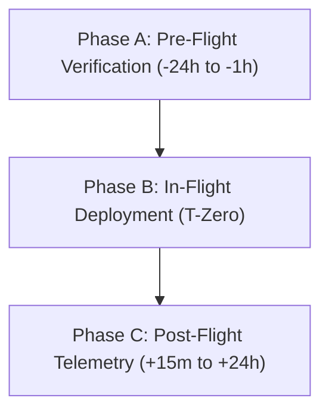

### Pre-Flight Verification Phase
- [ ] Database backup snapshot verified; point-in-time recovery (PITR) active.
- [ ] Backward-compatible database migrations executed and confirmed in staging.
- [ ] Staging automated smoke test suite passed with 100% success rate.
- [ ] Performance load test verified API latency p95 $\le 85\text{ms}$ under expected traffic.
- [ ] Container images cryptographically signed using Cosign and pushed to OCI registry.
- [ ] Environment secrets and API keys verified in HashiCorp Vault.
- [ ] On-call SRE and Squad Leads assembled in deployment communication channel.
- [ ] Cloudflare WAF rules and CDN caching headers configured.

### In-Flight Deployment Phase
- [ ] Deployment initiated via ArgoCD GitOps sync to production cluster.
- [ ] Traefik Ingress routes $10\%$ traffic to new canary pods.
- [ ] Real-time monitoring of Prometheus error metrics and response latency for 15 minutes.
- [ ] Canary traffic expanded to $50\%$; WebSocket connection stability confirmed.
- [ ] Full traffic shift to $100\%$; previous deployment pods placed in graceful termination drain.

### Post-Flight Verification Phase
- [ ] Production health check endpoints (`/health/liveness`, `/health/readiness`) return $200\text{ OK}$.
- [ ] Critical business flows verified live: User login, interactive GIS map rendering, village page view, test booking slot lock.
- [ ] Sentry / Datadog error monitoring reviewed for novel unhandled exceptions.
- [ ] Deployment status communicated to business stakeholders and customer support.
- [ ] GitHub Release notes published and Jira sprint version closed.

---

## 28. Incident Management Workflow

### 1. Purpose
Establishes an immediate, coordinated operational response to production service disruptions, minimizing downtime, safeguarding financial transaction integrity, and ensuring transparent stakeholder communication.

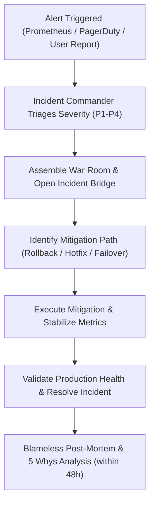

### 2. Entry Criteria
- Automated alert fired from Prometheus / Datadog / PagerDuty indicating SLO violation (5xx error rate $> 0.05\%$, API p95 $> 150\text{ms}$, payment webhook failures).
- Multiple customer support escalations or payment gateway webhook disconnect alerts received.

### 3. Exit Criteria
- System metrics return to normal baseline thresholds; all synthetic canary probes green.
- Incident Commander formally declares incident resolved in the incident bridge channel.
- Incident summary posted to internal stakeholders; post-mortem meeting scheduled within 48 hours.

### 4. Roles Responsible
- **Incident Commander (IC)**: Has absolute operational authority; directs investigation streams and approves mitigation actions.
- **Operations Lead / SRE**: Executes infrastructure commands, queries logs, and manipulates traffic routing.
- **Communications Lead**: Posts updates to public/internal status pages every 15 minutes for P1 outages and liaises with executive leadership.
- **Domain SME (Backend / PostGIS / Payment)**: Diagnoses root cause within specific application code.

### 5. Inputs
- Real-time Prometheus metrics, Datadog APM traces, Loki structured JSON logs, user complaint reports.

### 6. Outputs
- Restored service, timeline log in incident channel, root-cause action items, public status page incident report.

### 7. Dependencies
- PagerDuty automated alert escalation engine, Slack emergency incident channel (`#incident-war-room`), Datadog telemetry.

### 8. Quality Gates & Severity SLAs

| Severity | Definition & Impact | Response SLA | Target Resolution | Escalation Quorum |
| :--- | :--- | :--- | :--- | :--- |
| **P1 (Critical)** | Core platform outage (Booking engine down, Auth down, Map offline) | $< 5\text{ mins}$ | $< 30\text{ mins}$ | VP Eng, Principal Architect, Incident Commander |
| **P2 (Major)** | Major feature degraded (Search failing, Village Admin portal offline) | $< 15\text{ mins}$ | $< 2\text{ hours}$ | Tech Lead, On-Call Senior Engineer, SRE Lead |
| **P3 (Minor)** | Minor non-critical defect (Slow report generation, badge icon display error)| $< 2\text{ hours}$ | $< 24\text{ hours}$ | Squad On-Call Engineer |
| **P4 (Cosmetic)** | Cosmetic bug with viable workaround (Typography misalignment) | $< 1\text{ business day}$| Next Sprint | Assigned Squad Backlog |

### 9. Best Practices
- Focus on **mitigation first** (rollback, traffic shedding, feature toggle disabling) before attempting root-cause debugging.
- Keep the incident channel clear of speculation; communicate in objective observations, timestamps, and hypotheses.
- Facilitate a **Blameless Post-Mortem** within 48 hours using the **5 Whys** method to trace systemic, process, and architectural failures into committed preventive backlog tickets.

### 10. Common Mistakes
- Attempting to debug complex code in production under outage pressure instead of initiating an immediate rollback.
- Neglecting to notify customer support and executive stakeholders early in a P1 outage.
- Failing to assign dedicated owners to post-mortem action items, leading to recurring outages.

### 11. Future Scalability
Implementation of automated incident response playbooks (Runbooks as Code) that automatically execute safe remediation steps (pod recycling, cache clearing, circuit breaking) based on alert classification before human escalation.

---

## 29. Change Management Process

### 1. Purpose
Governs all non-routine changes to production infrastructure, database topologies, networking configurations, and third-party integrations, preventing unintended service disruption.

### 2. Entry Criteria
- Change proposal drafted detailing scope, risk category, implementation plan, and back-out strategy.
- Peer architectural review completed.

### 3. Exit Criteria
- Change executed during designated maintenance window.
- Post-change validation tests confirm normal system operation.
- Change ticket closed with post-implementation review notes.

### 4. Roles Responsible
- **Change Owner**: Designs and executes the change.
- **Change Reviewer**: Validates technical feasibility and risk containment.
- **CAB Chairperson**: Grants final operational authorization.

### 5. Inputs
- Change specification, rollback script, staging dry-run logs.

### 6. Outputs
- Applied infrastructure/system configuration, updated runbook documentation.

### 7. Dependencies
- Terraform infrastructure state, cloud IAM access keys.

### 8. Quality Gates
- **Dry-Run Mandatory**: All Terraform changes must produce a clean `terraform plan` output reviewed and verified before applying.
- **Rollback Preparedness**: If a change exceeds its allotted maintenance window by $50\%$, the change must be aborted and rolled back immediately.

### 9. Best Practices
- Treat all infrastructure changes as code (IaC) versioned in `infrastructure/terraform/`.
- Avoid executing manual changes directly in cloud web consoles ("ClickOps").

### 10. Common Mistakes
- Modifying security group or firewall rules without testing downstream database connection pools.
- Applying major network routing changes during peak business hours.

### 11. Future Scalability
GitOps infrastructure delivery via Atlantis or Terraform Cloud where approved PRs trigger automated execution in isolated pipelines.

---

# SECTION 7: QUALITY GATES, DEFINITIONS & GOVERNANCE

## 30. Quality Gates before Merge

Every pull request attempting to merge into `main` must pass through the **Ten Automated Quality Gates** codified below:

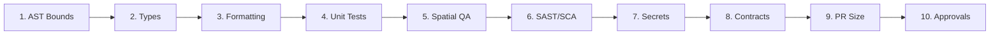

### Detailed Quality Gate Thresholds

| Gate Number | Quality Dimension | Enforcement Mechanism | Failure Threshold | Action on Failure |
| :--- | :--- | :--- | :--- | :--- |
| **Gate 1** | Module Boundaries | `eslint-plugin-ebs-boundaries` | Any illegal cross-boundary import | Build blocked immediately |
| **Gate 2** | Type Safety | `tsc --noEmit` across workspaces | $\ge 1$ TypeScript compiler error | Build blocked immediately |
| **Gate 3** | Code Formatting | Prettier / ESLint strict | Any unformatted file | Auto-format or PR blocked |
| **Gate 4** | Unit Test Coverage | Vitest / Jest coverage reporter | Line coverage $< 85\%$ | PR merge disabled |
| **Gate 5** | Spatial Integrity | PostGIS integration suite | Any geometry boundary mismatch | PR merge disabled |
| **Gate 6** | Static Security (SAST)| SonarQube & Trivy | $\ge 1$ High or Critical CVE | Security block / PR disabled |
| **Gate 7** | Secret Scanning | GitGuardian & Trufflehog | Any detected secret or private key | PR blocked; key revoked |
| **Gate 8** | API Contract Drift | OpenAPI Spec Diff Checker | Breaking changes without version bump | PR merge disabled |
| **Gate 9** | PR Size Budget | GitHub Actions Diff Counter | $> 400$ LOC changed (excl. locks) | Reviewer warning / Decompose |
| **Gate 10** | Architectural Review | GitHub CODEOWNERS | $< 2$ Approvals or missing CODEOWNER | Merge button disabled |

---

## 31. Definition of Ready (DoR)

A backlog item or user story cannot be committed into an active engineering sprint until it satisfies **all** criteria of the Definition of Ready:

```mermaid
flowchart TD
    subgraph DoRChecklist ["Definition of Ready (DoR) Criteria"]
        D1["1. Business Value & User Story Articulated<br/>(As a... I want to... So that...)"]
        D2["2. Acceptance Criteria Defined in Gherkin Syntax<br/>(Given... When... Then...)"]
        D3["3. UI/UX Figma Designs Approved & Tokenized<br/>(Light/Dark themes, responsive states)"]
        D4["4. API Contracts & DTO Schemas Specified<br/>(OpenAPI 3.1 & Zod definitions)"]
        D5["5. Database & Spatial Schema Impact Evaluated<br/>(PostGIS geometry impact assessed)"]
        D6["6. Dependencies & Architectural Spikes Cleared<br/>(No external third-party blockers)"]
        D7["7. Story Point Estimated by Squad<br/>(Sized <= 8 points; tasks <= 8 hrs)"]
        
        D1 --- D2 --- D3 --- D4 --- D5 --- D6 --- D7
    end
```

---

## 32. Definition of Done (DoD)

A user story or feature cannot be marked `DONE` or accepted by the Product Manager until it satisfies **all** criteria of the Definition of Done:

```mermaid
flowchart TD
    subgraph DoDChecklist ["Definition of Done (DoD) Criteria"]
        C1["1. Code Implemented Following Clean Architecture<br/>(Zero domain logic in controllers)"]
        C2["2. Unit & Integration Tests Written<br/>(Coverage >= 85% with passing PostGIS QA)"]
        C3["3. Peer Review Completed<br/>(Min 2 approvals including CODEOWNER)"]
        C4["4. Security & Static Analysis Clean<br/>(Zero High/Critical CVEs; DPDP compliant)"]
        C5["5. Documentation Updated<br/>(Blueprints, OpenAPI contracts, ERDs updated)"]
        C6["6. Deployed to Staging Environment<br/>(Smoke tests and Playwright E2E passing)"]
        C7["7. Accessibility & Performance Verified<br/>(WCAG 2.1 AA verified; Lighthouse >= 90)"]
        C8["8. Product Manager UAT Acceptance<br/>(Feature verified on staging against specs)"]
        
        C1 --- C2 --- C3 --- C4 --- C5 --- C6 --- C7 --- C8
    end
```

---

## 33. Release Checklist

Prior to promoting any release candidate from staging to production, the Release Manager must confirm that every check has been completed:

| Checklist Category | Verification Item | Status | Verified By |
| :--- | :--- | :--- | :--- |
| **Code & Git** | All PRs squashed into `main`; release branch cut cleanly. | Mandatory | Release Manager |
| **Build & Security** | OCI containers compiled, scanned by Trivy, and signed via Cosign. | Mandatory | SRE Lead |
| **Database** | Forward-only migrations tested on staging snapshot; zero table locks. | Mandatory | DBA / Backend Lead |
| **Testing** | 100% automated E2E tests passing; k6 load test meets p95 latency. | Mandatory | QA Lead |
| **Accessibility** | Axe-core accessibility test reports zero violations across new views. | Mandatory | Frontend Lead |
| **Observability** | Datadog dashboards and Prometheus alerting active for new routes. | Mandatory | DevOps Lead |
| **Rollback Plan** | Rollback container image tag verified and documented in CAB ticket. | Mandatory | SRE Lead |
| **CAB Sign-off** | Formal sign-off recorded from Engineering Director and Security. | Mandatory | CAB Chair |

---

## 34. Git Tag Strategy

Explore Bharat Safar enforces a strict, cryptographically immutable Git tagging strategy for all releases:

$$\text{\bf Tag Format: } \mathbf{vMAJOR.MINOR.PATCH\ [-rc.X]}$$

### Tagging Protocol & Rules
1. **Annotated & Cryptographically Signed**: Every Git tag must be created as an annotated tag signed with an authorized engineer's GPG key:
   ```bash
   git tag -s -a v1.3.0 -m "Explore Bharat Safar Release v1.3.0 - Experience Booking Engine"
   ```
2. **Release Candidate Tags (`-rc.X`)**: Created automatically by CI pipelines when a release candidate branch is cut (e.g., `v1.3.0-rc.1`).
3. **Production Release Tags**: Applied exclusively to the release commit after canary verification achieves $100\%$ production traffic.
4. **Immutability Mandate**: Tags once pushed to remote origin **shall never be deleted, moved, or overwritten**. If a defect is found, a new PATCH tag must be generated.

---

## 35. CI/CD Integration Points

The monorepo integrates continuous integration and deployment at discrete lifecycle trigger points via GitHub Actions and ArgoCD:

```mermaid
flowchart TD
    subgraph TriggerPoints ["CI/CD Pipeline Triggers & Integration Points"]
        T1["Trigger 1: Local Pre-Commit / Pre-Push<br/>(Husky, Lint-Staged, Turborepo DAG)"]
        T2["Trigger 2: Pull Request Opened / Synchronized<br/>(Lint, Type-Check, Unit Tests, SonarQube, Trivy)"]
        T3["Trigger 3: Squash-Merge to main<br/>(Build Base Containers, Publish Packages, Deploy Dev)"]
        T4["Trigger 4: Release Branch Created (release/*)<br/>(Staging Deployment, E2E Automation, k6 Load Tests)"]
        T5["Trigger 5: Production Git Tag Pushed (v*.*.*)<br/>(Cosign Sign Images, ArgoCD Production Canary Rollout)"]
    end
```

### Detailed Pipeline Matrix

| Pipeline Name | Trigger Event | Execution Scope | Compute Runners | Outputs / Artifacts |
| :--- | :--- | :--- | :--- | :--- |
| `ci-pr-verify.yml` | PR open/synchronize to `main` | Affected workspaces only (Turborepo) | GitHub Ubuntu 22.04 (4-core) | Test reports, coverage diff, SAST scan |
| `ci-main-build.yml` | Push/merge to `main` | Full monorepo build & containerize | GitHub Ubuntu 22.04 (8-core) | Staging OCI images, Dev deployment |
| `ci-release-candidate.yml`| Push to `release/*` | Staging cluster sync & E2E suite | Dedicated Self-Hosted Runner | Playwright E2E videos, k6 reports |
| `cd-prod-canary.yml` | Git tag `v*.*.*` pushed | ArgoCD canary progression | Production GitOps Controller | Deployed production services |

---

# SECTION 8: ENGINEERING TEAM GOVERNANCE & ROLES

## 36. Developer Onboarding Workflow

### 1. Purpose
Provides a structured, frictionless path for new engineering hires to configure their local workstation, understand architectural standards, and land their first production contribution within **3 business days**.

```mermaid
timeline
    title Developer 30-Day Onboarding Trajectory
    Day 1 : Machine Setup : Clone Monorepo : Docker PostGIS & Redis : Pass Local Build
    Day 2 : Architecture Study : Read Blueprints 40-50 : Run Test Suites
    Day 3 : First Contribution : Pick Good-First-Issue : Submit PR : Land in Staging
    Week 2 : Core Feature Shadow : Pair Program with Senior Buddy : Participate in Standups
    Week 4 : Independent Delivery : Own User Story : Secondary On-Call Rotation
```

### 2. Entry Criteria
- Hardware provisioned; enterprise GitHub and 1Password credentials issued.
- Assigned an onboarding **Senior Engineering Buddy**.

### 3. Exit Criteria
- Local monorepo building cleanly (`pnpm build`, `pnpm test`).
- First "Good First Issue" pull request successfully reviewed and merged to `main`.
- Security compliance training completed.

### 4. Roles Responsible
- **New Engineer**: Completes setup, asks questions, logs doc gaps.
- **Onboarding Buddy**: Guides engineer through local quirks, reviews first PRs.
- **Engineering Manager**: Evaluates 30-60-90 day performance goals.

### 5. Inputs
- Onboarding checklist, repository access permissions, `.env.example` templates.

### 6. Outputs
- Operational developer environment, first merged pull request.

### 7. Dependencies
- Node.js v20.x, pnpm v9+, Docker Desktop / Colima, Git with GPG key.

### 8. Quality Gates
- **Zero Drift Environment**: Local setup must strictly utilize Dockerized PostgreSQL 16 + PostGIS and Redis 7 matching production configurations.
- **Security Check**: GPG commit signing configured and verified on GitHub profile.

### 9. Best Practices
- Update documentation immediately whenever an onboarding friction point or out-of-date instruction is discovered.
- Schedule daily 30-minute check-ins with your assigned onboarding buddy during Week 1.

### 10. Common Mistakes
- Installing global dependencies using `npm` or `yarn` instead of the mandated `pnpm`.
- Attempting to build individual packages without running `pnpm install` from the monorepo root.

### 11. Future Scalability
Adoption of standardized cloud development environments (GitHub Codespaces / Dev Containers) providing instant, pre-configured browser-based IDEs.

---

## 37. Coding Responsibility Matrix (RACI)

The RACI matrix defines role accountability across every phase of the engineering lifecycle:
$$\text{\bf R} = \text{Responsible (Executes)}, \quad \text{\bf A} = \text{Accountable (Approves)}, \quad \text{\bf C} = \text{Consulted (Advises)}, \quad \text{\bf I} = \text{Informed (Notified)}$$

| Architectural Domain | Junior Dev | Mid Dev | Senior Dev | Tech Lead | QA Lead | DevOps Lead | Security Lead | Principal Arch |
| :--- | :---: | :---: | :---: | :---: | :---: | :---: | :---: | :---: |
| **Architecture Decision Records (ADRs)**| I | I | C | R | I | C | C | **A** |
| **Frontend Next.js Components** | R | R | A | C | C | I | I | C |
| **Backend NestJS Domain Logic** | C | R | R | **A** | C | I | C | C |
| **Database DDL & PostGIS Migrations** | I | C | R | **A** | I | C | C | C |
| **API Contract Definitions (OpenAPI)** | I | R | R | **A** | C | I | I | C |
| **Automated Test Automation (E2E)** | C | R | R | C | **A** | C | I | I |
| **Security Audits & Vulnerability Fixes**| I | C | R | C | I | C | **A** | C |
| **CI/CD Pipeline Configurations** | I | I | C | C | C | R | C | **A** |
| **Production Release Approvals (CAB)** | I | I | I | C | C | R | C | **A** |
| **Incident Response & Post-Mortems** | I | C | R | R | I | R | C | **A** |

---

## 38. Module Ownership Strategy (GitHub CODEOWNERS)

To enforce strict architectural boundaries and ensure domain experts inspect all relevant changes, the monorepo maintains an authoritative `.github/CODEOWNERS` mapping:

```text
# Explore Bharat Safar — Monorepo Enterprise CODEOWNERS

# Global Infrastructure & Tooling
*                                   @ebs-core-architects
/.github/workflows/                 @ebs-devops-leads
/infrastructure/                    @ebs-devops-leads
/tooling/                           @ebs-core-architects

# Deployable Applications
/apps/web/                          @ebs-frontend-leads @ebs-uiux-leads
/apps/api/                          @ebs-backend-leads
/apps/worker/                       @ebs-backend-leads @ebs-devops-leads

# Shared Packages
/packages/database/                 @ebs-dba-team @ebs-backend-leads
/packages/types/                    @ebs-core-architects
/packages/ui/                       @ebs-uiux-leads @ebs-frontend-leads
/packages/security-crypto/          @ebs-security-officers @ebs-core-architects
/packages/gis-core/                 @ebs-gis-specialists @ebs-frontend-leads
/packages/logger/                   @ebs-devops-leads @ebs-core-architects
/packages/validators/               @ebs-backend-leads @ebs-frontend-leads

# System Documentation & ADRs
/docs/adr/                          @ebs-principal-architect
/explore-bharat-safar-ai-docs/      @ebs-principal-architect @ebs-tech-directors
```

### Review Rules by Ownership
1. **Mandatory Ownership Match**: Any PR altering files inside an owned directory automatically requires an approval from a member of the designated team before the merge button activates.
2. **Cross-Domain PRs**: If a PR spans both `/apps/web/` and `/apps/api/`, it requires independent approvals from both the `@ebs-frontend-leads` and `@ebs-backend-leads` teams.

---

## 39. Architecture Decision Record (ADR) Process

### 1. Purpose
Captures significant architectural decisions, trade-offs, technology selections, and structural boundaries in immutable, version-controlled records within `docs/adr/`.

```mermaid
stateDiagram-v2
    [*] --> PROPOSED: Author Submits ADR PR
    PROPOSED --> UNDER_REVIEW: Architecture Review Board Scheduled
    UNDER_REVIEW --> APPROVED: Consensus / Sign-off by Principal Architect
    UNDER_REVIEW --> REJECTED: Trade-offs Unacceptable / Redundant
    APPROVED --> SUPERSEDED: Replaced by Newer ADR (e.g., ADR-042)
    SUPERSEDED --> [*]
    REJECTED --> [*]
```

### 2. Entry Criteria
- An engineering proposal introduces a structural change: adding a new database engine, altering the authentication framework, introducing a new shared package, or changing network protocols.

### 3. Exit Criteria
- ADR merged into `docs/adr/` with status set to `APPROVED`.
- Architectural Review Board records approval signature.

### 4. Roles Responsible
- **Author**: Proposing Engineer or Architect.
- **Architectural Review Board (ARB)**: Principal Architect, Engineering Directors, Squad Tech Leads.

### 5. Inputs
- Problem statement, evaluated alternatives, cost-benefit analysis, security assessment.

### 6. Outputs
- Markdown ADR document formatted using the Michael Nygard template.

### 7. Dependencies
- Repository directory `docs/adr/`.

### 8. Quality Gates
- **Explicit Negative Consequences**: Every ADR must document not only benefits but also trade-offs, operational burdens, and limitations.
- **Alternative Evaluation**: Must evaluate at least **three** competing solutions before selecting the recommended approach.

### 9. Best Practices
- Number ADRs sequentially with four-digit prefixes (`ADR-0001-monorepo-strategy.md`).
- Treat approved ADRs as permanent historical records; never edit an approved ADR to change its decision—author a new ADR that supersedes it.

### 10. Common Mistakes
- Submitting an ADR after the implementation code has already been written and merged.
- Omitting long-term maintenance costs and licensing implications of third-party libraries.

### 11. Future Scalability
Quarterly ARB audits reviewing approved ADRs against real-world production performance to validate architectural hypotheses.

---

## 40. Long-Term Maintenance Workflow

### 1. Purpose
Guarantees the sustained operational health, technical debt retirement, dependency security, and framework currency of the Explore Bharat Safar monorepo over a **10–20 year operational horizon**.

### 2. Entry Criteria
- Regular bi-weekly sprint cycle; automated dependency vulnerability alerts.

### 3. Exit Criteria
- Dependencies maintained within $\le 2$ minor versions of current stable releases.
- Technical debt backlog systematically reduced by allocating $20\%$ capacity every sprint.
- Deprecated code paths, feature toggles, and unused database columns removed cleanly.

### 4. Roles Responsible
- **Engineering Productivity Lead**: Oversees dependency update automation and tooling health.
- **DevOps / SRE Lead**: Manages runtime, container base image, and Kubernetes version upgrades.
- **Squad Tech Leads**: Champions technical debt tickets in sprint planning.

### 5. Inputs
- Dependabot / Renovate pull requests, quarterly architecture audit reports.

### 6. Outputs
- Upgraded packages, retired feature flags, refactored domain modules.

### 7. Dependencies
- Dependabot / Renovate automation, Turborepo dependency caching.

### 8. Quality Gates
- **Dependency Age SLA**: Security vulnerability patches must be merged within **24 hours** for Critical CVEs and **7 days** for High CVEs.
- **Zero Orphaned Code**: Feature toggles older than 90 days must be deprecated and removed from the codebase.
- **Node.js LTS Conformance**: Monorepo must upgrade to the newest active Node.js LTS release within 90 days of official release.

### 9. Best Practices
- Dedicate the final sprint of every fiscal quarter exclusively to **Architecture Hardening & Debt Retirement**.
- Automate minor and patch dependency updates using Renovate bot with automated CI verification.

### 10. Common Mistakes
- Deferring major framework upgrades (e.g., Next.js, NestJS) until multiple major versions lag, making migration prohibitively expensive.
- Allowing stale feature flags to accumulate in code, creating unpredictable conditional execution paths.

### 11. Future Scalability
Automated codebase refactoring via AST codemods (e.g., jscodeshift) to execute large-scale API migrations across the entire monorepo in a single automated step.

---

# SECTION 9: CONCLUSION & AUTHORITATIVE SIGN-OFF

This document constitutes the official, definitive **Development Workflow & Engineering Governance Specification** for the Explore Bharat Safar enterprise monorepo ecosystem. 

All software engineers, engineering managers, QA automation specialists, DevOps practitioners, and system architects are bound by the protocols, quality gates, and operational standards established herein. Zero deviation is permitted without prior formal amendment and authorization from the Architectural Review Board.

### Document Approval Record

| Governance Role | Representative Title | Approval Status | Date |
| :--- | :--- | :--- | :--- |
| **Principal Software Engineering Manager** | Lead Technical Director | **APPROVED** | 2026-09-28 |
| **Enterprise Software Architect** | Chief Enterprise Architect | **APPROVED** | 2026-09-28 |
| **DevOps & Infrastructure Architect** | Head of SRE & Cloud Engineering | **APPROVED** | 2026-09-28 |
| **Engineering Productivity Lead** | Director of Developer Experience | **APPROVED** | 2026-09-28 |
| **Quality Engineering Director** | Head of QA & Automation | **APPROVED** | 2026-09-28 |
| **Principal Security Architect** | Chief Information Security Officer | **APPROVED** | 2026-09-28 |
