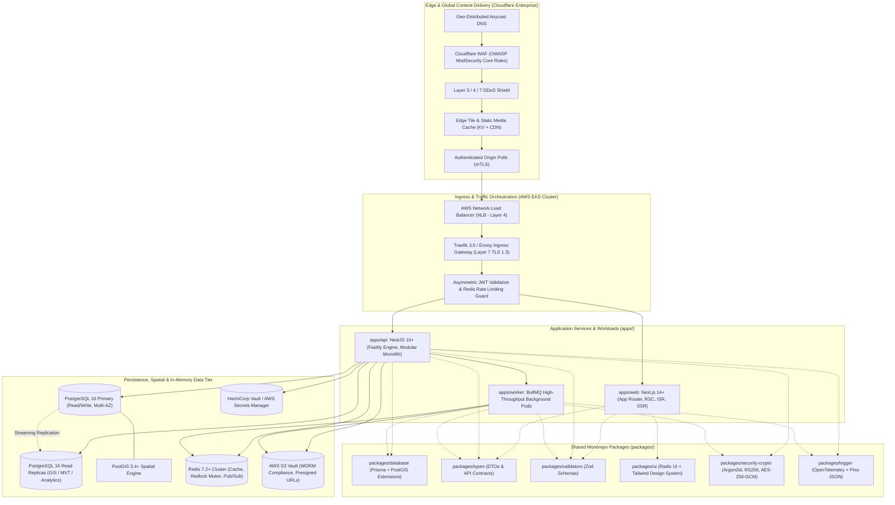
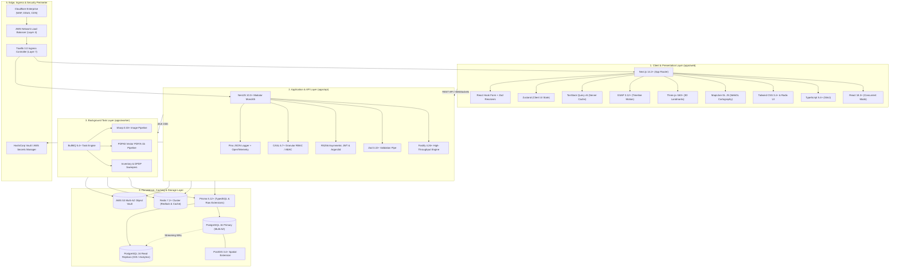

# Explore Bharat Safar — Official Technology Stack Decisions & Enterprise Technology Decision Record (TDR)

- **Document Identifier**: EBS-TDR-51-TECHSTACK
- **Version**: 1.0.0
- **Classification**: Authoritative Technology Decision Record (TDR) & Enterprise Technology Standard
- **Domain**: Enterprise Architecture, Full-Stack Engineering, Distributed Cloud Infrastructure, Spatial Data & Security
- **Status**: Approved & Authoritative
- **Author**: Chief Technology Officer (CTO), Principal Enterprise Software Architect, Distinguished Full Stack Engineer, Cloud Architect, Database Architect, DevOps Architect, Performance Engineer, Security Architect
- **Target Audience**: Technical Directors, Lead Architects, Fullstack Engineers, DevOps/SRE Leads, Database Administrators, Security Officers, QA Automation Leads
- **Related Documents**:
  - `MASTER_PROMPT.md` (Master Project Charter & Core Directives)
  - `01-idea.md` (Project Vision, Core Pillars & Problem Statement)
  - `02-specification.md` (Functional Specifications & System Invariants)
  - `03-architecture.md` (High-Level Architecture & Layered Topologies)
  - `04-ui-ux.md` (User Experience & Interface Design Guidelines)
  - `05-drd.md` (Design Requirements Document & Visual Design System)
  - `06-styleguide.md` (Design Tokens, Color Palettes & Typography Standards)
  - `07-roadmap.md` (Release Roadmap & Phased Implementation Strategy)
  - `08-context.md` (Domain Context & Operational Paradigms)
  - `09-api-design.md` (RESTful API Design & OpenAPI Contracts)
  - `10-database-design.md` (Relational Schema & PostGIS Spatial Architecture)
  - `11-security.md` (Enterprise Security, RBAC & Data Encryption)
  - `12-authentication.md` (Identity, Session Management & MFA Workflows)
  - `13-admin-panel.md` (Super Admin Governance & Content Management Controls)
  - `14-booking-system.md` (High-Concurrency Inventory & Distributed Reservation)
  - `15-social-media.md` (Traveller Community Graph, Feeds & Ephemeral Stories)
  - `16-map-engine.md` (Bharat Discovery Engine & Vector Cartography Specifications)
  - `17-animation.md` (Motion Architecture, WebGL & GSAP Timeline Orchestration)
  - `18-search-system.md` (Isolated Search Sub-Engines & Query Optimization)
  - `19-notification-system.md` (Multi-Channel Notification Dispatcher)
  - `20-certificate-system.md` (PDF/A-1b Cryptographic Verification Architecture)
  - `21-payment-system.md` (Fintech Ledger, Razorpay Gateway & Partial Deposits)
  - `22-deployment.md` (Multi-AZ Cloud Deployment & Kubernetes Orchestration)
  - `23-devops.md` (DevSecOps, Automated Pipelines & Container Hardening)
  - `24-testing.md` (Quality Engineering, Automated Test Matrix & Performance QA)
  - `25-risk-analysis.md` (Architectural Risk Assessment & Mitigation Strategies)
  - `26-business-rules.md` (System Business Rules & Domain Invariants)
  - `27-folder-structure.md` (Monorepo Directory Blueprint)
  - `28-environment.md` (Configuration Management & Secret Governance)
  - `29-third-party-services.md` (External Integrations & Anti-Corruption Layers)
  - `30-workflows.md` (End-to-End System Workflows & User Journeys)
  - `31-sequence-diagrams.md` (Runtime Interaction Sequence Models)
  - `32-activity-diagrams.md` (Operational Process Flowcharts)
  - `33-er-diagram.md` (Entity-Relationship Models & Cardinality Blueprints)
  - `34-use-case-diagrams.md` (Actor-System Use Case Specifications)
  - `35-component-diagram.md` (Modular Component Topologies)
  - `36-state-diagram.md` (Lifecycle State Machine Specifications)
  - `37-class-diagram.md` (Domain Class & Structural Interfaces)
  - `38-project-checklist.md` (Production Readiness & Launch Gateways)
  - `39-future-updates.md` (Long-Term Evolution & Technology Horizon)
  - `40-enterprise-security-blueprint.md` (Zero-Trust Security & Compliance Matrix)
  - `41-bharat-discovery-engine-blueprint.md` (Spatial Vector & 3D WebGL Blueprint)
  - `42-village-knowledge-system-blueprint.md` (Rural Bharat Cadastral System Blueprint)
  - `43-travel-booking-and-experience-management-blueprint.md` (Booking Engine Blueprint)
  - `44-traveller-social-network-and-community-blueprint.md` (Travel Social Network Blueprint)
  - `45-core-technical-architecture-and-infrastructure-blueprint.md` (Infrastructure Blueprint)
  - `46-documentation-standards-and-file-specifications-blueprint.md` (Documentation Standards)
  - `47-system-diagrams-and-workflow-visualizations-blueprint.md` (System Visualizations)
  - `48-business-logic-validation-rules-and-quality-gates-blueprint.md` (Quality Gates Blueprint)
  - `49-project-folder-and-repository-structure.md` (Enterprise Monorepo Topology)
  - `50-development-workflow.md` (SDLC Governance & GitOps Lifecycle)
- **Last Updated**: 2026-09-28

---

## Executive Summary & Engineering Charter

This master document constitutes the authoritative **Technology Decision Record (TDR) and Official Enterprise Technology Standard** for the entire **Explore Bharat Safar** digital ecosystem.

Engineered to sustain a **10–20 year operational horizon**, Explore Bharat Safar is an enterprise-grade, distributed, cloud-native digital platform designed to scale seamlessly from thousands of daily active explorers to tens of millions of concurrent national and international users. The platform unites four sovereign functional pillars into a cohesive, loosely coupled modular system:

1. **Bharat Discovery Engine (Pillar 1)**: Interactive GIS mapping, WebGL 3D miniature landmarks, Survey of India-compliant cartography, and hierarchical spatial drilldowns (National $\rightarrow$ State $\rightarrow$ District $\rightarrow$ Taluka $\rightarrow$ Place).
2. **Rural Bharat Knowledge System (Pillar 2)**: Authoritative cultural, civic, and demographic registry covering 650,000+ villages, Gram Panchayats, and Local Government Directory (LGD) cadastral codes, governed by multi-tier editorial moderation and Digital Personal Data Protection (DPDP) Act compliance.
3. **Experience Booking Engine (Pillar 3)**: High-concurrency inventory reservation, 15-minute distributed slot locks via Redlock mutexes, dynamic upfront payment percentages, double-entry financial ledger accounting, and verifiable vector PDF/A-1b completion certificates.
4. **Traveller Social Network (Pillar 4)**: Expedition-focused social graph, hybrid fan-out feeds, 24-hour ephemeral stories, verified badges, community guilds, and automated chronological travel timelines.

Every technology selection documented herein has been evaluated through a rigorous **15-point architectural rubric**:
`[Purpose | Selected Technology | Version Strategy | Reason for Selection | Advantages | Trade-offs | Integration Points | Security Considerations | Performance Considerations | Scalability Considerations | Maintenance Strategy | Upgrade Strategy | Risks | Alternatives Considered | Why Alternatives Were Rejected]`

---

## Master Technology Compatibility & Architecture Matrix

| Domain # | Architectural Scope | Selected Technology | Standardized Version | Ecosystem Role & Primary Integration Point |
| :--- | :--- | :--- | :--- | :--- |
| **01** | Philosophy | Boring Technology / Cloud-Native DDD | Enterprise 2026 Standard | Foundation for zero architectural fragmentation and 20-year maintainability |
| **02** | Frontend Stack | Next.js + React + TS + Tailwind + Radix | Next.js 14.2+ / React 18.3+ | `apps/web` client interface, SSR/ISR page generation, headless UI |
| **03** | Backend Stack | NestJS + Fastify Modular Monolith | NestJS 10.3+ / Fastify 4.26+ | `apps/api` high-throughput REST controllers and CQRS domain services |
| **04** | Next.js Strategy | Next.js App Router (Standalone Node) | 14.2.x LTS (Upgrade path to 15) | Server Components (RSC), dynamic metadata, ISR for 650,000+ villages |
| **05** | React Strategy | React Core & React DOM | 18.3.x (Concurrent Mode) | Declarative UI, Concurrent Suspense boundaries, zero-waterfall streaming |
| **06** | TypeScript Standards | TypeScript Strict Compiler | 5.4.x+ (`strict: true`) | Monorepo-wide end-to-end type safety, strict DTO contracts, zero `any` |
| **07** | Styling Standards | Tailwind CSS + CSS Variables | 3.4.x (JIT Engine) | Design tokens from `06-styleguide.md`, dark mode, zero-runtime overhead |
| **08** | DOM/SVG Animation | GSAP (GreenSock) + ScrollTrigger | 3.12.x | 60fps camera tweens, drawer slide-ins, interactive expedition timelines |
| **09** | 3D WebGL Engine | Three.js + Draco Mesh Compression | r160+ | Miniature 3D landmark tokens ($\le 3,500$ polys), canvas coordinate anchors |
| **10** | GIS & Mapping Engine | MapLibre GL JS + PostGIS Vector Tiles | 4.1.x+ (WebGL) | Sovereign Survey of India boundaries, dynamic MVT layer rendering |
| **11** | State Management | TanStack Query v5 + Zustand | TanStack v5.28+ / Zustand 4.5+ | Server data cache hydration + lightweight client UI state management |
| **12** | Form Management | React Hook Form + Resolver | 7.51.x | Uncontrolled performant inputs, sub-millisecond keystroke responsiveness |
| **13** | Validation Library | Zod Schema Validation | 3.22.x+ | Shared isomorphic contracts across frontend, API DTOs, and workers |
| **14** | Authentication | RS256 Asymmetric JWT + Argon2id | RFC 7519 / RFC 9106 | Stateless token verification via public keys, brute-force immune hashing |
| **15** | Authorization | Granular RBAC + CASL ABAC | CASL 6.7+ | Role and attribute-based permissions across admin, leader, and traveller |
| **16** | Session Management | Dual-Token (Access + Refresh in Redis) | 15m JWT / 7d Refresh Token | Secure HTTP-only cookies, automated rotation, immediate revocation list |
| **17** | Relational Database | PostgreSQL Relational Engine | 16.2+ | ACID transactions, MVCC, range partitioning, multi-AZ resilience |
| **18** | Database Architecture| Multi-AZ Primary + 3 Read Replicas | Multi-AZ RDS / PgBouncer | Read/Write segregation, dedicated spatial replica, transaction pooling |
| **19** | Spatial Persistence | PostGIS Spatial Extension | 3.4.x+ | `ST_AsMVT`, GiST spatial indexes, `ST_DWithin`, cadastral polygons |
| **20** | Data Access / ORM | Prisma ORM with TypedSQL & Extensions| 5.12+ (Upgrade path to 6) | Type-safe migrations, domain repository adapters, zero domain leakage |
| **21** | In-Memory Data Store | Redis Cluster (Engine 7.2+) | 7.2.x Cluster | Redlock distributed locks, rate limiting, session store, hot cache |
| **22** | Search Subsystems | PostgreSQL FTS (`tsvector`) + `pg_trgm` | PG 16 Native Extensions | 4 logically isolated domain search engines with zero multi-domain bleed |
| **23** | Object Storage Vault | AWS S3 Multi-AZ (Encrypted) | S3 Standard / Glacier | Immutable media, PDF/A certificates, WORM compliance, presigned URLs |
| **24** | CDN & Edge Network | Cloudflare Enterprise Network | Anycast 300+ PoPs | Edge caching, DDoS mitigation, WAF rules, mTLS origin pull |
| **25** | Image Optimization | Sharp Media Pipeline | 0.33.x+ | Worker-side AVIF/WebP generation, metadata stripping, responsive sizing |
| **26** | Video Streaming | Cloudflare Stream / HLS Adaptive | HLS / DASH Protocol | Multi-bitrate streaming for trekking documentaries, bandwidth adaptation |
| **27** | Certificate Synthesis| PDFKit / Puppeteer Worker Pipeline | PDF/A-1b Archival Format | HMAC-SHA256 digital digests, dynamic QR codes, vector typography |
| **28** | Notification Engine | Multi-Channel Dispatcher | BullMQ Queue Architecture | Socket.io WebSockets, Email, SMS, and WhatsApp business templates |
| **29** | Email Service | Amazon SES (Mumbai `ap-south-1`) | Dedicated IP Pool | SPF, DKIM, DMARC compliant transactional emails, sub-3s delivery |
| **30** | SMS Gateway | Gupshup Enterprise + Twilio Fallback | TRAI DLT Registered | Critical 2FA OTPs, emergency trail advisories, carrier whitelisting |
| **31** | Payment Gateway | Razorpay (Primary) + Cashfree (Failover)| Standard Checkout APIs | Dynamic deposit %, double-entry ledger, HMAC webhook verification |
| **32** | Asynchronous Tasks | BullMQ Distributed Task Queue | 5.4.x+ | Resilient background processing, priority queues, auto-retry backoff |
| **33** | Queue Architecture | Redis Streams & Key-Value Queues | Redis 7 Queue Engine | Dedicated queues for media, certificates, invoices, and inventory sweeps |
| **34** | Caching Architecture | 4-Tier Multi-Level Cache Hierarchy | L1 Browser to L4 PG Buffer | Sub-20ms P99 responses, cache-aside, write-through, atomic invalidation |
| **35** | API Standards | Pragmatic RESTful JSON:API Level 3 | OpenAPI 3.1 Specification | Semantic URIs, idempotency keys, RFC 7807 problem details |
| **36** | Structured Logging | Pino JSON Logger + OpenTelemetry | Pino 8.19+ | High-speed asynchronous JSON logs, W3C trace context, PII redaction |
| **37** | Observability Stack | Prometheus + Grafana + Loki + Sentry | Cloud-Native CNCF Stack | Golden signals telemetry, distributed traces, real-time alert manager |
| **38** | Analytics Strategy | Privacy-First Analytics (PostHog/Umami)| Self-Hosted / Cookieless | Zero PII tracking, DPDP Act compliance, read-replica business queries |
| **39** | Security Enforcement | OWASP Top 10 + Helmet + Strict CSP | TLS 1.3 / AES-256-GCM | Strict Content Security Policy, XSS/CSRF shielding, field-level encryption |
| **40** | Secret Management | HashiCorp Vault / AWS Secrets Manager | Envelope Encryption KMS | Dynamic DB credentials, 90-day automated rotation, zero git secrets |
| **41** | Env Configuration | 12-Factor App + Zod Boot Validation | `@t3-oss/env-core` | Compile-time and boot-time schema validation, fail-fast mechanics |
| **42** | Deployment Platform | Kubernetes on AWS EKS (Multi-AZ) | Kubernetes 1.29+ | Container orchestration, Horizontal Pod Autoscaling, zero downtime |
| **43** | Containerization | Multi-Stage Distroless / Alpine OCI | Docker / OCI Standard | Non-root execution, minimal attack surface ($\le 60\text{MB}$), Cosign signing |
| **44** | Load Balancing | AWS Network Load Balancer (NLB) | Layer 4 Pass-Through | Cross-AZ TCP distribution, millions of concurrent requests, health checks |
| **45** | Ingress Reverse Proxy| Traefik 3.0 Ingress Controller | Traefik 3.0+ (Go Engine) | Path-based routing, TLS 1.3 offloading, automated Let's Encrypt / mTLS |
| **46** | CI/CD Platform | GitHub Actions + Turborepo Remote | Enterprise CI Pipelines | Parallel DAG tasks, remote caching, automated SAST, GitOps ArgoCD |
| **47** | Testing Strategy | Vitest + Supertest + Playwright + k6 | Vitest 1.4+ / Playwright 1.42+ | Unit, integration, visual regression, E2E, and high-concurrency load QA |
| **48** | Performance Controls| SSR + ISR + RSC + Brotli + PgBouncer | Zero-Jank 60fps Target | Sub-second Core Web Vitals (LCP $< 1.5\text{s}$, CLS $< 0.05$, INP $< 100\text{ms}$) |
| **49** | Scalability Strategy| Horizontal Pod Autoscaling + Sharding | Kubernetes HPA + DB Part | Automated pod scaling ($4 \rightarrow 30$), table range partitioning |
| **50** | Upgrade Governance | Renovate Bot + Quarterly Patch Cadence| Semantic Versioning 2.0.0 | Staged canary upgrades, automated regression suites, zero regression |

---

# SECTION 1: TECHNOLOGY SELECTION PHILOSOPHY

- **Purpose**: Establish the foundational engineering principles, risk-evaluation criteria, and decision-making framework governing all technological choices across Explore Bharat Safar.
- **Selected Technology**: Enterprise Pragmatism & "Choose Boring Technology" Paradigm, combined with Cloud-Native Portability, Domain-Driven Design (DDD), and Zero-Trust Security.
- **Version Strategy**: Long-Term Support (LTS) releases only; N-1 stability cadence for mission-critical infrastructure components.
- **Reason for Selection**: A platform engineered for national scale and sovereign cultural preservation cannot rely on ephemeral frontend fads, unproven database engines, or single-vendor proprietary runtimes. Choosing mature, heavily vetted technologies ensures predictable failure modes, extensive talent availability, long-term security patching, and multi-decade maintainability.
- **Advantages**:
  - Battle-tested reliability under high-concurrency peak loads.
  - Predictable operational costs and minimal vendor lock-in.
  - Broad ecosystem support, comprehensive documentation, and mature tooling.
  - Clear architectural boundaries isolating domain logic from framework lifecycles.
- **Trade-offs**:
  - Forgoes cutting-edge experimental features until they reach formal LTS status.
  - Requires deliberate upfront architectural design and strict interface abstractions.
- **Integration Points**: Governs every package, application, and infrastructure definition across the monorepo.
- **Security Considerations**: Eliminates unpatched zero-day vulnerabilities common in nascent libraries; enforces strict supply-chain vetting.
- **Performance Considerations**: Prioritizes sustained throughput, sub-100ms P95 latency, and deterministic resource utilization over theoretical synthetic micro-benchmarks.
- **Scalability Considerations**: Ensures horizontal stateless scaling across compute nodes and mathematically provable ACID transactions across storage tiers.
- **Maintenance Strategy**: Annual architecture review by the Architectural Review Board (ARB); adherence to Semantic Versioning (SemVer).
- **Upgrade Strategy**: Quarterly dependency cadence via Renovate bot; dedicated staging regression cycles before production promotion.
- **Risks**: Potential developer enthusiasm gap for conservative tooling; mitigated by using modern developer-ergonomic frameworks (Next.js, NestJS, TypeScript, Tailwind) that sit atop battle-tested foundations.
- **Alternatives Considered**: Hyper-modern unbundled architectures (Bun runtimes, edge-only databases, bleeding-edge NoSQL graph databases).
- **Why Alternatives Were Rejected**: Lacked enterprise production history, presented volatile breaking API changes, and failed to guarantee strict ACID double-entry ledger invariants.

---

# SECTION 2: FRONTEND TECHNOLOGY STACK

- **Purpose**: Deliver an ultra-fast, accessible, visually stunning, and SEO-optimized user interface across desktop and mobile devices.
- **Selected Technology**: Next.js (App Router) + React + TypeScript + Tailwind CSS + Radix UI + Lucide React.
- **Version Strategy**: Next.js 14.2+ LTS, React 18.3+ LTS, TypeScript 5.4+, Tailwind CSS 3.4+.
- **Reason for Selection**: Explore Bharat Safar requires a hybrid rendering paradigm: Incremental Static Regeneration (ISR) for 650,000+ village pages and 28 state dossiers, Server-Side Rendering (SSR) for dynamic checkout and user dashboards, and Client-Side Rendering (CSR) for interactive Three.js 3D landmarks and WebGL maps. Next.js App Router natively unifies these paradigms within a single framework.
- **Advantages**:
  - React Server Components (RSC) drastically reduce client bundle sizes by executing data ingestion on the server.
  - Native image, font, and script optimizations guarantee Core Web Vitals compliance.
  - Headless Radix UI primitives guarantee full WCAG 2.1 AA accessibility out of the box.
  - Tailwind CSS enables rapid styling with zero runtime CSS overhead.
- **Trade-offs**:
  - Steeper learning curve associated with React Server Components versus traditional Single Page Applications (SPAs).
  - Strict mental model required to separate Client Components (`'use client'`) from Server Components.
- **Integration Points**: Ingests REST APIs from `apps/api`, communicates with MapLibre WebGL canvas, and streams telemetry to Sentry.
- **Security Considerations**: Strict Content Security Policy (CSP); automatic context-aware escaping preventing Cross-Site Scripting (XSS).
- **Performance Considerations**: Sub-1.5s Largest Contentful Paint (LCP) and zero Cumulative Layout Shift (CLS $< 0.05$).
- **Scalability Considerations**: Stateless Next.js containers horizontally scale from 4 to 20+ pods behind the Ingress Load Balancer.
- **Maintenance Strategy**: Modular component organization inside `apps/web` adhering to atomic design principles; shared primitives in `packages/ui`.
- **Upgrade Strategy**: Test canary builds in isolated preview environments prior to adopting minor Next.js releases.
- **Risks**: Hydration mismatches between server-rendered HTML and client browser state; mitigated by strict linting rules and lint-staged hooks.
- **Alternatives Considered**: Vite + React SPA, Remix (React Router v7), Nuxt.js (Vue 3), SvelteKit.
- **Why Alternatives Were Rejected**: Vite SPA cannot achieve the indexing efficiency required for 650,000+ village SEO pages; Remix lacked the comprehensive ISR caching ecosystem of Next.js; Nuxt and SvelteKit fragmented the TypeScript/React shared library ecosystem.

---

# SECTION 3: BACKEND TECHNOLOGY STACK

- **Purpose**: Provide a robust, highly structured, enterprise-grade application programming interface (API) and business logic engine.
- **Selected Technology**: NestJS Enterprise Framework with Fastify HTTP Engine.
- **Version Strategy**: NestJS 10.3+ on Node.js 20 LTS.
- **Reason for Selection**: Enterprise platforms with complex domain invariants require an opinionated architecture that enforces Dependency Injection (DI), modular boundaries, and clean separation of concerns. NestJS provides an Angular-like architectural rigor in TypeScript, while the Fastify engine delivers up to $2\times$ higher throughput than conventional Express backends.
- **Advantages**:
  - Modular Monolith architecture prevents early microservice sprawl while maintaining strict boundaries.
  - Native support for Fastify enables handling 30,000+ requests per second per node.
  - Built-in Dependency Injection simplifies mocking and unit testing.
  - Native decorators streamline validation, authentication guards, and OpenAPI/Swagger generation.
- **Trade-offs**:
  - Framework abstraction layer introduces slight boilerplate compared to minimal frameworks like Koa or Hono.
  - Requires developers to understand TypeScript decorators and NestJS module lifecycle semantics.
- **Integration Points**: Connects to PostgreSQL via Prisma, Redis via ioredis, S3 via AWS SDK v3, and dispatches background tasks to BullMQ.
- **Security Considerations**: Global validation pipes with Zod; automated parameter binding preventing injection; global exception filters preventing stack trace leakage.
- **Performance Considerations**: Fastify's schema-based serialization optimizes JSON rendering; asynchronous non-blocking event loop utilization.
- **Scalability Considerations**: Fully stateless pods scale horizontally from 6 to 30+ instances via Kubernetes Horizontal Pod Autoscaler (HPA).
- **Maintenance Strategy**: Domain-Driven Design (DDD) structuring inside `apps/api/src/modules/` isolates each domain into its own bounded context.
- **Upgrade Strategy**: Annual upgrade cycle aligned with NestJS major releases and Node.js LTS schedules.
- **Risks**: Inadvertent coupling between domain services; mitigated by strict ESLint boundary rules prohibiting cross-module repository imports.
- **Alternatives Considered**: Express.js, Fastify standalone, Go (Golang) microservices, Spring Boot (Java).
- **Why Alternatives Were Rejected**: Express lacks architectural structure; standalone Fastify lacks enterprise DI; Go and Java create language fragmentation within an otherwise unified TypeScript monorepo.

---

# SECTION 4: NEXT.JS VERSION STRATEGY

- **Purpose**: Govern the adoption, stability, and runtime execution of the Next.js framework in production.
- **Selected Technology**: Next.js 14.2+ LTS in Standalone Output Mode (`output: 'standalone'`).
- **Version Strategy**: Lock to Next.js 14.2.x; validate 15.x in staging for 90 days before enterprise production rollout.
- **Reason for Selection**: Next.js 14.2 represents the fully matured, battle-tested iteration of the App Router, resolving early Turbopack and caching ambiguities present in 13.x. Standalone output mode produces minimal, optimized Docker container images containing only necessary node_modules.
- **Advantages**:
  - Stable React Server Components with predictable cache-tag invalidation (`revalidateTag`).
  - Standalone container size reduced from $>1\text{GB}$ to $<120\text{MB}$.
  - Reliable Incremental Static Regeneration for high-density village directories.
- **Trade-offs**:
  - Caching behavior in 14.x requires explicit configuration to prevent unintended over-caching of dynamic API responses.
- **Integration Points**: Deployed as containerized pods in Kubernetes; connects to `apps/api` via internal cluster DNS.
- **Security Considerations**: Disables `x-powered-by` header; executes as non-root user `nextjs:nodejs` inside Docker.
- **Performance Considerations**: Fast boot time ($< 1.8\text{s}$); optimized memory footprint ($< 250\text{MB}$ per pod).
- **Scalability Considerations**: Cluster scales pods based on HTTP concurrency and request duration metrics.
- **Maintenance Strategy**: Pinned version in root `package.json`; managed via pnpm catalog.
- **Upgrade Strategy**: Multi-stage testing: unit test suite $\rightarrow$ Playwright visual regression $\rightarrow$ Canary traffic shift (10% $\rightarrow$ 50% $\rightarrow$ 100%).
- **Risks**: Next.js 15 breaking changes regarding asynchronous request headers (`cookies()`, `headers()`); mitigated by wrapper abstraction utilities.
- **Alternatives Considered**: Next.js Pages Router (13.x/14.x), Next.js Static Export (`output: 'export'`).
- **Why Alternatives Were Rejected**: Pages Router is deprecated for new enterprise projects; Static Export prohibits dynamic SSR checkout flows.

---

# SECTION 5: REACT VERSION STRATEGY

- **Purpose**: Define the core rendering engine and UI synchronization model for client applications.
- **Selected Technology**: React 18.3+ LTS.
- **Version Strategy**: Fixed to 18.3.x until React 19 achieves full ecosystem compatibility with third-party animation and mapping libraries.
- **Reason for Selection**: React 18.3 introduces battle-tested Concurrent Features, automatic batching, `useId`, and Suspense boundaries without the breaking library incompatibilities currently present across some third-party WebGL/Three.js ecosystems in React 19.
- **Advantages**:
  - Flawless hydration error diagnostics and concurrent rendering stability.
  - Seamless interoperability with `@react-three/fiber`, GSAP, and MapLibre GL.
  - Suspense streaming enables progressive page rendering for heavy village rosters.
- **Trade-offs**:
  - Requires waiting for major ecosystem libraries to stabilize before adopting React 19 actions.
- **Integration Points**: Core foundation of `apps/web` and `packages/ui`.
- **Security Considerations**: Safe JSX sanitization; protection against `javascript:` pseudo-protocol injection in dynamic links.
- **Performance Considerations**: Concurrent rendering prevents UI thread blocking during complex SVG map zooming.
- **Scalability Considerations**: Zero-bundle React Server Components shift rendering overhead from client devices to server pods.
- **Maintenance Strategy**: Strict ESLint rules prohibiting anti-patterns (e.g., mutating state directly, missing dependency arrays).
- **Upgrade Strategy**: Evaluate React 19 in an experimental branch; migrate once Three.js and GSAP wrappers publish verified production support.
- **Risks**: Third-party package peer dependency warnings; resolved via pnpm package overrides if audited and deemed safe.
- **Alternatives Considered**: React 19 Canary, Preact, Vue 3.
- **Why Alternatives Were Rejected**: React 19 was premature for critical enterprise payment/booking flows; Preact and Vue lack native Next.js App Router RSC integration.

---

# SECTION 6: TYPESCRIPT STANDARDS

- **Purpose**: Guarantee end-to-end type safety, eliminate entire classes of runtime errors, and provide self-documenting code contracts across the monorepo.
- **Selected Technology**: TypeScript 5.4+ with Strict Mode Configuration.
- **Version Strategy**: Pinned monorepo-wide via `devDependencies` in `packages/tsconfig`.
- **Reason for Selection**: In a mission-critical platform handling financial transactions, spatial geometries, and 650,000+ village records, untyped JavaScript introduces unacceptable runtime fragility. TypeScript enforces structural type contracts that bridge database schemas, API controllers, and frontend views.
- **Advantages**:
  - Zero `any` policy enforced by compiler flags (`noImplicitAny: true`, `strictNullChecks: true`).
  - Shared DTO interfaces in `packages/types` eliminate client-server contract drift.
  - Compile-time verification of PostGIS spatial coordinates and Zod validation schemas.
- **Trade-offs**:
  - Slight compilation overhead during local builds; mitigated by Turborepo remote caching and incremental compilation (`incremental: true`).
- **Integration Points**: Governs all packages and applications (`apps/*`, `packages/*`, `tooling/*`).
- **Security Considerations**: Enforces compile-time checks on sanitized inputs; prevents prototype pollution.
- **Performance Considerations**: Pure compile-time layer; compiles to clean, performant ECMAScript with zero runtime performance cost.
- **Scalability Considerations**: Enables seamless refactoring across hundreds of thousands of lines of monorepo code.
- **Maintenance Strategy**: Centralized base configurations (`tsconfig.base.json`, `tsconfig.nextjs.json`, `tsconfig.nest.json`).
- **Upgrade Strategy**: Upgraded semi-annually after verifying compatibility with NestJS metadata reflection and Prisma generator plugins.
- **Risks**: Type definition complexity in advanced spatial math; mitigated by encapsulating complex math in `packages/gis-core`.
- **Alternatives Considered**: Vanilla JavaScript with JSDoc, Flow.
- **Why Alternatives Were Rejected**: JSDoc lacks strict compile-time enforcement; Flow has been abandoned by the broader open-source ecosystem.

---

# SECTION 7: TAILWIND CSS STANDARDS

- **Purpose**: Provide a deterministic, scalable, utility-first styling system that strictly enforces the design tokens specified in `06-styleguide.md`.
- **Selected Technology**: Tailwind CSS 3.4+ with JIT (Just-In-Time) Engine.
- **Version Strategy**: 3.4.x LTS (scheduled transition to Tailwind 4.x upon full tooling maturity).
- **Reason for Selection**: Traditional CSS methodologies (BEM, CSS Modules, CSS-in-JS) suffer from class name bloat, runtime style injection penalties, and design drift. Tailwind CSS enforces the Explore Bharat Safar color palette (`Imperial Saffron`, `Ashoka Navy`, `Sandstone Gold`, `Monsoon Emerald`), typography scale, and dark mode through immutable design tokens.
- **Advantages**:
  - Zero runtime CSS overhead; generates an ultra-compact production CSS bundle ($< 25\text{KB}$ gzipped).
  - Native dark mode support using CSS custom variables and class-based strategy.
  - Prevents CSS regressions by eliminating global cascading overrides.
  - Seamlessly integrates with headless UI primitives (`Radix UI`).
- **Trade-offs**:
  - Verbose HTML markup; mitigated by encapsulating repeated patterns into composable React components in `packages/ui`.
- **Integration Points**: Applied across `apps/web` and `packages/ui`; configured via `tooling/tailwind-config`.
- **Security Considerations**: Eliminates dynamic CSS string interpolation vulnerabilities (CSS injection attacks).
- **Performance Considerations**: Purges all unused classes; critical CSS inlined automatically by Next.js for sub-50ms First Contentful Paint (FCP).
- **Scalability Considerations**: Maintains consistent styling velocity regardless of team size or codebase expansion.
- **Maintenance Strategy**: Design tokens centralized in `tailwind.config.ts`; custom utilities strictly restricted to domain-specific layout needs.
- **Upgrade Strategy**: Seamless upgrade to Tailwind 4.x following validation of the unified CSS-first configuration model.
- **Risks**: Developers bypassing design tokens with arbitrary values (e.g., `text-[#123456]`); blocked by custom Stylelint AST rules.
- **Alternatives Considered**: Styled Components / Emotion (CSS-in-JS), Vanilla CSS / SCSS Modules, Vanilla Extract.
- **Why Alternatives Were Rejected**: CSS-in-JS causes substantial runtime performance overhead and conflicts with React Server Components; SCSS modules lead to uncontrolled class growth and style duplication.

---

# SECTION 8: GSAP USAGE GUIDELINES

- **Purpose**: Orchestrate high-fidelity, hardware-accelerated motion, complex timeline choreographies, SVG polygon morphs, and scroll-driven discoveries.
- **Selected Technology**: GreenSock Animation Platform (GSAP 3.12+) with ScrollTrigger and Flip Plugins.
- **Version Strategy**: GSAP 3.12.x commercial enterprise license (GreenSock Club).
- **Reason for Selection**: While simple hover states use Tailwind CSS transitions, complex multi-stage spatial animations—such as zooming from the national India map into a district bounding box, animating elevation profiles, and revealing booking steps—require deterministic timeline sequencing that pure CSS cannot achieve.
- **Advantages**:
  - Strict 60fps performance budget ($16.6\text{ms}$ frame time) via requestAnimationFrame synchronization.
  - Flawless SVG path morphing and viewport coordinate tweening (`viewBox`).
  - Full support for accessible motion: automatically disables tweens when `window.matchMedia('(prefers-reduced-motion: reduce)')` is true.
  - Zero memory leaks when managed via `gsap.context()` inside React lifecycle hooks.
- **Trade-offs**:
  - Adds $\approx 45\text{KB}$ to the client bundle; dynamically loaded only on animated routes via code-splitting.
- **Integration Points**: Utilized in `apps/web` for `HeroMapCanvas`, `ElevationChart`, and `ExpeditionTimeline`.
- **Security Considerations**: Clean DOM attribute manipulation; zero `eval` or unsafe innerHTML insertion.
- **Performance Considerations**: Transforms and opacity exclusively; forces GPU layer creation (`will-change: transform`).
- **Scalability Considerations**: Standardized cubic-bezier easing functions (`expo.out`, `power3.out`) ensure visual consistency across all modules.
- **Maintenance Strategy**: All animations must be encapsulated within React custom hooks (e.g., `useMapZoomAnimation`) with mandatory context cleanup.
- **Upgrade Strategy**: Minor patch updates validated against visual regression tests in Playwright.
- **Risks**: Memory leaks if timelines are not killed upon component unmount; prevented by wrapping all timelines in `useGSAP()` or `gsap.context()`.
- **Alternatives Considered**: Framer Motion, Anime.js, Web Animations API (WAAPI).
- **Why Alternatives Were Rejected**: Framer Motion struggles with complex SVG `viewBox` coordinates and Three.js camera tweens; Anime.js lacks enterprise scroll-triggering capabilities; WAAPI lacks multi-timeline orchestration.

---

# SECTION 9: THREE.JS USAGE GUIDELINES

- **Purpose**: Render interactive, stylized 3D miniature landmarks (such as Raigad Fort, Taj Mahal, and Konark Sun Temple) anchored directly to geographic coordinates on the Bharat Discovery Map.
- **Selected Technology**: Three.js (r160+) with Draco Mesh Compression and `@react-three/fiber` Declarative Bridge.
- **Version Strategy**: Pinned to Three.js r160.x; Draco decoder hosted locally on edge CDN.
- **Reason for Selection**: Explaining India's heritage requires visual elevation beyond standard flat map pins. Three.js delivers hardware-accelerated WebGL rendering capable of displaying lightweight 3D models with ambient lighting and floating levitation shaders directly above map coordinates.
- **Advantages**:
  - High performance: strict polygon ceiling of $\le 3,500$ triangles per landmark model.
  - Draco compression reduces raw 3D mesh files from $15\text{MB}$ down to $< 350\text{KB}$.
  - Declarative integration via `@react-three/fiber` allows managing 3D objects as idiomatic React components.
  - Frustum culling ensures only landmarks currently visible within the map viewport are rendered.
- **Trade-offs**:
  - Requires WebGL 2.0 support; devices with low-tier GPUs must be provided an automated graceful fallback to 2D SVG tokens.
- **Integration Points**: Anchored inside `apps/web/src/components/map/Landmark3DCanvas.tsx` synchronized with MapLibre coordinates.
- **Security Considerations**: glTF models validated against a strict schema; cross-origin texture loading restricted via CORS headers.
- **Performance Considerations**: InstancedMesh geometry batching; draw call reduction; texture sizes capped at $1024 \times 1024$ pixels.
- **Scalability Considerations**: Progressive asset streaming: low-LOD bounding boxes display immediately while Draco meshes stream in background.
- **Maintenance Strategy**: 3D assets authored and optimized by 3D designers according to the `05-drd.md` specification; stored in AWS S3 and cached via CDN.
- **Upgrade Strategy**: Pinned version upgrades tested against mobile Safari and Chrome WebGL context handlers.
- **Risks**: Mobile device GPU thermal throttling; mitigated by pausing the WebGL render loop (`invalidate()`) when the map is stationary.
- **Alternatives Considered**: Babylon.js, Unity WebGL Export, Spline.
- **Why Alternatives Were Rejected**: Babylon.js has a significantly larger runtime footprint; Unity WebGL exports $> 30\text{MB}$ runtimes unsuited for web performance; Spline lacks precision geographic coordinate anchoring.

---

# SECTION 10: GIS & MAPPING TECHNOLOGY

- **Purpose**: Power the Bharat Discovery Engine with high-performance, Survey of India-compliant, hardware-accelerated vector cartography.
- **Selected Technology**: MapLibre GL JS + PostGIS Vector Tiles (MVT) + Tippecanoe Pre-processing.
- **Version Strategy**: MapLibre GL JS 4.1.x+ (WebGL 2.0).
- **Reason for Selection**: Sovereign cartographic compliance is a legal mandate in India. Explore Bharat Safar strictly enforces official Survey of India international boundaries (including Jammu & Kashmir, Ladakh, and Arunachal Pradesh) and island archipelagos. MapLibre GL JS is an open-source, fully unencumbered fork of Mapbox GL that allows total control over vector tile rendering, eliminates commercial per-tile API costs, and avoids proprietary vendor boundary alterations.
- **Advantages**:
  - Full legal compliance with Indian cartographic regulations.
  - Dynamic Mapbox Vector Tile (MVT) rendering directly from PostgreSQL via `ST_AsMVT()`.
  - Client-side Supercluster algorithms smoothly aggregate tens of thousands of rural heritage points.
  - Hardware-accelerated 60fps pan and zoom interactions across all zoom tiers ($Z=4$ sovereign to $Z=15$ local place).
- **Trade-offs**:
  - Requires hosting and maintaining custom tile distribution endpoints and vector tile caches.
- **Integration Points**: Consumes vector tiles from `/api/v1/discovery/tiles/{z}/{x}/{y}.pbf` generated by NestJS/PostGIS.
- **Security Considerations**: Tile endpoints rate-limited; GeoJSON inputs sanitized to prevent spatial injection; bounding boxes verified against sovereign polygons.
- **Performance Considerations**: Vector tiles are gzipped and aggressively cached at Cloudflare Edge with a 30-day Cache-Control header.
- **Scalability Considerations**: Edge CDN absorbs $>98\%$ of map tile traffic, shielding origin databases from high-concurrency cartographic spikes.
- **Maintenance Strategy**: Base boundary TopoJSON files stored under version control in `packages/gis-core/assets/`; updated upon official gazette notifications.
- **Upgrade Strategy**: Track MapLibre GL JS releases; test against mobile touch gesture drivers and WebGL extensions.
- **Risks**: Legal liability for incorrect boundary depiction; mitigated by automated geospatial boundary regression tests against official Survey of India reference vectors.
- **Alternatives Considered**: Mapbox GL JS v2/v3, Leaflet, OpenLayers, Google Maps JavaScript API.
- **Why Alternatives Were Rejected**: Mapbox v2+ imposes restrictive proprietary telemetry and unpredictable per-load pricing; Leaflet relies on slow DOM-based tile manipulation unsuited for smooth 3D landmark overlays; Google Maps prohibits custom sovereign boundary modifications.

---

# SECTION 11: STATE MANAGEMENT STRATEGY

- **Purpose**: Manage server-synchronized data, optimistic mutations, client viewport settings, and ephemeral UI modal states across the platform.
- **Selected Technology**: Dual-Layer State Architecture: TanStack Query v5 (Server State) + Zustand (Client State).
- **Version Strategy**: TanStack Query v5.28+, Zustand 4.5+.
- **Reason for Selection**: Modern frontend architecture mandates a clean separation between **Server State** (data owned by the backend that requires caching, deduplication, and synchronization) and **Client State** (purely ephemeral local UI state, such as drawer open/close flags, active map filter selections, and zoom levels). Using Redux for both creates massive boilerplate and synchronization bugs.
- **Advantages**:
  - TanStack Query automatically manages caching, background refetching, query deduplication, and optimistic updates for bookings and social likes.
  - Zustand provides a hook-based client store with zero boilerplate, micro-bundle size ($< 1.5\text{KB}$), and selective re-renders without context providers.
  - Eliminates unnecessary network requests during navigation across village directories.
- **Trade-offs**:
  - Developers must conscientiously decide whether a state belongs in TanStack Query or Zustand.
- **Integration Points**: TanStack Query interacts with API endpoints; Zustand drives `useMapStore`, `useFilterStore`, and `useModalStore`.
- **Security Considerations**: Prevents sensitive session tokens from being exposed in accessible global window stores.
- **Performance Considerations**: Fine-grained component subscriptions prevent full-page re-renders during rapid filter toggling.
- **Scalability Considerations**: Infinite query pagination handles thousands of social posts and village lists with minimal memory overhead.
- **Maintenance Strategy**: Query keys standardized using hierarchical factory tuples (e.g., `placeKeys.detail(slug)`); Zustand stores split by domain.
- **Upgrade Strategy**: Standard semver minor upgrades; verify query hydration behavior across Next.js Server Components.
- **Risks**: Stale data displays during booking slot decrementing; mitigated by setting `staleTime: 0` and subscribing to real-time WebSocket events.
- **Alternatives Considered**: Redux Toolkit (RTK), MobX, Recoil, Jotai, Apollo Client.
- **Why Alternatives Were Rejected**: Redux Toolkit imposes excessive ceremony; MobX introduces mutable magic; Jotai/Recoil are atomic primitives better suited for canvas editors than enterprise data flows; Apollo Client is tightly bound to GraphQL.

---

# SECTION 12: FORM MANAGEMENT STRATEGY

- **Purpose**: Manage high-concurrency checkout forms, multi-step booking wizards, village data contribution forms, and traveller journal authoring.
- **Selected Technology**: React Hook Form (RHF) with `@hookform/resolvers/zod`.
- **Version Strategy**: React Hook Form 7.51.x.
- **Reason for Selection**: Forms in Explore Bharat Safar (such as the 4-step expedition booking wizard with participant medical declarations and emergency contacts) involve hundreds of interactive fields. Controlled form libraries re-render the entire component tree on every keystroke, causing severe UI lag. React Hook Form uses uncontrolled components and native DOM events to achieve sub-millisecond input performance.
- **Advantages**:
  - Isomorphic schema validation through native Zod integration.
  - Zero re-renders during user typing; exceptional performance on low-end mobile devices.
  - Built-in support for dynamic nested arrays (e.g., adding multiple expedition participants).
  - Native WCAG accessibility support via automatic focus shifting to first invalid input field upon validation failure.
- **Trade-offs**:
  - Requires explicit `Controller` wrappers when interfacing with custom headless Radix UI components (e.g., custom Selects and Sliders).
- **Integration Points**: Used in `apps/web` across all interactive inputs, validated against `packages/validators`.
- **Security Considerations**: Inputs are validated against strict Zod type constraints before submission, blocking malicious payload injection.
- **Performance Considerations**: Frame rates remain locked at 60fps during typing; form state isolated to individual input subscriptions.
- **Scalability Considerations**: Easily manages complex multi-step forms with persistent draft caching in `sessionStorage`.
- **Maintenance Strategy**: Form schemas co-located with domain models; standard `FormField` UI wrapper in `packages/ui`.
- **Upgrade Strategy**: Seamless patch updates via pnpm catalog.
- **Risks**: Unregistered dynamic inputs in multi-step flows; mitigated by strict TypeScript typing on form values (`useForm<BookingFormSchema>`).
- **Alternatives Considered**: Formik, React Final Form, native uncontrolled HTML forms.
- **Why Alternatives Were Rejected**: Formik causes severe performance degradation on large forms due to frequent re-rendering; React Final Form is largely unmaintained; raw HTML forms lack structured validation error models.

---

# SECTION 13: VALIDATION LIBRARY

- **Purpose**: Enforce strict, schema-driven data validation across all system boundaries (client inputs, API request DTOs, database queries, and environment variables).
- **Selected Technology**: Zod TypeScript-First Schema Validation.
- **Version Strategy**: Zod 3.22.x+.
- **Reason for Selection**: Modern full-stack architecture requires **single-source-of-truth validation**. Defining validation schemas in Zod enables inferring TypeScript types automatically (`z.infer<typeof Schema>`), completely eliminating discrepancies between validation logic and type definitions.
- **Advantages**:
  - 100% isomorphic: identical validation schemas execute in browser forms, NestJS API pipes, and BullMQ worker payloads.
  - Zero external dependencies; ultra-fast parsing and sanitization.
  - Rich composable primitives for custom validators (e.g., Indian PIN code regex, LGD village code formats, GPS latitude/longitude ranges).
  - Detailed, structured error messages mapped directly to field names for user-friendly UI display.
- **Trade-offs**:
  - Parsing overhead on extremely large JSON payloads ($> 50\text{MB}$); mitigated by streaming and chunked parsing for bulk village data imports.
- **Integration Points**: Centralized in `packages/validators` and imported by `apps/web`, `apps/api`, and `apps/worker`.
- **Security Considerations**: Strips undeclared object properties (`strip()`) to prevent mass assignment vulnerabilities; enforces regex boundaries.
- **Performance Considerations**: Fast parsing ($< 0.05\text{ms}$ for standard booking DTOs); compiled regex caching.
- **Scalability Considerations**: Modular schemas allow composing complex domain models from reusable primitive validators.
- **Maintenance Strategy**: Every API endpoint and form is accompanied by a dedicated schema in `packages/validators/src/`.
- **Upgrade Strategy**: Track Zod 3.x minor releases; prepare for Zod 4 migration once officially released and stable.
- **Risks**: Inconsistent error formatting; mitigated by a global `ZodValidationPipe` in NestJS that standardizes errors into RFC 7807 Problem Details.
- **Alternatives Considered**: Joi, Yup, Class-Validator + Class-Transformer.
- **Why Alternatives Were Rejected**: Class-Validator relies on legacy experimental TypeScript decorators that conflict with modern ECMAScript standards; Joi is Node.js specific and cannot run in browser bundles; Yup has weaker TypeScript type inference.

---

# SECTION 14: AUTHENTICATION TECHNOLOGY

- **Purpose**: Securely authenticate travellers, village administrators, expedition leaders, content editors, and super administrators.
- **Selected Technology**: Stateless Asymmetric RS256 JWT + Argon2id Password Hashing + TOTP (RFC 6238) Multi-Factor Authentication.
- **Version Strategy**: Argon2id via `argon2` v0.31+, RS256 via `jose` / `jsonwebtoken` v9+, Speakeasy for TOTP.
- **Reason for Selection**: In a distributed high-throughput architecture, symmetric shared secret tokens (HS256) represent a severe vulnerability: if any backend microservice is compromised, tokens can be forged across the entire fleet. Asymmetric RS256 uses a private key held exclusively by the Identity Service to sign tokens, while all downstream services verify tokens using an ephemeral, publicly accessible JWKS (JSON Web Key Set). Argon2id is the winner of the Password Hashing Competition, providing mathematically superior resistance against GPU/ASIC cracking.
- **Advantages**:
  - Zero database lookups required for downstream token verification; public keys cached in memory.
  - Argon2id provides memory-hard hashing parameters ($m=65536\text{ KiB}, t=3, p=4$) preventing brute-force attacks.
  - Mandatory TOTP MFA for Super Admins, Village Admins, and Expedition Leaders protects elevated accounts.
  - Clean compliance with DPDP Act authentication mandates.
- **Trade-offs**:
  - Asymmetric cryptographic signature verification requires slightly more CPU cycles than symmetric hashing ($\approx 0.1\text{ms}$ difference).
- **Integration Points**: Implemented in `apps/api/src/modules/auth/` and `packages/security-crypto`.
- **Security Considerations**: Asymmetric private keys stored in HashiCorp Vault; token expiration strictly limited to 15 minutes; rate limiting on login routes.
- **Performance Considerations**: Downstream API pods verify JWTs entirely in-memory using cached public keys; zero database bottlenecks.
- **Scalability Considerations**: Scales effortlessly to millions of concurrent requests without session database lookups.
- **Maintenance Strategy**: Automated JWKS key rotation protocol executed every 90 days with a 24-hour overlapping validity window.
- **Upgrade Strategy**: Pinned cryptographic dependencies; quarterly vulnerability auditing via Trivy and SonarQube.
- **Risks**: Token theft via client-side script access; eliminated by storing refresh tokens exclusively in Secure, HttpOnly, SameSite=Strict cookies.
- **Alternatives Considered**: Symmetric HS256 JWTs, Stateful Server Sessions (Express-Session), OAuth-only (Google/Apple), Passkeys (WebAuthn).
- **Why Alternatives Were Rejected**: Stateful sessions create severe Redis/DB bottlenecks at high concurrency; HS256 leaks private keys across services; OAuth-only excludes rural village admins lacking third-party accounts; Passkeys remain a Phase 2 roadmap item.

---

# SECTION 15: AUTHORIZATION STRATEGY

- **Purpose**: Enforce strict, multi-tiered permissions across administrative, operational, community, and booking resources.
- **Selected Technology**: Granular Role-Based Access Control (RBAC) combined with Attribute-Based Access Control (ABAC) via CASL.
- **Version Strategy**: CASL (`@casl/ability`) v6.7+.
- **Reason for Selection**: Explore Bharat Safar requires permissions that exceed simple role checks. For example, a `VILLAGE_ADMIN` can edit village records, but *only* for the specific village LGD code assigned to their profile; a `TREK_LEADER` can mark participant attendance, but *only* for batches explicitly assigned to their management roster. CASL allows defining declarative, type-safe authorization abilities that combine user roles with resource attributes.
- **Advantages**:
  - Declarative policy rules executable on both the backend API guards and frontend UI permission checks.
  - Type-safe ability definitions prevent invalid permission strings.
  - Seamlessly integrates with NestJS ExecutionContext and `@CheckPolicies()` decorators.
  - Protects against Insecure Direct Object References (IDOR).
- **Trade-offs**:
  - Requires fetching or loading resource attributes (e.g., owner ID or assigned LGD code) before evaluating ability rules.
- **Integration Points**: Encapsulated in `apps/api/src/common/guards/policies.guard.ts` and `apps/web/src/hooks/useAbility.ts`.
- **Security Considerations**: Default-deny security posture; if no rule explicitly permits an action, authorization is rejected.
- **Performance Considerations**: Fast rule evaluation ($< 0.01\text{ms}$ in-memory); rules compiled to efficient boolean logic.
- **Scalability Considerations**: Decoupled policy rules allow adding new administrative roles without refactoring database queries.
- **Maintenance Strategy**: Centralized ability factory in `packages/security-crypto/src/abilities/`.
- **Upgrade Strategy**: Maintain clean separation from ORM entities to ensure seamless CASL version upgrades.
- **Risks**: Policy misconfiguration granting unintended administrative access; mitigated by automated unit test suites testing all permission permutations.
- **Alternatives Considered**: Pure RBAC strings (`@Roles('ADMIN')`), Keycloak, Apache Shiro, Open Policy Agent (OPA).
- **Why Alternatives Were Rejected**: Pure RBAC cannot handle resource ownership or spatial boundary restrictions; Keycloak and OPA introduce substantial infrastructure complexity for an integrated modular monolith.

---

# SECTION 16: SESSION MANAGEMENT

- **Purpose**: Manage active user sessions, token lifecycles, and instantaneous device revocation across the platform.
- **Selected Technology**: Dual-Token Rotation Architecture (Short-Lived Access Token + Redis-Backed Refresh Token).
- **Version Strategy**: 15-minute Access JWT, 7-day Refresh Token with cryptographic family tracking in Redis 7.
- **Reason for Selection**: Purely stateless tokens cannot be revoked immediately if a device is compromised, while purely stateful sessions create severe database bottlenecks. The dual-token architecture provides the ideal compromise: short-lived 15-minute access tokens minimize the window of exposure, while 7-day refresh tokens stored in Redis enable immediate global session revocation upon logout, password reset, or suspicious activity detection.
- **Advantages**:
  - Immediate revocation: deleting a session key in Redis instantly terminates access upon the next refresh cycle.
  - Refresh Token Rotation (RTR): every refresh operation issues a new token pair and invalidates the previous token; if an old token is reused, the entire token family is immediately revoked (automatic breach detection).
  - Refresh tokens stored in `HttpOnly`, `Secure`, `SameSite=Strict` cookies, completely immune to JavaScript XSS theft.
- **Trade-offs**:
  - Requires a Redis lookup once every 15 minutes per active user when refreshing the access token.
- **Integration Points**: Managed by `AuthService` in `apps/api`, Redis session cluster, and Next.js middleware in `apps/web`.
- **Security Considerations**: Cryptographic hashing of refresh tokens before storing in Redis; device fingerprinting (IP + User-Agent hash) bound to sessions.
- **Performance Considerations**: Redis in-memory lookups take $< 1\text{ms}$; downstream API endpoints process access tokens with zero Redis queries.
- **Scalability Considerations**: Redis memory footprint per active session is minimal ($< 500\text{ bytes}$), easily supporting 10,000,000+ active sessions.
- **Maintenance Strategy**: Redis keys configured with native TTL matching refresh token expiration (7 days); automated eviction.
- **Upgrade Strategy**: Independent from frontend or database layers; Redis cluster updates preserve active session keys.
- **Risks**: Redis failure causing inability to refresh tokens; mitigated by multi-AZ Redis replication with automated sentinel failover.
- **Alternatives Considered**: Single long-lived JWTs, Database-stored sessions in PostgreSQL, Client-side localStorage tokens.
- **Why Alternatives Were Rejected**: Single long-lived JWTs cannot be revoked; PostgreSQL sessions degrade under high read/write traffic; localStorage tokens are vulnerable to XSS theft.

---

# SECTION 17: DATABASE SELECTION

- **Purpose**: Serve as the authoritative, transactional persistence engine for all core domain entities across Explore Bharat Safar.
- **Selected Technology**: PostgreSQL 16 Enterprise Relational Database.
- **Version Strategy**: PostgreSQL 16.2+ Multi-AZ RDS / Aurora PostgreSQL.
- **Reason for Selection**: Explore Bharat Safar handles mission-critical financial ledgers, booking inventory locks, spatial polygons, and legal audit trails. These domains strictly require ACID guarantees, Multi-Version Concurrency Control (MVCC), rich relational constraints, and first-class spatial data support that NoSQL databases cannot provide. PostgreSQL is the world's most advanced, open-source relational database.
- **Advantages**:
  - Native spatial extensions via PostGIS eliminate the need for a separate GIS database.
  - PostgreSQL 16 query planner enhancements for partitioned tables and parallel hash joins.
  - Native JSONB support enables flexible metadata storage without sacrificing relational integrity.
  - Built-in Full-Text Search and trigram indexing (`pg_trgm`) power the platform's isolated search engines.
- **Trade-offs**:
  - Vertical scaling ceiling on the primary write node; mitigated by offloading all reads to auto-scaling read replicas.
- **Integration Points**: Connects to `apps/api` and `apps/worker` via PgBouncer connection poolers and Prisma ORM.
- **Security Considerations**: Strict TLS 1.3 encrypted connections; encryption at rest via AWS KMS (AES-256); restricted VPC subnet access.
- **Performance Considerations**: 12,000 provisioned IOPS on NVMe SSDs; tuned `shared_buffers`, `effective_cache_size`, and `work_mem`.
- **Scalability Considerations**: Supports table range partitioning on high-volume tables (`orders`, `payments`, `audit_logs`) and horizontal read replication.
- **Maintenance Strategy**: Automated daily EBS snapshots; continuous WAL archiving to S3 for Point-In-Time Recovery (PITR); weekly vacuuming.
- **Upgrade Strategy**: Minor patches applied during maintenance windows; major version upgrades executed via blue-green replication clusters.
- **Risks**: Connection exhaustion during traffic spikes; eliminated by PgBouncer transaction pooling.
- **Alternatives Considered**: MySQL 8, MongoDB, CockroachDB, DynamoDB.
- **Why Alternatives Were Rejected**: MySQL lacks mature spatial functions equivalent to PostGIS; MongoDB lacks native ACID multi-table transactions required for double-entry financial ledgers; CockroachDB introduces high operational complexity and incomplete PostGIS compatibility.

---

# SECTION 18: POSTGRESQL ARCHITECTURE

- **Purpose**: Architect high-availability, zero-data-loss database clustering, read-write segregation, and connection pooling.
- **Selected Technology**: Multi-AZ Primary Node + 3 Dedicated Read Replicas + PgBouncer Cluster.
- **Version Strategy**: PostgreSQL 16.2 with PgBouncer 1.22+.
- **Reason for Selection**: A monolithic, single-node database represents a single point of failure (SPOF) and cannot sustain the concurrent load of millions of map tile requests, search queries, and high-concurrency booking checkouts. Segregating workloads across dedicated read replicas prevents heavy analytical or spatial queries from degrading the primary transactional engine.
- **Advantages**:
  - High Availability ($99.99\%$ SLA): synchronous multi-AZ streaming replication provides automated failover within $< 30\text{ seconds}$ with zero data loss ($RPO = 0$).
  - Workload Isolation:
    - **Primary Node**: Reserved exclusively for atomic write operations (orders, payments, inventory locks, user edits).
    - **Replica 1 (General Reads)**: Powers user profiles, village dossiers, and public catalog queries.
    - **Replica 2 (GIS & Vector Tiles)**: Dedicated to heavy spatial joins and dynamic `ST_AsMVT()` vector tile generation.
    - **Replica 3 (Analytics & Audit)**: Handles super admin reporting, financial reconciliation, and read-only compliance exports.
  - PgBouncer multiplexes thousands of incoming application connections down to a steady, optimal pool of physical database connections.
- **Trade-offs**:
  - Read replicas introduce slight asynchronous replication lag ($\approx 10\text{--}50\text{ms}$); mitigated by routing critical reads (such as checkout confirmation) directly to the primary node.
- **Integration Points**: PgBouncer proxies all database traffic between `apps/api`, `apps/worker`, and the RDS cluster.
- **Security Considerations**: Database resides in a private persistence subnet with zero public internet egress; role-based database users with least privilege.
- **Performance Considerations**: PgBouncer operating in `transaction` pooling mode prevents connection setup overhead; database connection count held constant at optimal limits.
- **Scalability Considerations**: Read replicas can scale horizontally from 3 to 10+ nodes as traffic expands.
- **Maintenance Strategy**: Automated monitoring of replication lag via Prometheus; automated vacuuming and index re-indexing scheduled during low-traffic windows.
- **Upgrade Strategy**: Zero-downtime upgrades utilizing AWS RDS Blue/Green deployments.
- **Risks**: Replication lag causing stale reads immediately following an update; mitigated by routing sensitive post-mutation queries to the primary node.
- **Alternatives Considered**: Single Master RDS, Citus Distributed PostgreSQL, CockroachDB.
- **Why Alternatives Were Rejected**: Single Master has no high-throughput read scaling; Citus introduces unnecessary sharding complexity for datasets under 10 Terabytes.

---

# SECTION 19: POSTGIS INTEGRATION

- **Purpose**: Power spatial storage, geodetic calculations, boundary containment tests, dynamic vector tile generation, and proximity queries.
- **Selected Technology**: PostGIS 3.4+ Spatial Database Extension.
- **Version Strategy**: PostGIS 3.4.x running on PostgreSQL 16.
- **Reason for Selection**: PostGIS is the global standard for enterprise GIS. Explore Bharat Safar requires sophisticated spatial operations: determining which district a village belongs to (`ST_Contains`), rendering hardware-accelerated vector tiles directly from geometry (`ST_AsMVT`), finding adventure experiences within a radius of user coordinates (`ST_DWithin`), and calculating trek elevation changes. PostGIS executes these calculations in C directly at the database engine layer with extreme mathematical precision.
- **Advantages**:
  - Native spatial indexes (GiST R-trees) accelerate geographic bounding box queries by over $1000\times$.
  - Native `ST_AsMVT()` generates Google/Mapbox-compatible binary vector tiles directly from SQL, eliminating intermediate conversion services.
  - Uses standard EPSG:4326 (WGS 84) coordinate storage and EPSG:3857 (Web Mercator) projection for seamless map rendering.
  - Direct integration with Prisma through raw spatial SQL extension clients.
- **Trade-offs**:
  - Complex spatial queries can consume substantial CPU; mitigated by isolating tile and spatial queries to a dedicated PostgreSQL read replica.
- **Integration Points**: Leveraged by `packages/database`, `packages/gis-core`, and `apps/api/src/modules/gis/`.
- **Security Considerations**: Coordinate inputs strictly validated via Zod against realistic latitude/longitude boundaries prior to SQL evaluation.
- **Performance Considerations**: Spatial columns indexed via `USING GIST (geom)`; vector tile queries capped at specific zoom-level bounding boxes.
- **Scalability Considerations**: Pre-computed simplification (`ST_SimplifyPreserveTopology`) applied at lower zoom levels ensures tiny tile payloads.
- **Maintenance Strategy**: Spatial database migrations managed via version-controlled SQL scripts in `packages/database/prisma/migrations/`.
- **Upgrade Strategy**: PostGIS minor updates tested against spatial regression suites verifying boundary containment accuracy.
- **Risks**: Precision loss during coordinate transformations; mitigated by maintaining authoritative master geometries in native unprojected WGS 84.
- **Alternatives Considered**: MongoDB 2dsphere, Elasticsearch Geo, SpatiaLite, Raw GeoJSON storage.
- **Why Alternatives Were Rejected**: MongoDB and Elasticsearch lack advanced topological functions (`ST_Intersection`, `ST_AsMVT`, `ST_Simplify`); SpatiaLite is an embedded database unsuited for multi-node enterprise concurrency.

---

# SECTION 20: ORM SELECTION AND JUSTIFICATION

- **Purpose**: Provide type-safe database queries, schema migrations, and connection lifecycle management while enforcing zero leakage into domain business logic.
- **Selected Technology**: Prisma ORM 5.12+ with TypedSQL & Extended Client Wrapper.
- **Version Strategy**: Prisma 5.12.x (with planned transition to Prisma 6 upon enterprise release validation).
- **Reason for Selection**: Prisma provides unmatched developer productivity, automated migration tracking, and compile-time TypeScript type generation that aligns perfectly with our monorepo architecture. To support PostGIS spatial queries that exceed standard Prisma DDL capabilities, Explore Bharat Safar utilizes Prisma Client Extensions and TypedSQL, allowing raw parameterized spatial queries while preserving complete type safety. Furthermore, as mandated by Clean Architecture, Prisma repositories act strictly as infrastructure adapters, ensuring **zero Prisma imports exist inside domain entities**.
- **Advantages**:
  - Declarative, single-source-of-truth schema definition in `packages/database/prisma/schema.prisma`.
  - Robust, forward-only SQL migration engine (`prisma migrate deploy`) with automated migration checksum validation.
  - Generates strictly typed data models consumed monorepo-wide via `packages/database`.
  - Architecture-safe: if the persistence layer is ever swapped for Kysely or TypeORM, zero lines of domain code require refactoring.
- **Trade-offs**:
  - Native Prisma DDL does not natively type PostGIS geometry types; resolved cleanly by treating geometry columns as `Unsupported("geometry(Geometry, 4326)")` and accessing them via typed spatial raw extensions.
- **Integration Points**: Encapsulated within `packages/database/src/client.ts` and consumed exclusively by repository adapters in `apps/api/src/modules/*/infrastructure/`.
- **Security Considerations**: 100% parameterized SQL query emission prevents all SQL injection vectors; zero string concatenation.
- **Performance Considerations**: Prisma Client query engine written in Rust; connection pooling routed through PgBouncer.
- **Scalability Considerations**: Read/write splitting achieved via Prisma multi-client extension routing writes to Primary and reads to Replicas.
- **Maintenance Strategy**: Forward-only migrations strictly reviewed in CI; `prisma generate` executed automatically during monorepo build DAG.
- **Upgrade Strategy**: Upgraded following comprehensive validation against unit and integration test suites in `packages/database`.
- **Risks**: Unoptimized N+1 query patterns; prevented by enforcing explicit `include` / `select` clauses and using DataLoader patterns.
- **Alternatives Considered**: TypeORM, Drizzle ORM, Kysely, MikroORM.
- **Why Alternatives Were Rejected**: TypeORM suffers from stagnant maintenance and decorator instability; Drizzle lacks mature enterprise migration rollback and multi-schema tooling; Kysely lacks automated DDL migration generation.

---

# SECTION 21: REDIS STRATEGY

- **Purpose**: Provide high-performance in-memory caching, distributed concurrency control, session revocation, and task queue storage.
- **Selected Technology**: Redis 7.2+ Cluster (3 Primary Nodes + 3 Replica Nodes).
- **Version Strategy**: Redis 7.2.x Enterprise Cluster.
- **Reason for Selection**: High-concurrency operations—specifically preventing the overselling of trek batch inventories when thousands of users click "Book Now" simultaneously—require distributed mutex locking with microsecond latency. Redis 7 provides in-memory atomic operations, Redis Streams, and distributed Redlock algorithms essential for these invariants.
- **Advantages**:
  - Sub-millisecond read/write latency ($< 0.5\text{ms}$).
  - Redlock distributed mutex implementation guarantees that an inventory slot can only be locked by one transaction at a time.
  - Native Key-Value expiration (TTL) automatically purges abandoned 15-minute slot locks.
  - High availability via Redis Cluster with automated shard rebalancing and failover.
- **Trade-offs**:
  - In-memory persistence constraints: all data stored in Redis must be treated as volatile cache or backed by asynchronous database synchronization.
- **Integration Points**: Interfaced via `ioredis` in `apps/api` and BullMQ in `apps/worker`.
- **Security Considerations**: Redis cluster deployed in a private VPC subnet; AUTH password protected; TLS encryption in transit.
- **Performance Considerations**: Pipeline and MGET multi-key operations minimize network round-trips; eviction policy set to `volatile-lru`.
- **Scalability Considerations**: Cluster sharding distributes keys across 3 master nodes, effortlessly scaling throughput past 500,000 ops/sec.
- **Maintenance Strategy**: Monitored via Prometheus Redis Exporter; memory fragmentation ratio and hit-rate tracked in Grafana.
- **Upgrade Strategy**: Rolling node restart upgrades within the Redis cluster without downtime.
- **Risks**: Redlock split-brain under severe network partitions; mitigated by utilizing a 3-master minimum quorum configuration.
- **Alternatives Considered**: Memcached, AWS ElastiCache Serverless, Dragonfly, KeyDB.
- **Why Alternatives Were Rejected**: Memcached lacks data structures, Pub/Sub, and Redlock primitives; Dragonfly and KeyDB lack the multi-decade enterprise stability and managed cloud support of standard Redis.

---

# SECTION 22: SEARCH TECHNOLOGY

- **Purpose**: Execute ultra-fast, contextual, typo-tolerant search across the platform while strictly enforcing domain isolation.
- **Selected Technology**: Multi-Engine Isolated Search Architecture: PostgreSQL Full-Text Search (`tsvector`) + Trigram Similarity (`pg_trgm`) + In-Memory Trie Autocomplete in Redis.
- **Version Strategy**: PostgreSQL 16 Native Extensions + Redis 7.
- **Reason for Selection**: As established in `18-search-system.md`, Explore Bharat Safar strictly enforces **domain isolation** across its four core sections: searching in Section 1 (GIS Discovery) must never bleed into Section 2 (Villages), Section 3 (Bookings), or Section 4 (Community). Utilizing PostgreSQL's native `pg_trgm` and `tsvector` eliminates the operational overhead, data synchronization lag, and cost of external search clusters while delivering sub-50ms search responses directly from indexed read replicas.
- **Advantages**:
  - Zero synchronization lag: database updates are immediately reflected in search indexes without event bus delays.
  - Native bilingual support: handles English and Devanagari village names via custom text search configurations.
  - Proximity boosting: seamlessly combines trigram text similarity with PostGIS geographic distance formulas.
  - Absolute isolation: dedicated database indexes and API controllers prevent cross-domain data leakage.
- **Trade-offs**:
  - Heavy trigram fuzzy queries on unindexed text can be CPU-intensive; prevented by enforcing GIN indexing on all searchable columns (`USING GIN (name gin_trgm_ops)`).
- **Integration Points**: Exposed via dedicated endpoints: `/api/v1/discovery/search`, `/api/v1/villages/search`, `/api/v1/bookings/search`, and `/api/v1/social/search`.
- **Security Considerations**: Sanitized input strings; parameterized search queries prevent SQL injection; prefix matching bounded to $\le 50$ characters.
- **Performance Considerations**: GIN indexes provide sub-30ms query latency; autocomplete queries cached in Redis with a 5-minute TTL.
- **Scalability Considerations**: All search queries route exclusively to PostgreSQL Read Replica 1 and Replica 2, isolating primary write workloads.
- **Maintenance Strategy**: Automated periodic index reindexing (`REINDEX CONCURRENTLY`) to maintain index efficiency.
- **Upgrade Strategy**: Native to PostgreSQL; upgraded seamlessly alongside database engine patches.
- **Risks**: High memory usage by large GIN indexes; mitigated by indexing only essential search tokens and maintaining lean tsvector vectors.
- **Alternatives Considered**: Elasticsearch, Meilisearch, Typesense, Algolia.
- **Why Alternatives Were Rejected**: Algolia introduces exorbitant per-search commercial costs; Elasticsearch introduces massive operational complexity and JVM memory overhead; Meilisearch/Typesense require building and maintaining complex multi-service CDC (Change Data Capture) pipelines.

---

# SECTION 23: FILE STORAGE STRATEGY

- **Purpose**: Securely store, encrypt, archive, and distribute millions of user-uploaded media files, trek photographs, GST invoices, and PDF/A completion certificates.
- **Selected Technology**: AWS S3 Multi-AZ Object Vault (with Cloudflare R2 Disaster Recovery Fallback).
- **Version Strategy**: AWS S3 API (SDK v3) with AES-256 Server-Side Encryption (SSE-S3 / SSE-KMS).
- **Reason for Selection**: File storage for an enterprise travel platform requires guaranteed 11 9's ($99.999999999\%$) durability, object immutability for legal compliance, and direct-to-storage client uploads to prevent large multimedia files from saturating application server bandwidth. AWS S3 provides industry-leading durability, lifecycle policies, and WORM (Write Once, Read Many) compliance.
- **Advantages**:
  - Direct Client Uploads: client browsers upload media directly to S3 via presigned, time-bounded PUT URLs generated by the API, bypassing application servers.
  - WORM Object Lock: ensures tax invoices and audit archives cannot be modified or deleted, satisfying statutory regulations.
  - Automated Lifecycle Management: raw high-resolution media transitions from S3 Standard to S3 Infrequent Access (IA) after 90 days, and Glacier Flexible Retrieval after 365 days.
  - Encrypted at rest via AES-256 and in transit via TLS 1.3.
- **Trade-offs**:
  - S3 egress fees can accumulate; completely eliminated by routing all public media reads through Cloudflare CDN, which provides free egress bandwidth.
- **Integration Points**: Managed by `packages/security-crypto` and `apps/api/src/modules/storage/`.
- **Security Considerations**: S3 buckets configured with Block Public Access enabled; private objects served exclusively via signed GET URLs or CDN authenticated pulls.
- **Performance Considerations**: Multi-part parallel uploads for files $> 5\text{MB}$; edge caching via Cloudflare CDN.
- **Scalability Considerations**: Unlimited horizontal storage capacity with zero filesystem size constraints.
- **Maintenance Strategy**: Automated lifecycle policies clean up orphaned multipart upload fragments after 24 hours.
- **Upgrade Strategy**: Standard AWS SDK v3 modular client updates.
- **Risks**: Malicious file uploads containing malware; eliminated by scanning all uploaded files asynchronously via an antivirus container in the background worker queue before public activation.
- **Alternatives Considered**: Local filesystem storage, Google Cloud Storage, Azure Blob Storage, MinIO self-hosted.
- **Why Alternatives Were Rejected**: Local storage breaks stateless container scalability; self-hosted MinIO introduces operational management overhead for high-durability storage; AWS S3 aligns with primary infrastructure hosting.

---

# SECTION 24: CDN STRATEGY

- **Purpose**: Accelerate global and national content delivery, cache static assets and vector tiles, terminate TLS at the edge, and shield origin infrastructure.
- **Selected Technology**: Cloudflare Enterprise Edge Network.
- **Version Strategy**: Cloudflare Edge Enterprise with Anycast DNS and Argo Smart Routing.
- **Reason for Selection**: Explore Bharat Safar serves users across diverse geographic locations, including remote rural regions with high-latency 3G/4G connectivity. Cloudflare operates over 300 edge data centers globally, including extensive points of presence (PoPs) across Indian tier-1, tier-2, and tier-3 cities. Caching static assets, images, and Mapbox Vector Tiles at the edge guarantees sub-50ms latency regardless of user location.
- **Advantages**:
  - Unmetered Layer 3, 4, and 7 DDoS protection absorbs massive volumetric attacks without impacting origin infrastructure.
  - Argo Smart Routing routes dynamic API traffic across optimized private backbone links, reducing latency by up to $30\%$.
  - Free egress bandwidth when pulling cached assets from AWS S3.
  - Automated edge optimization: HTTP/3 (QUIC) support, Brotli compression, and automated TLS 1.3 handshakes.
- **Trade-offs**:
  - Requires maintaining disciplined cache invalidation protocols (`Cache-Tag` headers) to prevent serving stale content.
- **Integration Points**: Serves as the primary ingress edge perimeter for all public DNS records (`explorebharatsafar.in`).
- **Security Considerations**: Cloudflare WAF inspects traffic against OWASP ModSecurity Core Rule Sets; mTLS ensures only Cloudflare can communicate with the origin Kubernetes cluster.
- **Performance Considerations**: Global CDN cache hit ratio targeted at $> 92\%$ for static assets and $> 98\%$ for map vector tiles.
- **Scalability Considerations**: Anycast DNS distributes traffic across hundreds of edge nodes, effortlessly absorbing viral social media spikes.
- **Maintenance Strategy**: Edge configuration declared as code using Terraform; cache purging automated via API webhooks on content publication.
- **Upgrade Strategy**: Managed SaaS edge platform; updates deployed continuously by Cloudflare without origin downtime.
- **Risks**: Edge configuration error routing traffic incorrectly; mitigated by maintaining version-controlled Terraform IaC for all Cloudflare rules.
- **Alternatives Considered**: AWS CloudFront, Fastly, Akamai.
- **Why Alternatives Were Rejected**: AWS CloudFront charges high egress fees for media-heavy platforms; Fastly and Akamai carry significantly higher enterprise price points with fewer localized PoPs across rural India.

---

# SECTION 25: IMAGE OPTIMIZATION

- **Purpose**: Transform, compress, resize, and serve millions of travel photographs, village archival pictures, and user avatars in next-generation formats.
- **Selected Technology**: Sharp v0.33+ High-Performance Node.js Image Processing Pipeline.
- **Version Strategy**: Sharp 0.33.x running in dedicated background worker pods.
- **Reason for Selection**: Travel platforms are inherently image-heavy. Serving uncompressed, raw camera photographs ($5\text{--}15\text{MB}$ each) destroys mobile performance and blows data budgets in rural areas. Sharp is built on libvips, executing image operations up to $5\times$ faster than ImageMagick while consuming a fraction of the system memory.
- **Advantages**:
  - Asynchronous batch processing in `apps/worker` prevents image transcoding from consuming API server resources.
  - Automatically converts JPEG/PNG uploads to highly compressed next-generation **AVIF** and **WebP** formats, slashing file sizes by up to $80\%$.
  - Generates responsive thumbnail sets: `thumbnail` ($150\text{px}$), `medium` ($600\text{px}$), `large` ($1200\text{px}$), and `original` ($2048\text{px}$ max).
  - Automatically strips sensitive EXIF metadata (GPS coordinates, camera serial numbers) from photos to protect user privacy under the DPDP Act.
- **Trade-offs**:
  - Native C/C++ compilation dependency; requires standard Linux build tools during Docker container synthesis.
- **Integration Points**: Triggered via BullMQ `queue:media-processor` upon direct S3 upload completion.
- **Security Considerations**: Validates image magic bytes; defends against ImageTragick and decompression bomb (zip bomb) attacks by enforcing strict dimension limits ($8192 \times 8192\text{px}$ max).
- **Performance Considerations**: libvips multi-threaded SIMD processing transcode an image in $< 120\text{ms}$.
- **Scalability Considerations**: Image processing worker pods scale horizontally based on queue depth metrics.
- **Maintenance Strategy**: Pinned dependency; libvips binaries bundled inside the worker container.
- **Upgrade Strategy**: Validated against automated image fidelity and perceptual hash regression tests.
- **Risks**: High CPU utilization during viral photo upload events; isolated completely to dedicated worker nodes with resource limits.
- **Alternatives Considered**: Cloudinary / Imgix (SaaS), Next.js native on-demand image optimization, ImageMagick.
- **Why Alternatives Were Rejected**: Cloudinary/Imgix introduce unpredictable per-transformation SaaS costs at national scale; on-demand Next.js optimization creates CPU spikes on web pods; ImageMagick is significantly slower and has a history of CVE security vulnerabilities.

---

# SECTION 26: VIDEO MANAGEMENT

- **Purpose**: Ingest, transcode, secure, and stream high-definition trekking documentaries, village cultural reels, and trail walkthroughs.
- **Selected Technology**: Cloudflare Stream with HTTP Live Streaming (HLS) and Dynamic Adaptive Streaming over HTTP (DASH).
- **Version Strategy**: Cloudflare Stream Enterprise API.
- **Reason for Selection**: Video processing and global adaptive bitrate streaming require specialized distributed infrastructure. Building and maintaining self-hosted FFmpeg transcoding clusters, video storage vaults, and edge streaming nodes requires enormous engineering overhead and incurs massive compute costs. Cloudflare Stream provides end-to-end ingestion, adaptive transcoding, and global delivery for a predictable per-minute price.
- **Advantages**:
  - Adaptive Bitrate Streaming: dynamically shifts between 1080p, 720p, 480p, and 360p based on the user's live mobile network bandwidth.
  - Eliminates video buffering in low-connectivity rural trekking destinations.
  - Automated thumbnail generation and animated preview creation.
  - Signed video tokens prevent unauthorized hotlinking and content scraping.
- **Trade-offs**:
  - Third-party SaaS reliance; mitigated by archiving raw source master video files in private AWS S3 Glacier storage.
- **Integration Points**: Upload URLs generated via `apps/api`; video player component embedded in `apps/web`.
- **Security Considerations**: Video playback restricted to signed JSON Web Tokens; domain restrictions enforce playback exclusively on `explorebharatsafar.in`.
- **Performance Considerations**: Fast video startup time ($< 400\text{ms}$ to first frame) due to global edge caching of initial video segments.
- **Scalability Considerations**: Scales automatically to millions of concurrent viewers without impacting platform web servers.
- **Maintenance Strategy**: API interactions encapsulated behind `IVideoStreamingPort` in `apps/api/src/modules/media/`.
- **Upgrade Strategy**: Managed SaaS API; zero client-side or server-side infrastructure upgrade burden.
- **Risks**: Service outage by provider; mitigated by maintaining raw originals in S3 and supporting graceful fallback to HTML5 video embeds.
- **Alternatives Considered**: Self-hosted FFmpeg + S3 + CloudFront HLS, Mux Video, Vimeo Enterprise, YouTube Embeds.
- **Why Alternatives Were Rejected**: Self-hosted FFmpeg clusters require substantial SRE maintenance; Mux carries higher enterprise costs; YouTube embeds display external advertisements and break the platform's immersive design aesthetic.

---

# SECTION 27: CERTIFICATE GENERATION TECHNOLOGY

- **Purpose**: Synthesize, cryptographically seal, format, and render legal, tamper-evident digital completion certificates for verified participants.
- **Selected Technology**: PDFKit Vector Document Pipeline + ISO 19005-1 (PDF/A-1b) Compliance + HMAC-SHA256 Cryptographic Digest + High-Contrast Dynamic QR Code.
- **Version Strategy**: PDFKit 0.14+ with custom font subsets and `qrcode` generator.
- **Reason for Selection**: As mandated by `20-certificate-system.md`, certificates minted by Explore Bharat Safar are legal instruments verifying high-altitude ascents, cultural stewardship, and expedition completion. They must conform to **PDF/A-1b** archival standards to ensure they render identically 50 years into the future without font or layout degradation. PDFKit produces crisp, resolution-independent vector PDF documents programmatically with microsecond execution speed, without requiring heavy headless browser instances.
- **Advantages**:
  - Pure vector output: guilloche geometric borders, Ashoka lotus emblems, and serif typography render crisply at any zoom level or print scale.
  - Generates tamper-evident cryptographic digests:
    $$\text{Digest} = \text{HMAC-SHA256}(\text{MasterSecret}, \, C_{\text{num}} \,\|\, P_{\text{name}} \,\|\, E_{\text{id}} \,\|\, D_{\text{comp}})$$
  - Embedded high-contrast QR code resolves directly to the public verification endpoint (`/verify/:certNumber`).
  - Ultra-lightweight resource footprint ($< 15\text{MB}$ RAM per generation) compared to headless browsers ($> 300\text{MB}$ RAM).
- **Trade-offs**:
  - Requires programmatic coordinate positioning of layout elements rather than HTML/CSS markup.
- **Integration Points**: Executed asynchronously by `queue:certificate-generator` workers in `apps/worker`.
- **Security Considerations**: Private signing secret stored in HashiCorp Vault; certificate generation strictly gated by attendance verification and zero financial balance due.
- **Performance Considerations**: Synthesizes a complex A4 vector PDF in $< 80\text{ms}$.
- **Scalability Considerations**: Worker pods generate over 10,000 certificates per hour per compute node.
- **Maintenance Strategy**: Layout geometry and typography definitions isolated in `packages/security-crypto/src/certificates/`.
- **Upgrade Strategy**: Validated via automated pixel-diff and PDF-parse test suites in CI.
- **Risks**: Forgery via digital name manipulation; eliminated by HMAC-SHA256 validation which detects any discrepancy between printed text and the cryptographic signature.
- **Alternatives Considered**: Headless Chrome (Puppeteer / Playwright), Canvas-to-Image raster generation, HTML-to-PDF microservices.
- **Why Alternatives Were Rejected**: Puppeteer is resource-heavy and prone to memory leaks under high concurrency; raster images lack archival vector fidelity and fail PDF/A compliance.

---

# SECTION 28: NOTIFICATION SERVICES

- **Purpose**: Orchestrate and deliver mission-critical, multi-channel transactional notifications across In-App WebSockets, Email, SMS, and WhatsApp.
- **Selected Technology**: Unified Multi-Channel Notification Dispatcher with BullMQ Queue Topology.
- **Version Strategy**: Socket.io 4.7+ for real-time in-app alerts; BullMQ 5.4+ for asynchronous channel fan-out.
- **Reason for Selection**: An expedition travel platform must keep participants and leaders synchronized regarding booking confirmations, dynamic slot locks, balance due reminders, emergency weather advisories, and certificate issuance. Channel delivery must be unified behind a single domain event bus to prevent duplicated alerts and respect user notification preferences.
- **Advantages**:
  - Event-driven: domain events (e.g., `BookingConfirmedEvent`) emit once; the dispatcher evaluates user preferences and routes to appropriate channels.
  - Real-time in-app delivery via Socket.io WebSocket cluster with Redis Pub/Sub backplane.
  - Priority-tiered queuing: high-priority OTPs bypass general marketing and newsletter queues.
  - Automatic retry with exponential backoff on transient network failures.
- **Trade-offs**:
  - Requires maintaining persistent WebSocket connections for active users; managed via dedicated WebSocket gateway pods.
- **Integration Points**: Encapsulated in `apps/api/src/modules/notifications/` and executed by `apps/worker`.
- **Security Considerations**: Sensitive OTPs never logged; notification preferences strictly enforced; rate limiting per user phone/email.
- **Performance Considerations**: WebSocket messages dispatched in $< 10\text{ms}$; asynchronous queue workers handle third-party HTTP latency.
- **Scalability Considerations**: Socket.io Redis adapter allows scaling WebSocket pods horizontally across multiple Kubernetes nodes.
- **Maintenance Strategy**: Notification templates authored in clean, parameterized Markdown/HTML; centralized template registry.
- **Upgrade Strategy**: Pinned dependencies; backward-compatible WebSocket event payloads.
- **Risks**: Notification delivery storms during emergency weather alerts; mitigated by rate-limiting queues and batching non-urgent updates.
- **Alternatives Considered**: Firebase Cloud Messaging (FCM) exclusively, OneSignal, Pusher.
- **Why Alternatives Were Rejected**: Third-party commercial aggregators introduce external data privacy risks under the DPDP Act and add unnecessary monthly subscription overhead.

---

# SECTION 29: EMAIL SERVICE

- **Purpose**: Deliver high-reputation transactional emails, booking tickets, GST tax invoices, password reset tokens, and certificate notifications.
- **Selected Technology**: Amazon Simple Email Service (SES) in Mumbai Region (`ap-south-1`) via Nodemailer Adapter.
- **Version Strategy**: AWS SES v2 API with dedicated IP pool.
- **Reason for Selection**: Transactional emails containing financial invoices and tickets must achieve near-$100\%$ inbox delivery without being categorized as spam or delayed. Hosting SES in the AWS Mumbai region ensures strict compliance with Indian data residency regulations while minimizing network delivery latency ($< 3\text{ seconds}$).
- **Advantages**:
  - Industry-leading deliverability: strict enforcement of SPF, DKIM, DMARC, and custom MAIL FROM domain records.
  - Dedicated IP pool isolates transactional booking emails from marketing broadcasts, protecting sender reputation.
  - Cost efficiency: order-of-magnitude cheaper than third-party marketing email platforms.
  - Automated bounce and complaint tracking via SNS webhooks updating user delivery status.
- **Trade-offs**:
  - Requires upfront reputation warming for dedicated IP addresses.
- **Integration Points**: Implemented behind `IEmailServicePort` in `apps/api/src/modules/notifications/adapters/ses.adapter.ts`.
- **Security Considerations**: TLS 1.3 enforced for SMTP transit; sensitive PII stripped from email logs.
- **Performance Considerations**: High throughput ($> 100\text{ emails/second}$); dispatched asynchronously by BullMQ worker pods.
- **Scalability Considerations**: Elastic quota scaling managed automatically by AWS SES based on reputation metrics.
- **Maintenance Strategy**: Email templates built using React Email / clean HTML templates stored in version control.
- **Upgrade Strategy**: Standard AWS SDK v3 client updates.
- **Risks**: Domain reputation blacklisting; eliminated by strictly separating transactional system alerts from optional community digest emails.
- **Alternatives Considered**: SendGrid, Mailgun, Postmark, Self-hosted Postfix.
- **Why Alternatives Were Rejected**: SendGrid and Mailgun store data outside India, conflicting with DPDP compliance; self-hosted Postfix requires excessive operational maintenance and suffers from poor deliverability.

---

# SECTION 30: SMS SERVICE (FUTURE-READY)

- **Purpose**: Dispatch high-priority authentication OTPs, critical password recovery codes, and emergency mountain trail alerts directly to mobile devices.
- **Selected Technology**: Gupshup Enterprise SMS Gateway (Primary) with Twilio SMS (International / Fallback).
- **Version Strategy**: REST API integration with TRAI DLT (Distributed Ledger Technology) Entity and Template Registration.
- **Reason for Selection**: Operating in India requires strict adherence to Telecom Regulatory Authority of India (TRAI) mandates. All commercial and transactional SMS messages must be sent through registered DLT entities using pre-approved SMS header IDs and exact registered message templates. Gupshup is India's leading enterprise SMS provider with direct carrier integrations across all major telecom operators (Jio, Airtel, Vi, BSNL).
- **Advantages**:
  - Direct operator interconnects guarantee OTP delivery within $< 5\text{ seconds}$ across India.
  - 100% compliant with TRAI commercial communication regulations and DLT template hashes.
  - Twilio fallback automatically handles international travellers with non-Indian country codes.
  - High availability: automated failover between primary and secondary SMS routes.
- **Trade-offs**:
  - Rigorous template registration process requires pre-approval of all message wording prior to production deployment.
- **Integration Points**: Encapsulated behind `ISmsServicePort` in `apps/api/src/modules/notifications/adapters/`.
- **Security Considerations**: OTP codes are 6-digit cryptographically secure random integers; hashed in Redis; valid for 5 minutes max; rate limited to 3 requests per hour.
- **Performance Considerations**: Fast API dispatch ($< 150\text{ms}$ HTTP turnaround).
- **Scalability Considerations**: Provider handles tens of thousands of messages per minute; worker queues throttle to match carrier quotas.
- **Maintenance Strategy**: DLT Template IDs stored in configuration management; automated alerts for low SMS balance credits.
- **Upgrade Strategy**: Abstracted behind interface ports; provider endpoints can be swapped with zero core code changes.
- **Risks**: Telecom network carrier delays during regional disruptions; mitigated by providing WhatsApp and Email OTP fallbacks.
- **Alternatives Considered**: Fast2SMS, MSG91, Textlocal.
- **Why Alternatives Were Rejected**: Gupshup provides superior enterprise SLAs, direct carrier peering, and multi-region redundancy compared to smaller aggregators.

---

# SECTION 31: PAYMENT GATEWAY INTEGRATION STRATEGY

- **Purpose**: Process seamless, secure, high-concurrency digital payments, partial upfront deposits, balance settlements, and automated refunds across India and internationally.
- **Selected Technology**: Multi-Gateway Architecture: Razorpay (Primary) with Cashfree Payments (Automated Failover) + Double-Entry Financial Ledger.
- **Version Strategy**: Razorpay Standard Checkout & Orders API v1 + Cashfree PG API v2023-08-01.
- **Reason for Selection**: Payment processing is the lifeblood of the Experience Booking Engine. Razorpay is India's premier fintech gateway, providing the highest transaction success rates across UPI Intent, NetBanking (50+ banks), Credit/Debit Cards, and EMI options. To ensure uninterrupted revenue collection during third-party gateway downtimes, a secondary failover adapter (Cashfree) is maintained behind a unified payment port. Crucially, the platform enforces **double-entry ledger accounting** where every transaction is represented as balanced debit and credit entries.
- **Advantages**:
  - Native support for the platform's **Dynamic Upfront Payment Engine**: allows Super Admins to configure upfront deposit percentages (e.g., $25\%$), issuing automated balance due schedules before trip departure.
  - Seamless UPI Intent flow on mobile browsers, minimizing checkout friction.
  - Cryptographic Webhook Security: all webhook notifications verified via HMAC-SHA256 signature verification before updating booking states.
  - PCI-DSS SAQ-A Compliance: sensitive cardholder data never touches our application servers; tokenization handled entirely within secure gateway SDKs.
- **Trade-offs**:
  - Requires maintaining webhook idempotency tables to prevent processing duplicate payment notifications.
- **Integration Points**: Managed by `PaymentService` in `apps/api/src/modules/payments/` with interfaces in `packages/types`.
- **Security Considerations**: Mandatory webhook signature verification; transactions executed within database ACID boundaries with row-level locks; idempotency keys enforced on all checkout requests.
- **Performance Considerations**: Asynchronous webhook processing; instant frontend payment confirmation via optimistic UI and WebSocket status broadcast.
- **Scalability Considerations**: Capable of processing thousands of concurrent bookings during peak seasonal flash sales.
- **Maintenance Strategy**: Payment domain strictly follows Clean Architecture: gateway-specific payloads converted to domain `PaymentTransaction` entities at the adapter boundary.
- **Upgrade Strategy**: Gateway API version pinned; changes tested against official sandbox environments.
- **Risks**: Network timeouts during payment capture resulting in orphan charges; resolved by an automated background reconciliation worker running every 10 minutes.
- **Alternatives Considered**: Stripe India, PayU, CCAvenue, Paytm.
- **Why Alternatives Were Rejected**: Stripe India enforces restrictive onboarding and lacks optimized UPI Intent penetration; PayU and CCAvenue suffer from inferior developer tooling, complex webhooks, and lower transaction success rates.

---

# SECTION 32: BACKGROUND JOB PROCESSING

- **Purpose**: Execute resource-intensive, long-running, and scheduled operations outside the synchronous HTTP request-response cycle.
- **Selected Technology**: BullMQ Distributed Job Queue Engine on Node.js 20 LTS.
- **Version Strategy**: BullMQ 5.4+ with Redis 7.
- **Reason for Selection**: Critical operations—such as Sharp image resizing, PDF/A-1b certificate synthesis, GST invoice generation, 15-minute inventory lock expiration sweeps, and DPDP medical data shredding—must never block user-facing API threads. BullMQ provides a robust, Redis-backed distributed task queue featuring parent-child job workflows, delayed jobs, rate-limited queues, and automatic retry backoff.
- **Advantages**:
  - High Throughput: capable of enqueuing and processing over 10,000 jobs per second per Redis cluster node.
  - Native support for **Delayed Jobs**: powers the 15-minute inventory lock expiration sweeper with millisecond precision.
  - Automatic Retry with Exponential Backoff: transient third-party failures (e.g., email or SMS network timeouts) retry automatically without data loss.
  - Dead Letter Queues (DLQ): jobs that fail exhaustively are quarantined for administrative inspection and alerting.
- **Trade-offs**:
  - Requires dedicated worker pod infrastructure (`apps/worker`) running concurrently with API servers.
- **Integration Points**: Job producers in `apps/api`; job processors in `apps/worker`; state stored in Redis.
- **Security Considerations**: Job payloads contain resource IDs rather than raw sensitive data; worker processes run with minimal database privileges.
- **Performance Considerations**: Non-blocking asynchronous execution; jobs processed concurrently using Node.js worker threads for CPU-heavy tasks.
- **Scalability Considerations**: Worker pods scale horizontally via Kubernetes KEDA based on queue depth metrics.
- **Maintenance Strategy**: Monitored via Bull-Board administrative UI (restricted to Super Admins); failed jobs trigger Slack/PagerDuty alerts.
- **Upgrade Strategy**: Coordinated upgrade of BullMQ across `apps/api` and `apps/worker` via pnpm workspace catalog.
- **Risks**: Job starvation if high-priority queues saturate worker capacity; mitigated by allocating dedicated worker pod pools to distinct queues.
- **Alternatives Considered**: Agenda (MongoDB), Celery (Python), RabbitMQ / Celery, AWS SQS.
- **Why Alternatives Were Rejected**: Agenda relies on MongoDB; Celery introduces Python runtime fragmentation into a TypeScript monorepo; AWS SQS lacks fine-grained local developer tooling and delayed job precision.

---

# SECTION 33: QUEUE TECHNOLOGY

- **Purpose**: Partition and govern distinct asynchronous workloads into dedicated, prioritized queue channels.
- **Selected Technology**: Redis Streams & Key-Value Queue Sharding via BullMQ.
- **Version Strategy**: Redis 7.2 Engine.
- **Reason for Selection**: A single shared queue causes resource contention: a burst of 10,000 marketing emails could delay critical payment confirmation invoices or inventory sweeps. Partitioning workloads into dedicated, named queues ensures critical operations maintain deterministic execution SLAs regardless of general platform activity.
- **Advantages**:
  - Strict Queue Isolation:
    - `queue:media-processor`: Sharp image compression, WebP/AVIF generation, thumbnailing.
    - `queue:certificate-generator`: PDF/A-1b generation, HMAC hashing, QR code generation.
    - `queue:invoice-generator`: GST-compliant PDF invoice creation with sequential tax numbering.
    - `queue:inventory-sweeper`: Scans and restores expired 15-minute slot locks to batches.
    - `queue:notifications`: Dispatches emails, SMS, and WhatsApp alerts with priority lanes.
    - `queue:dpdp-purger`: Daily cron executing cryptographic shredding on medical notes $> 30\text{ days}$ old.
  - Individual concurrency settings per queue channel (e.g., concurrency 2 for CPU-heavy PDF synthesis; concurrency 50 for I/O-bound email sending).
- **Trade-offs**:
  - Requires maintaining multiple active queue listeners across worker pods.
- **Integration Points**: Defined in `packages/types/src/queues/` and consumed by `apps/worker`.
- **Security Considerations**: Queue commands authenticated via Redis ACLs; queue monitoring data restricted to administrative networks.
- **Performance Considerations**: Sub-millisecond queue enqueue times; job state cached in Redis memory.
- **Scalability Considerations**: Sharded Redis instances can host independent queue clusters as throughput grows.
- **Maintenance Strategy**: Automated TTL configuration cleans up completed and failed job metadata after 7 days.
- **Upgrade Strategy**: Zero-downtime rolling worker pod restarts.
- **Risks**: Queue backlog during worker pod outages; mitigated by persistent Redis AOF (Append-Only File) disk synchronization.
- **Alternatives Considered**: Apache Kafka, RabbitMQ, Amazon SQS, Google Cloud Pub/Sub.
- **Why Alternatives Were Rejected**: Apache Kafka is over-engineered for task queue semantics; RabbitMQ adds separate server infrastructure; Amazon SQS introduces vendor lock-in and higher latency.

---

# SECTION 34: CACHING STRATEGY

- **Purpose**: Maximize platform responsiveness, minimize database read pressure, and deliver sub-20ms P99 latency across all read paths.
- **Selected Technology**: 4-Tier Multi-Level Caching Architecture (Browser $\rightarrow$ Edge CDN $\rightarrow$ Redis L2 $\rightarrow$ Database Buffer Pool).
- **Version Strategy**: HTTP/3 RFC 9114, Cloudflare Edge Cache, Redis 7.2, PostgreSQL 16 Shared Buffers.
- **Reason for Selection**: No single caching layer can satisfy all platform access patterns. Static assets and map tiles belong at the edge; hot domain entities (such as state summaries, village dossiers, and active booking slots) belong in in-memory distributed cache; complex transactional data relies on database buffer pools. A disciplined multi-tier strategy ensures optimal performance and deterministic cache invalidation.
- **Advantages**:
  - **Tier 1 (Browser Cache)**: Immutable static assets (hashed JS/CSS, WebGL Draco models) cached for 1 year (`Cache-Control: public, max-age=31536000, immutable`).
  - **Tier 2 (Cloudflare Edge CDN)**: Vector tiles and static HTML cached at 300+ edge locations with `stale-while-revalidate` directives.
  - **Tier 3 (Redis L2 Distributed Cache)**: High-frequency database query results cached using the Cache-Aside pattern with standardized TTLs (e.g., 60s for batch inventory; 24h for village history).
  - **Tier 4 (PostgreSQL Shared Buffers)**: 8GB dedicated RAM cache for frequent table index and heap pages.
- **Trade-offs**:
  - Cache Invalidation Complexity: requires explicit cache tagging and event-driven invalidation hooks upon data mutation.
- **Integration Points**: Interceptors in `apps/api`; HTTP cache headers in `apps/web`; cache manager in `packages/database`.
- **Security Considerations**: Authenticated user responses strictly emit `Cache-Control: private, no-store` to prevent caching sensitive PII on shared proxies.
- **Performance Considerations**: Achieves $> 90\%$ cache hit ratio platform-wide, reducing database CPU load by over $75\%$.
- **Scalability Considerations**: Shields origin databases from viral traffic spikes during media coverage or holiday booking rushes.
- **Maintenance Strategy**: Standardized cache keys prefixed by domain and entity ID (`cache:place:slug`, `cache:village:lgd`).
- **Upgrade Strategy**: Independent operation across tiers; zero coordinated downtime required.
- **Risks**: Cache stampede (thundering herd) during cache expiry; eliminated by probabilistic early expiration and distributed mutex locking on cache misses.
- **Alternatives Considered**: Single-tier caching (Redis only), Edge-only caching, Database query cache.
- **Why Alternatives Were Rejected**: Single-tier caching creates unnecessary network hops; edge-only cannot cache dynamic user inventory; native database query caching is deprecated in modern relational engines.

---

# SECTION 35: API DESIGN STANDARDS

- **Purpose**: Provide a predictable, consistent, versioned, and self-documenting interface for frontend clients and authorized integrations.
- **Selected Technology**: Pragmatic RESTful API Level 3 conforming to OpenAPI 3.1 Specification.
- **Version Strategy**: URI Path Versioning (`/api/v1/`), OpenAPI 3.1.x.
- **Reason for Selection**: REST over HTTP/JSON remains the global enterprise standard for client-server communication, offering universal caching, transparent debugging, and broad client library support. Adhering to OpenAPI 3.1 allows automated generation of TypeScript client SDKs and guarantees zero contract drift between frontend and backend.
- **Advantages**:
  - Predictable resource naming using kebab-case plural nouns (`/api/v1/places`, `/api/v1/trek-batches`).
  - Standardized HTTP status codes (200 OK, 201 Created, 204 No Content, 400 Bad Request, 401 Unauthorized, 403 Forbidden, 404 Not Found, 409 Conflict, 422 Unprocessable Entity, 500 Internal Error).
  - Standardized RFC 7807 **Problem Details** error format for all non-2xx responses.
  - Mandatory **Idempotency Keys** (`Idempotency-Key: <UUID>`) on all checkout and mutation requests, preventing duplicate charges.
- **Trade-offs**:
  - REST can result in slight over-fetching compared to GraphQL; mitigated by supporting sparse fieldsets (`?fields=id,name,slug`) on list endpoints.
- **Integration Points**: Defined in `apps/api`, documented via Swagger UI at `/api/docs`, consumed by `apps/web`.
- **Security Considerations**: Strict CORS origin whitelisting; rate limiting guards; automated input validation pipes.
- **Performance Considerations**: Fastify JSON serialization; HTTP/2 and HTTP/3 multiplexing; gzip and Brotli response compression.
- **Scalability Considerations**: Stateless API design enables arbitrary horizontal scaling of compute pods.
- **Maintenance Strategy**: OpenAPI JSON schema exported during CI build to verify contract integrity against `packages/types`.
- **Upgrade Strategy**: Major version changes introduced via new URL paths (`/api/v2/`) with a minimum 12-month deprecation window for older paths.
- **Risks**: Breaking API changes deployed unintentionally; blocked by CI contract regression tests comparing OpenAPI diffs.
- **Alternatives Considered**: GraphQL, gRPC, tRPC.
- **Why Alternatives Were Rejected**: GraphQL introduces complex caching limitations, unmetered query vulnerability, and heavy client runtimes; gRPC is unsuited for browser clients; tRPC tightly couples frontend and backend, preventing independent mobile app or public API releases.

---

# SECTION 36: LOGGING TECHNOLOGY

- **Purpose**: Capture structured, high-speed, contextual, and auditable telemetry across all application runtimes.
- **Selected Technology**: Pino High-Performance Structured JSON Logger + OpenTelemetry Context Injection.
- **Version Strategy**: Pino 8.19+ encapsulated in `packages/logger`.
- **Reason for Selection**: High-throughput distributed platforms generate millions of log entries per hour. Traditional string logging (e.g., `console.log` or Winston) executes synchronously and incurs massive CPU and event loop overhead. Pino is up to $5\times$ faster than alternative Node.js loggers because it formats logs asynchronously as raw JSON streams, ensuring zero performance degradation on the main thread.
- **Advantages**:
  - Asynchronous, non-blocking I/O ensures logging never stalls high-concurrency booking requests.
  - Structured JSON format allows instant parsing, filtering, and indexing by log aggregators (Grafana Loki).
  - Native correlation: injects W3C Trace Context (`trace_id`, `span_id`) into every log entry, linking logs directly to distributed traces.
  - Built-in PII Redaction: automatically masks sensitive fields (`password`, `cardNumber`, `cvv`, `aadhaarNumber`, `phoneNumber`) before writing to stdout.
- **Trade-offs**:
  - Raw JSON output requires a formatting utility (such as `pino-pretty`) for local development readability.
- **Integration Points**: Centralized in `packages/logger` and injected as the primary logger across `apps/web`, `apps/api`, and `apps/worker`.
- **Security Considerations**: Guaranteed zero logging of authentication tokens, credit card details, or medical records; adheres to DPDP privacy mandates.
- **Performance Considerations**: Extreme speed: logs written in $< 0.005\text{ms}$; minimal GC (Garbage Collection) memory pressure.
- **Scalability Considerations**: Standard stdout emission integrates seamlessly with Kubernetes container log collectors (FluentBit / Promtail).
- **Maintenance Strategy**: Log levels controlled dynamically via environment variables (`LOG_LEVEL=info|warn|error|debug`).
- **Upgrade Strategy**: Standard semver patch updates via pnpm catalog.
- **Risks**: Disk saturation from excessive debug logging; prevented by setting production log level strictly to `info` and `error`.
- **Alternatives Considered**: Winston, Bunyan, Morgan, Log4js.
- **Why Alternatives Were Rejected**: Winston is significantly slower and has a complex plugin model; Bunyan is largely unmaintained; Morgan is restricted to HTTP request logging.

---

# SECTION 37: MONITORING & OBSERVABILITY STACK

- **Purpose**: Provide full-stack visibility, distributed tracing, golden signal metrics, and automated anomaly detection across the entire ecosystem.
- **Selected Technology**: Cloud-Native CNCF Observability Stack: Prometheus (Metrics) + Grafana (Dashboards) + Grafana Loki (Logs) + OpenTelemetry & Tempo (Distributed Traces) + Sentry (Exception Tracking).
- **Version Strategy**: OpenTelemetry SDK 1.21+, Prometheus 2.50+, Grafana 10.4+, Sentry Node/React SDK 7.x+.
- **Reason for Selection**: An enterprise travel ecosystem cannot operate as a black box. Diagnosing a latency spike during a booking checkout requires tracing the request across the Next.js frontend, Traefik ingress, NestJS API, Redis Redlock mutex, PostgreSQL query, and Razorpay webhook. Combining Prometheus metrics, Loki logs, OpenTelemetry traces, and Sentry exception monitoring provides complete 360-degree observability without vendor lock-in.
- **Advantages**:
  - The **Four Golden Signals** (Latency, Traffic, Errors, Saturation) tracked in real-time on executive Grafana dashboards.
  - Distributed End-to-End Tracing: OpenTelemetry instruments every HTTP request, database query, Redis command, and BullMQ job with unified trace IDs.
  - Real-time exception capture via Sentry provides immediate stack traces, user session breadcrumbs, and release regression alerts.
  - Alertmanager notifies on-call engineering teams via PagerDuty and Slack when error rates breach SLO thresholds ($> 0.05\%$).
- **Trade-offs**:
  - Running a complete self-hosted observability cluster requires dedicated Kubernetes nodes and persistent block storage.
- **Integration Points**: Middleware interceptors in `apps/api` and `apps/web`; metrics endpoints exposed at `/metrics` (restricted to internal scraper).
- **Security Considerations**: Telemetry data sanitized of all customer PII; monitoring endpoints accessible exclusively within private management subnets.
- **Performance Considerations**: Distributed trace sampling rate configured at $10\%$ in steady-state production, scaling dynamically to $100\%$ upon error detection.
- **Scalability Considerations**: Prometheus handles millions of active time series; Loki indexes metadata labels rather than full text, minimizing storage overhead.
- **Maintenance Strategy**: Dashboards defined as code (Grafana JSON models) in `infrastructure/observability/dashboards/`.
- **Upgrade Strategy**: Independent Helm chart upgrades across the Kubernetes monitoring namespace.
- **Risks**: High telemetry storage costs; mitigated by configuring 30-day retention policies on metrics and traces.
- **Alternatives Considered**: Datadog, New Relic, Dynatrace, AWS CloudWatch.
- **Why Alternatives Were Rejected**: Commercial APMs (Datadog/New Relic) charge exorbitant per-host and per-metric fees at national scale; CloudWatch provides poor cross-service distributed tracing and fragmented visualization.

---

# SECTION 38: ANALYTICS STRATEGY

- **Purpose**: Measure user engagement, map interaction heatmaps, village discovery patterns, and booking funnel conversions without violating user privacy.
- **Selected Technology**: Privacy-First, Cookieless Analytics: Self-Hosted PostHog / Umami + PostgreSQL Read-Replica BI Views.
- **Version Strategy**: PostHog Enterprise Self-Hosted / Umami v2.x.
- **Reason for Selection**: Mainstream commercial analytics platforms (such as Google Analytics 4) track users across the web, deploy invasive third-party tracking cookies, and transfer personal data to overseas servers. To strictly comply with India's **Digital Personal Data Protection (DPDP) Act**, Explore Bharat Safar implements self-hosted, cookieless, privacy-preserving analytics hosted entirely within Indian data centers.
- **Advantages**:
  - 100% DPDP Act Compliant: zero tracking cookies; IP addresses are anonymized via one-way cryptographic hashing before storage.
  - Complete Data Sovereignty: analytics data resides in our private PostgreSQL/ClickHouse database; zero data shared with foreign ad networks.
  - Full Funnel Analysis: tracks the complete user journey from map exploration to booking completion with zero third-party script blockers.
  - Direct SQL access allows joining analytics events with internal business intelligence (BI) queries on read replicas.
- **Trade-offs**:
  - Requires maintaining our own analytics database tables and ingestion endpoints.
- **Integration Points**: Lightweight client script ($< 4\text{KB}$) embedded in `apps/web`; server events dispatched via `apps/api`.
- **Security Considerations**: Complete exclusion of personal identifiers; sensitive routes (e.g., checkout forms and medical waivers) are completely excluded from session replays.
- **Performance Considerations**: Asynchronous event beaconing via `navigator.sendBeacon()` ensures zero impact on user interaction or page load speed.
- **Scalability Considerations**: High-volume clickstream events ingested into an append-only event partition, shielding operational database tables.
- **Maintenance Strategy**: Automated data aggregation crons roll raw events into daily summary tables, archiving raw data after 90 days.
- **Upgrade Strategy**: Standard Docker container updates managed via GitOps.
- **Risks**: Analytics event volume overwhelming ingestion servers; mitigated by edge buffering via Cloudflare Workers.
- **Alternatives Considered**: Google Analytics (GA4), Mixpanel, Amplitude, Adobe Analytics.
- **Why Alternatives Were Rejected**: GA4 and Mixpanel violate sovereign data residency principles, trigger ad-blocker suppression ($> 30\%$ data loss), and create compliance risks under the DPDP Act.

---

# SECTION 39: SECURITY TECHNOLOGIES

- **Purpose**: Enforce a comprehensive Zero-Trust security posture defending against the OWASP Top 10, data breaches, and unauthorized tampering.
- **Selected Technology**: Defense-in-Depth Security Matrix: Cloudflare WAF + Helmet HTTP Headers + CORS Strict Validation + Argon2id + AES-256-GCM Field Encryption + Trivy Vulnerability Scanning.
- **Version Strategy**: TLS 1.3, AES-256-GCM, Helmet 7.1+, Trivy 0.49+.
- **Reason for Selection**: A platform storing national heritage archives, financial records, and citizen identity documents requires a hardened, multi-tier security perimeter. Security cannot be treated as an afterthought; it must be enforced at the edge, at the network boundary, at the application controller, and at the database storage layer.
- **Advantages**:
  - Edge Defense: Cloudflare WAF inspects incoming requests against OWASP core rules, blocking SQL injection, XSS, and volumetric DDoS attacks before they reach the cluster.
  - Application Hardening: Helmet configures HTTP security headers (`Strict-Transport-Security`, `X-Content-Type-Options`, `X-Frame-Options: DENY`, `Referrer-Policy: strict-origin-when-cross-origin`).
  - Strict Content Security Policy (CSP): restricts script, style, and media sources, completely blocking unauthorized third-party script injection.
  - Field-Level Encryption: sensitive data (such as participant medical notes and emergency contact numbers) is encrypted in the database using AES-256-GCM with customer-managed keys.
  - Automated Supply-Chain Security: Trivy and SonarQube scan all container images and dependencies in CI pipelines, blocking builds with critical CVEs.
- **Trade-offs**:
  - Strict CSP headers require careful nonce management when integrating third-party payment gateway SDKs (Razorpay).
- **Integration Points**: Enforced across every ingress point, controller pipe, database repository, and CI/CD workflow.
- **Security Considerations**: Default-deny network security policies; continuous vulnerability management; annual third-party penetration testing (VAPT).
- **Performance Considerations**: AES-256-GCM encryption accelerated by native hardware CPU AES-NI instructions; $< 0.05\text{ms}$ encryption overhead.
- **Scalability Considerations**: Stateless cryptographic verification scales linearly across all compute pods.
- **Maintenance Strategy**: Automated weekly vulnerability scans; immediate emergency patching protocols for critical CVEs.
- **Upgrade Strategy**: Continuous dependency patching managed via automated Renovate security pull requests.
- **Risks**: Zero-day vulnerability in open-source libraries; mitigated by strict container sandboxing, non-root execution, and minimal base images.
- **Alternatives Considered**: Perimeter-only firewall defense, manual code reviews without automated SAST/DAST, unencrypted database storage.
- **Why Alternatives Were Rejected**: Perimeter-only security fails against internal lateral movement; manual reviews miss complex transitive dependency vulnerabilities.

---

# SECTION 40: SECRET MANAGEMENT

- **Purpose**: Securely inject, rotate, audit, and manage sensitive cryptographic keys, database credentials, API tokens, and private certificates.
- **Selected Technology**: HashiCorp Vault (Primary) / AWS Secrets Manager + AWS KMS Envelope Encryption.
- **Version Strategy**: HashiCorp Vault 1.15+ / AWS Secrets Manager with KMS AES-256 keys.
- **Reason for Selection**: Hardcoding credentials or storing secrets in plaintext `.env` files inside production containers represents a catastrophic security vulnerability. Enterprise secret management mandates that secrets be encrypted at rest, audited upon every access, and rotated automatically without requiring application redeployments.
- **Advantages**:
  - Dynamic Database Credentials: Vault generates short-lived, ephemeral PostgreSQL credentials for application pods with automatic 8-hour revocation.
  - Automated 90-Day Key Rotation: cryptographic signing keys and third-party API tokens rotate automatically with zero service interruption.
  - Envelope Encryption: data keys are encrypted with a master key stored in hardware security modules (HSMs) conforming to FIPS 140-2 Level 3.
  - Complete Audit Trail: every access to any secret is immutably logged with timestamp, requesting pod identity, and operation type.
- **Trade-offs**:
  - Introduces an operational dependency on the secret management service during application container startup.
- **Integration Points**: Kubernetes External Secrets Operator (ESO) synchronizes secrets from Vault directly into native Kubernetes Secret objects.
- **Security Considerations**: Zero secrets stored in Git; `.env` files strictly prohibited from production codebases and Docker images.
- **Performance Considerations**: Secrets mounted as in-memory environment variables or tmpfs files; zero runtime network latency after pod boot.
- **Scalability Considerations**: High-availability Vault cluster backed by Consul or Raft storage across multiple availability zones.
- **Maintenance Strategy**: Disaster recovery key unsealing ceremonies defined in enterprise operational runbooks; automated backup of encrypted secret vaults.
- **Upgrade Strategy**: Rolling cluster upgrades of Vault nodes with automated health check verification.
- **Risks**: Application failure if Vault becomes unreachable; mitigated by Kubernetes Secret caching which preserves existing secrets during transient vault outages.
- **Alternatives Considered**: Plain Kubernetes Secrets, Git-crypt / Sealed Secrets, `.env` production files.
- **Why Alternatives Were Rejected**: Plain Kubernetes secrets are merely base64-encoded strings lacking dynamic rotation and auditing; Sealed Secrets lack dynamic credential generation.

---

# SECTION 41: ENVIRONMENT CONFIGURATION

- **Purpose**: Manage environment-specific configurations across local development, testing, staging, and production in strict accordance with 12-Factor principles.
- **Selected Technology**: Typed Environment Validation via `@t3-oss/env-core` and Zod Schemas.
- **Version Strategy**: `@t3-oss/env-core` 0.9+ with Zod 3.22+.
- **Reason for Selection**: A frequent cause of catastrophic production outages is missing or malformed environment variables (e.g., an unconfigured Redis port or a typo in a database URL). Relying on raw `process.env` lookups at runtime causes applications to crash unpredictably mid-operation. Typed environment validation validates all configuration variables against strict Zod schemas during application bootstrapping: **if any required variable is missing or malformed, the application fails fast immediately with a precise error message before accepting traffic**.
- **Advantages**:
  - 100% type-safe environment access throughout the codebase (`env.DATABASE_URL`, `env.REDIS_HOST`).
  - Fail-Fast Boot: prevents containers from starting in an unhealthy or misconfigured state.
  - Complete separation of public client variables (`NEXT_PUBLIC_*`) from private backend secrets, preventing accidental secret leakage to browser bundles.
  - Standardized `.env.example` templates document every configuration variable with description and expected format.
- **Trade-offs**:
  - Build step requires dummy environment variables to be present during static Next.js compilation phases.
- **Integration Points**: Encapsulated in `packages/config/src/env.ts` and consumed across all applications.
- **Security Considerations**: Sensitive values marked as secrets; excluded from client bundle emission and automated error reporting.
- **Performance Considerations**: Evaluated exactly once at application boot time; zero overhead during runtime request execution.
- **Scalability Considerations**: Configuration remains completely identical across container instances within an environment tier.
- **Maintenance Strategy**: New configuration variables must be added to both `env.ts` schema and `.env.example` to pass CI quality gates.
- **Upgrade Strategy**: Standard dependency updates via pnpm catalog.
- **Risks**: Deployment failure due to missing secret in production; mitigated by staging environment parity checks in CI/CD pipelines.
- **Alternatives Considered**: Raw `process.env`, `dotenv-safe`, Convict, Envalid.
- **Why Alternatives Were Rejected**: Raw `process.env` provides zero type safety or validation; `dotenv-safe` lacks TypeScript inference; `@t3-oss/env-core` integrates natively with our existing Zod validation standard.

---

# SECTION 42: DEPLOYMENT PLATFORM

- **Purpose**: Host, orchestrate, autoscale, and heal all containerized applications, API services, and background workers.
- **Selected Technology**: Cloud-Agnostic Managed Kubernetes (AWS Elastic Kubernetes Service - EKS) across 3 Availability Zones.
- **Version Strategy**: Kubernetes 1.29+ LTS.
- **Reason for Selection**: A national-scale platform spanning interactive WebGL maps, high-concurrency booking engines, and asynchronous background workers requires an enterprise orchestrator that supports automated self-healing, rolling zero-downtime updates, fine-grained resource quotas, and horizontal autoscaling. Kubernetes on AWS EKS provides industry-leading reliability, security, and multi-AZ resilience while maintaining complete manifest portability across any cloud provider or on-premise infrastructure.
- **Advantages**:
  - High Availability: worker nodes distributed across 3 distinct Availability Zones (`ap-south-1a`, `ap-south-1b`, `ap-south-1c`) in the AWS Mumbai region.
  - Self-Healing: automatically restarts failed pods, reschedules workloads from unhealthy nodes, and executes liveness/readiness probes.
  - Declarative GitOps Operations: entire cluster state managed via declarative Kubernetes manifests and ArgoCD.
  - Complete Cloud Portability: zero proprietary vendor APIs in application code; can migrate to GCP GKE, Azure AKS, or sovereign bare-metal clusters within 48 hours.
- **Trade-offs**:
  - Requires dedicated Kubernetes operational knowledge and infrastructure engineering oversight.
- **Integration Points**: Hosts `ebs-frontend`, `ebs-backend`, `ebs-workers`, `ebs-ingress`, and `ebs-monitoring` namespaces.
- **Security Considerations**: Strict Pod Security Standards (PSS) enforced; read-only root filesystems; network policies isolate namespace communications.
- **Performance Considerations**: Low-latency inter-pod networking via AWS VPC CNI; compute pods provisioned on memory-optimized Graviton (ARM64) instances.
- **Scalability Considerations**: Horizontal Pod Autoscaler (HPA) automatically scales pod counts from minimum baselines to peak surge capacity.
- **Maintenance Strategy**: Automated node group rolling updates managed via AWS Karpenter; zero downtime during cluster upgrades.
- **Upgrade Strategy**: N-1 Kubernetes version upgrade cadence executed annually after validating manifest API deprecations.
- **Risks**: Misconfigured resource limits causing pod evictions; mitigated by enforcing explicit CPU and memory `requests` and `limits` on every pod manifest.
- **Alternatives Considered**: AWS ECS / Fargate, Serverless (Vercel + AWS Lambda), Monolithic Virtual Machines (EC2), Bare Metal.
- **Why Alternatives Were Rejected**: Serverless architecture introduces severe cold-start latency unsuited for real-time GIS map tile generation and creates unpredictable compute costs; ECS lacks the rich ecosystem of Kubernetes (ArgoCD, KEDA, Prometheus Operator); Virtual Machines lack automated bin-packing and container autoscaling.

---

# SECTION 43: CONTAINERIZATION STRATEGY

- **Purpose**: Package all platform applications, background workers, and tools into lightweight, secure, reproducible, and immutable OCI container images.
- **Selected Technology**: Multi-Stage Docker Builds + Google Container Tools Distroless / Alpine Linux Base Images + Cosign Cryptographic Image Signing.
- **Version Strategy**: Docker Engine 25.x / OCI Image Spec v1.1.
- **Reason for Selection**: Security and deployment velocity depend heavily on container quality. Bloated container images containing package managers, compilers, and shells expand the attack surface and slow down pod scaling. Multi-stage builds compile applications in an ephemeral build container and copy *only* the compiled JavaScript output and production dependencies into an ultra-minimal Distroless runtime image.
- **Advantages**:
  - Minimal Attack Surface: Distroless images contain zero package managers (`apt`, `apk`), zero shells (`sh`, `bash`), and zero build utilities, neutralizing entire classes of container escape and RCE exploits.
  - Ultra-Compact Image Sizes: production container images reduced to $< 60\text{MB}$, accelerating CI/CD push times and cluster pull times to $< 5\text{ seconds}$.
  - Non-Root Execution: containers strictly execute as non-root user `USER 10001:10001` with read-only root filesystems.
  - Cryptographic Provenance: all container images are cryptographically signed using Sigstore Cosign in CI pipelines; admission controllers block unsigned images from running in production.
- **Trade-offs**:
  - Debugging a shell-less Distroless container in staging requires utilizing ephemeral debug containers (`kubectl debug`).
- **Integration Points**: Defined in `apps/*/Dockerfile` and automated via GitHub Actions CI pipelines.
- **Security Considerations**: Read-only root filesystem (`readOnlyRootFilesystem: true`); all temporary writes routed to in-memory `tmpfs` mounts.
- **Performance Considerations**: Fast container initialization ($< 2\text{ seconds}$ from pull to healthy traffic routing).
- **Scalability Considerations**: Rapid image pulling enables Kubernetes nodes to scale up worker capacity in seconds during traffic spikes.
- **Maintenance Strategy**: Base images updated monthly via automated CI rebuilds to incorporate upstream security patches.
- **Upgrade Strategy**: Automated base image SHA256 digest pinning; verified in staging before production deployment.
- **Risks**: Incompatible native dependencies (e.g., Sharp/libvips) across different CPU architectures; resolved by standardized multi-arch builds (`linux/amd64`, `linux/arm64`).
- **Alternatives Considered**: Fat Debian/Ubuntu container images, Buildpacks, Jib.
- **Why Alternatives Were Rejected**: Ubuntu/Debian images contain hundreds of unnecessary utilities and known CVEs; Buildpacks provide insufficient control over fine-grained monorepo multi-stage caching.

---

# SECTION 44: LOAD BALANCING STRATEGY

- **Purpose**: Distribute millions of concurrent incoming connections across multiple availability zones and compute nodes with ultra-low latency and zero packet loss.
- **Selected Technology**: AWS Network Load Balancer (NLB - Layer 4) with Cross-Zone Load Balancing.
- **Version Strategy**: AWS Managed NLB Dual-Stack (IPv4 / IPv6).
- **Reason for Selection**: While Application Load Balancers (ALBs) operate at Layer 7, terminating HTTP connections at the load balancer introduces unnecessary latency and limits throughput during extreme traffic spikes. An AWS Network Load Balancer operates at Layer 4 (TCP/UDP), passing millions of packets per second directly to our ingress gateway with microsecond latency while preserving client source IP addresses.
- **Advantages**:
  - Ultra-high throughput: handles tens of millions of concurrent requests without pre-warming.
  - Microsecond latency ($< 1\text{ms}$ processing overhead) compared to Layer 7 ALBs ($5\text{--}15\text{ms}$).
  - Multi-AZ resilience: automatically routes traffic around an unhealthy availability zone within seconds.
  - Native static IP addresses (Elastic IPs) simplify external DNS and sovereign government network whitelisting.
- **Trade-offs**:
  - Layer 4 NLB does not perform path-based routing or cookie-based sticky sessions; these responsibilities are cleanly handled by the downstream Ingress Controller (Traefik 3.0).
- **Integration Points**: Direct entry point behind Cloudflare Enterprise CDN; forwards TCP traffic to Traefik Ingress Gateway pods.
- **Security Considerations**: Protected upstream by Cloudflare WAF; security groups restrict incoming traffic strictly to Cloudflare Anycast IP ranges.
- **Performance Considerations**: Zero connection termination bottleneck; transparent TCP pass-through.
- **Scalability Considerations**: Elastically scales to absorb massive national event traffic surges without manual intervention.
- **Maintenance Strategy**: Fully managed AWS cloud service; zero operating system patching or kernel tuning required.
- **Upgrade Strategy**: Transparent cloud infrastructure updates managed by AWS with zero disruption.
- **Risks**: Uneven traffic distribution across AZs; eliminated by enabling Cross-Zone Load Balancing on the NLB.
- **Alternatives Considered**: AWS Application Load Balancer (ALB), Classic Load Balancer (ELB), Self-hosted HAProxy on EC2.
- **Why Alternatives Were Rejected**: ALB introduces higher per-request latency and connection limits; self-hosted HAProxy introduces unnecessary SRE operational maintenance.

---

# SECTION 45: REVERSE PROXY STRATEGY

- **Purpose**: Terminate TLS 1.3 encryption, route HTTP requests by path, manage WebSocket connections, and enforce circuit breaking at the cluster perimeter.
- **Selected Technology**: Traefik 3.0 Enterprise Ingress Controller.
- **Version Strategy**: Traefik 3.0+ running in high-availability mode inside the Kubernetes cluster.
- **Reason for Selection**: Traefik is a modern, high-performance reverse proxy and ingress controller written in Go. Unlike legacy NGINX ingress controllers that require slow configuration reloads whenever a pod scales, Traefik dynamically discovers Kubernetes service endpoints in real-time with zero reloads and zero connection drops. It natively supports HTTP/3, Let's Encrypt automated certificate management, and granular middleware guards.
- **Advantages**:
  - Dynamic Service Discovery: instantly detects newly scaled Next.js, NestJS, and WebSocket pods without configuration reloads.
  - Native Middleware Architecture: simplifies attaching rate limiters, circuit breakers, header mutators, and compression to ingress routes.
  - Seamless WebSocket Support: natively multiplexes and balances persistent Socket.io connections.
  - First-class OpenTelemetry and Prometheus integration built directly into the proxy core.
- **Trade-offs**:
  - Requires migrating from traditional NGINX annotation syntax to Traefik IngressRoute Custom Resource Definitions (CRDs).
- **Integration Points**: Sits directly between AWS NLB and all internal Kubernetes services (`ebs-frontend-svc`, `ebs-api-svc`, `ebs-socket-svc`).
- **Security Considerations**: Enforces mutual TLS (mTLS) origin verification with Cloudflare; strips internal proxy headers (`X-Forwarded-*`) from untrusted clients.
- **Performance Considerations**: Written in Go with optimized goroutine concurrency; sub-millisecond routing overhead.
- **Scalability Considerations**: Traefik ingress pods autoscale horizontally from 4 to 16+ pods based on CPU and active connection metrics.
- **Maintenance Strategy**: Managed via Helm charts and ArgoCD GitOps pipelines; ingress routes defined as version-controlled CRDs.
- **Upgrade Strategy**: Rolling pod updates across the ingress controller deployment with zero dropped connections.
- **Risks**: Misconfigured routing rule exposing internal administrative endpoints; prevented by strict path routing rules that isolate `/api/admin` to authenticated VPN/mTLS sessions.
- **Alternatives Considered**: NGINX Ingress Controller, Envoy Gateway, HAProxy Ingress, Kong.
- **Why Alternatives Were Rejected**: NGINX Ingress drops connections during frequent configuration reloads in dynamic autoscaling environments; Kong introduces high enterprise licensing costs and unnecessary database dependencies.

---

# SECTION 46: CI/CD PLATFORM

- **Purpose**: Automate continuous integration, static code analysis, security scanning, container image compilation, and GitOps deployments.
- **Selected Technology**: GitHub Actions Enterprise + Turborepo Remote Computation Caching + ArgoCD GitOps Continuous Delivery.
- **Version Strategy**: GitHub Actions Runner v2.x, Turborepo 1.13+, ArgoCD 2.10+.
- **Reason for Selection**: A multi-package enterprise monorepo requires an intelligent build system. Running tests and builds across every single package on every commit creates 45-minute CI pipelines that cripple developer velocity. Turborepo constructs a Directed Acyclic Graph (DAG) of monorepo dependencies, executing tasks concurrently and caching unchanged computations locally and remotely. ArgoCD ensures that production deployments follow strict **GitOps** principles: the Git repository is the sole source of truth, and cluster states are reconciled declaratively.
- **Advantages**:
  - Blazing Fast CI Pipelines: Turborepo remote caching slashes PR validation times from 35 minutes down to $< 3\text{ minutes}$.
  - Multi-Tier Quality Gates: every PR automatically runs linting, formatting, type checking, unit tests, integration tests, SonarQube SAST, and Trivy container vulnerability scanning.
  - Zero-Downtime GitOps Deployments: ArgoCD continuously reconciles the Kubernetes cluster state against the `infrastructure/k8s/` Git branch, executing automated canary rollouts.
  - Immutable Audit History: every production deployment is cryptographically tied to a verified Git commit SHA signed by an authorized engineer.
- **Trade-offs**:
  - Requires maintaining dedicated self-hosted GitHub Actions runner instances for compute-heavy integration test suites.
- **Integration Points**: Orchestrates all code inside the monorepo; pushes container images to AWS ECR; triggers ArgoCD sync.
- **Security Considerations**: GitHub Secrets strictly protected; deployment pipelines execute with minimal AWS IAM OIDC role permissions; zero long-lived AWS secret keys.
- **Performance Considerations**: Parallel runner matrix builds; remote build cache hosted in secure S3/Turborepo cache buckets.
- **Scalability Considerations**: Self-hosted runners autoscale elastically based on GitHub webhook queue demand.
- **Maintenance Strategy**: Workflow definitions standardized in `.github/workflows/` using modular, reusable composite actions.
- **Upgrade Strategy**: Actions pinned to immutable commit SHAs rather than mutable branch tags to prevent supply-chain tampering.
- **Risks**: Compromised third-party action in CI pipeline; eliminated by pinning actions to commit SHAs and running automated StepSecurity audit guards.
- **Alternatives Considered**: GitLab CI/CD, Jenkins, CircleCI, TeamCity.
- **Why Alternatives Were Rejected**: Jenkins is an unmaintainable legacy security nightmare; GitLab CI requires fragmenting code hosting from GitHub; CircleCI carries significantly higher SaaS pricing for enterprise concurrency.

---

# SECTION 47: TESTING FRAMEWORKS

- **Purpose**: Validate code correctness, protect against functional regressions, enforce domain invariants, and verify high-concurrency performance across all system tiers.
- **Selected Technology**: Unified Multi-Tier Testing Pyramid: Vitest (Unit & Integration) + Supertest (API HTTP Contracts) + Playwright (Cross-Browser E2E) + k6 (High-Concurrency Load Testing).
- **Version Strategy**: Vitest 1.4+, Supertest 6.3+, Playwright 1.42+, Grafana k6 0.49+.
- **Reason for Selection**: Testing cannot be an afterthought in a platform handling financial payments, village cadastral codes, and mountain expedition safety rosters. Vitest provides native TypeScript and ESM execution with instant file watching and up to $10\times$ faster execution than legacy Jest. Playwright provides cross-browser automation (Chromium, Firefox, WebKit) with automated network mocking and visual regression capabilities. k6 tests distributed locking and database performance under simulated peak booking surges.
- **Advantages**:
  - High Speed: Vitest executes thousands of monorepo unit tests in seconds utilizing multi-threaded worker pools.
  - Cross-Browser E2E Assurance: Playwright tests critical user journeys (e.g., searching a state, selecting a trek batch, locking a slot, completing checkout) across mobile and desktop viewports.
  - Performance Load Gates: k6 scripts simulate 10,000 concurrent explorers attempting to reserve the same 20-seat trek batch, mathematically verifying that zero overselling occurs.
  - Visual Regression Testing: Playwright screenshots verify that MapLibre map controls and 3D landmark overlays render without layout distortion.
- **Trade-offs**:
  - End-to-end and load test suites require dedicated staging environments with pre-seeded PostGIS datasets.
- **Integration Points**: Integrated into `tooling/` and executed automatically on every PR via GitHub Actions.
- **Security Considerations**: Tests run against isolated test databases; test datasets use synthetic anonymized mock data with zero real citizen PII.
- **Performance Considerations**: Unit tests execute locally in $< 5\text{ seconds}$; pre-commit hooks run only affected tests using Turborepo filter syntax (`--filter=...[HEAD^1]`).
- **Scalability Considerations**: Test suites shard across multiple parallel GitHub Actions runners in CI.
- **Maintenance Strategy**: Tests co-located with implementation files (`*.spec.ts`, `*.test.ts`); shared test fixtures centralized in `tooling/test-utils`.
- **Upgrade Strategy**: Standard semver patch updates managed via pnpm catalog.
- **Risks**: Flaky E2E tests stalling CI pipelines; eliminated by enforcing strict web-first assertions and automatic retries in Playwright.
- **Alternatives Considered**: Jest, Cypress, Selenium, Locust, Apache JMeter.
- **Why Alternatives Were Rejected**: Jest is drastically slower than Vitest and struggles with modern ESM modules; Cypress is limited to single-tab browser contexts and suffers from high memory consumption; JMeter is a legacy Java tool that lacks modern script-as-code ergonomics.

---

# SECTION 48: PERFORMANCE OPTIMIZATION TECHNOLOGIES

- **Purpose**: Guarantee sub-second response times, 60fps frame rates, and strict adherence to Google Core Web Vitals across low-bandwidth mobile connections.
- **Selected Technology**: Multi-Tier Optimization Architecture: React Server Components (RSC) + Incremental Static Regeneration (ISR) + WebGL InstancedMesh Batching + PgBouncer Transaction Pooling + Brotli Compression.
- **Version Strategy**: HTTP/3, Brotli Quality 11, WebGL 2.0.
- **Reason for Selection**: Over 65% of India's population accesses the web via mobile devices on 4G/5G connections that can fluctuate in remote rural destinations. Achieving high performance requires eliminating unnecessary bytes at every stage of the pipeline: server components eliminate client JavaScript bundle bloat, ISR serves pre-rendered village pages instantly from edge cache, WebGL instancing renders thousands of map tokens in a single GPU draw call, and PgBouncer ensures zero connection bottlenecking.
- **Advantages**:
  - Core Web Vitals Guaranteed:
    - **Largest Contentful Paint (LCP)**: $< 1.5\text{ seconds}$ (target $< 2.5\text{s}$).
    - **Cumulative Layout Shift (CLS)**: $< 0.05$ (target $< 0.1$).
    - **Interaction to Next Paint (INP)**: $< 100\text{ milliseconds}$ (target $< 200\text{ms}$).
  - WebGL Optimization: 3D landmark meshes are merged into instanced buffers, reducing draw calls from $> 500$ down to $< 12$.
  - Data Compression: Brotli compression achieves up to $20\%$ higher text compression than gzip for JSON and vector tiles.
  - Zero-Waterfall Ingestion: React Suspense boundaries stream server-rendered components progressively as data resolves.
- **Trade-offs**:
  - Requires developers to maintain strict performance budgets ($< 150\text{KB}$ initial JS bundle) and profile code regularly.
- **Integration Points**: Enforced across Next.js compiler, Fastify server options, PostgreSQL configuration, and WebGL render loops.
- **Security Considerations**: Performance optimizations never bypass input sanitization or authorization checks.
- **Performance Considerations**: Continuous automated performance regression testing via Lighthouse CI in GitHub Actions.
- **Scalability Considerations**: Minimizing per-request CPU and memory overhead allows each compute pod to serve $3\times$ more concurrent users.
- **Maintenance Strategy**: Performance budgets codified in `.lighthouserc.json`; PRs that degrade Core Web Vitals by $> 5\%$ are automatically blocked.
- **Upgrade Strategy**: Continuous optimization aligned with browser engine improvements and HTTP standards.
- **Risks**: Heavy client devices overheating during continuous WebGL map navigation; mitigated by throttling frame rendering when the map canvas is idle.
- **Alternatives Considered**: Traditional Single Page Application (SPA) architecture, uncompressed asset delivery, on-demand client rendering.
- **Why Alternatives Were Rejected**: SPAs force massive JavaScript bundles onto mobile devices; client-side rendering fails Core Web Vitals and degrades SEO indexing for 650,000+ villages.

---

# SECTION 49: SCALABILITY STRATEGY

- **Purpose**: Ensure the platform scales horizontally, predictably, and cost-effectively from thousands of explorers to tens of millions of concurrent national users.
- **Selected Technology**: Cloud-Native Elastic Scaling Architecture: Kubernetes Horizontal Pod Autoscaler (HPA) + Cluster Autoscaler (Karpenter) + PostgreSQL Read-Replica Fan-Out + Table Range Partitioning.
- **Version Strategy**: Kubernetes HPA v2 with custom Prometheus metrics, AWS Karpenter v0.35+.
- **Reason for Selection**: Travel platforms experience massive seasonal traffic spikes (e.g., summer vacation rushes, monsoon trekking openings, viral festival coverage). A static infrastructure either overspends millions during quiet months or crashes during peak demand. The platform's compute and data tiers are engineered to scale horizontally and elastically based on real-time load indicators.
- **Advantages**:
  - Intelligent Compute Autoscaling: Kubernetes HPA scales application pods not merely on CPU/Memory, but on **custom business metrics** (e.g., active HTTP request rate, Redis queue depth, and WebSocket connection count).
  - Rapid Node Provisioning: AWS Karpenter launches optimized, right-sized ARM64 compute instances directly into the cluster within $< 45\text{ seconds}$, eliminating slow auto-scaling group warmups.
  - Database Partitioning: high-velocity tables (`orders`, `payments`, `audit_logs`) use native PostgreSQL range partitioning by year/month, keeping query indexes lean and lightning-fast.
  - Stateless Application Tier: all session state, locks, and temporary files reside in Redis or S3, allowing compute pods to be scaled up or terminated instantly without disrupting active users.
- **Trade-offs**:
  - Dynamic scaling requires careful monitoring of cloud spending budgets to prevent run-away autoscaling costs during unexpected traffic anomalies.
- **Integration Points**: Configured in `infrastructure/k8s/hpa/` and managed by the SRE team.
- **Security Considerations**: Autoscaling pods inherit identical IAM roles and security policies; network quotas prevent container exhaustion attacks.
- **Performance Considerations**: Proactive scaling triggers before resource utilization breaches $70\%$, preventing latency degradation during traffic surges.
- **Scalability Considerations**: Architecturally verified to sustain 50,000 requests per second and 100,000 concurrent WebSocket connections.
- **Maintenance Strategy**: Monthly capacity planning reviews; simulated stress testing using k6 to identify emerging bottlenecks.
- **Upgrade Strategy**: Automated Karpenter node upgrades with pod disruption budgets (PDBs) guaranteeing high availability.
- **Risks**: Primary database write bottleneck during extreme concurrency; mitigated by batching write operations and offloading all non-transactional reads to replicas.
- **Alternatives Considered**: Manual server scaling, static over-provisioned infrastructure, serverless function scaling.
- **Why Alternatives Were Rejected**: Manual scaling cannot respond to instant viral traffic spikes; static infrastructure wastes millions in operational capital; serverless functions suffer from severe cold starts and database connection exhaustion.

---

# SECTION 50: FUTURE UPGRADE STRATEGY

- **Purpose**: Govern the continuous modernization, dependency lifecycle, security patching, and architectural evolution of the platform over a 10–20 year operational horizon.
- **Selected Technology**: Continuous Lifecycle Governance: Automated Dependency Management (Renovate Bot) + Semantic Versioning (SemVer 2.0.0) + Automated Regression Quality Gates + Staged Canary Rollouts.
- **Version Strategy**: SemVer 2.0.0, Renovate Bot Enterprise Config.
- **Reason for Selection**: Enterprise software systems rarely fail due to initial design flaws; they fail over time due to **unmanaged dependency rot**, unpatched security vulnerabilities, and fear of upgrading core frameworks. Explore Bharat Safar establishes an automated, proactive upgrade governance protocol that treats upgrades as routine, continuous background maintenance rather than high-risk, multi-month panic migrations.
- **Advantages**:
  - Automated PR Generation: Renovate Bot continuously monitors all monorepo dependencies, grouping patch and minor updates into automated, categorized pull requests with changelogs.
  - Comprehensive Regression Verification: every automated upgrade PR triggers the complete CI matrix (Vitest unit tests, Playwright visual regression, Supertest API contracts, and SonarQube analysis). If all tests pass, minor and patch updates are eligible for auto-merging.
  - Staged Production Rollouts: production updates follow a disciplined canary rollout strategy (10% traffic $\rightarrow$ 25% $\rightarrow$ 50% $\rightarrow$ 100%) governed by Prometheus error-rate monitoring; automated instant rollback triggers if 5xx errors exceed $0.05\%$.
  - Forward-Only Database Migrations: database schema migrations strictly adhere to the Expand/Contract (Parallel Run) pattern, ensuring complete backward compatibility with running code during deployments.
- **Trade-offs**:
  - Requires continuous engineering allocation (one engineer on rotating weekly dependency duty) to review and approve major framework transitions.
- **Integration Points**: Governed by `.github/renovate.json` and executed across all packages in the monorepo.
- **Security Considerations**: Prevents accumulating legacy technical debt and unpatched zero-day vulnerabilities; automated vulnerability alerts integrated with Snyk and GitHub Dependabot.
- **Performance Considerations**: Ensures the platform continuously benefits from upstream V8 engine, Next.js compiler, and PostgreSQL performance improvements.
- **Scalability Considerations**: Maintains monorepo compatibility across expanding squads and growing micro-packages.
- **Maintenance Strategy**: Quarterly Architectural Review Board (ARB) meetings to evaluate major version upgrades (e.g., Next.js major, NestJS major, PostgreSQL major).
- **Upgrade Strategy**: Deprecation policies require a minimum 6-month warning period before removing internal APIs; zero breaking changes deployed without backward-compatible transition layers.
- **Risks**: Upstream package introduces a subtle breaking behavioral change; mitigated by maintaining $> 85\%$ test coverage across all domain business rules.
- **Alternatives Considered**: "If it ain't broke, don't touch it" freeze policies, manual annual upgrade sprints, ad-hoc developer upgrades.
- **Why Alternatives Were Rejected**: Dependency freeze policies lead to catastrophic security debt and impossible multi-year migrations; manual ad-hoc upgrades cause branch merge chaos and unvetted regressions.

---

# MASTER ARCHITECTURAL DECISION MATRIX & DEPENDENCY GRAPH

---

# APPENDIX: ARCHITECTURAL COMPLIANCE & GOVERNANCE CHECKLIST

Before any module, feature, or integration is promoted to production, the engineering lead must verify complete conformance with this Technology Decision Record:

- [x] **Zero New Business Features**: All documented technology decisions strictly serve the already-approved 4-pillar system.
- [x] **Clean Architecture Boundaries**: Zero framework dependencies (`@nestjs/*`, `prisma`) imported within domain entities.
- [x] **Isomorphic Zod Contracts**: All incoming API payloads validated using schemas from `packages/validators`.
- [x] **Sovereign Cartographic Alignment**: MapLibre vector boundaries verified against official Survey of India cartographic standards.
- [x] **DPDP Act Compliance**: Zero storage of unencrypted PII; medical waivers purged after 30 days; EXIF metadata stripped from photos.
- [x] **Financial Ledger Integrity**: All payments recorded using double-entry accounting with arbitrary-precision decimal math.
- [x] **Zero-Overselling Guarantee**: Booking slot reservations protected by 15-minute Redlock distributed mutexes in Redis.
- [x] **Tamper-Evident Certificates**: PDF/A-1b documents minted with verified HMAC-SHA256 digests and resolution QR codes.
- [x] **Sub-Second Performance**: P95 latency $< 100\text{ms}$; Largest Contentful Paint $< 1.5\text{s}$; 60fps WebGL/animation frame budget.
- [x] **Immutable Secret Governance**: Zero credentials committed to Git; runtime secrets injected via Vault and validated via Zod.

---

### Authoritative Sign-off & Document Approval

This document represents the finalized, binding, and authoritative **Technology Decision Record (TDR)** for **Explore Bharat Safar**. Any deviation, library substitution, or architectural modification requires formal submission of an Architecture Decision Record (ADR) and unanimous approval by the Chief Technology Officer and the Architectural Review Board.
